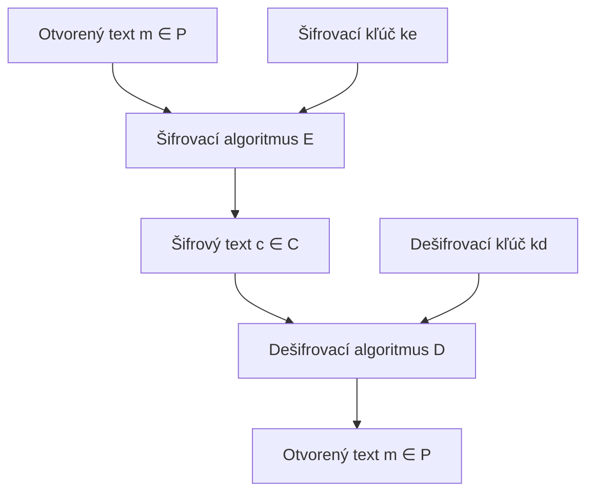

# Q01 — Uveďte formálnu definíciu kryptografického systému, symetrickej a asymetrickej šifry

## Kľúčové pojmy

- [[concepts/Kryptosystém]] — pätica $(P, C, K, E, D)$
- [[concepts/Symetrická-šifra]] · [[concepts/Asymetrická-šifra]]
- [[concepts/AES]] · [[concepts/DES]] · [[concepts/RSA]] · [[concepts/ElGamal]] · [[concepts/Eliptické-krivky]]
- [[concepts/Trapdoor-funkcia]] — jednosmerná funkcia s „padacími dvierkami"

## Vysvetlenie

### Formálna definícia kryptosystému

Kryptografický systém (kryptosystém) je formálne definovaný ako **usporiadaná pätica** $\mathcal{K} = (P, C, K, E, D)$, kde:

- $P$ (**P**laintext) — konečná množina všetkých možných **otvorených textov**.
- $C$ (**C**iphertext) — konečná množina všetkých možných **šifrových textov**.
- $K$ (**K**eys) — konečná množina všetkých možných **kľúčov** (kľúčový priestor).
- $E$ (**E**ncryption) — množina **šifrovacích funkcií** $e_k: P \to C$ pre každý kľúč $k \in K$.
- $D$ (**D**ecryption) — množina **dešifrovacích funkcií** $d_k: C \to P$.

**Základná korektnosť:** pre každý kľúč $k \in K$ a každý otvorený text $m \in P$ platí
$$d_k(e_k(m)) = m.$$

> [!tip] Ako si to pamätať
> **„PCK – ED"** (P, C, K → potom E, D). Najprv definuješ **priestory** (čo môže vstupovať, vystupovať, čím šifrujeme), až potom **operácie** (E = zašifrovať, D = dešifrovať).

### Symetrická šifra

Kryptosystém je **symetrický**, ak šifrovací kľúč $k_e$ a dešifrovací kľúč $k_d$ sú **identické**, alebo sa jeden dá ľahko odvodiť z druhého (typicky $k_e = k_d = k$).

- Obe strany musia **vopred zdieľať** rovnaký tajný kľúč → problém **distribúcie kľúčov**.
- **Veľmi rýchle** (rádovo gigabajty/s), vhodné na šifrovanie veľkých objemov dát.
- **Príklady:** [[concepts/AES]] (blokový), [[concepts/DES]]/3DES (historický), **ChaCha20** (prúdový), Salsa20.

### Asymetrická šifra (s verejným kľúčom)

Kryptosystém je **asymetrický**, ak šifrovací a dešifrovací kľúč sú **rôzne** a zo znalosti šifrovacieho (verejného) kľúča nemožno v reálnom čase vypočítať dešifrovací (súkromný) kľúč.

- **Verejný kľúč** $pk$ — slúži na šifrovanie alebo overenie podpisu, **voľne dostupný**.
- **Súkromný kľúč** $sk$ — slúži na dešifrovanie alebo vytvorenie podpisu, **musí ostať utajený**.
- Bezpečnosť stojí na existencii **jednosmerných funkcií s padacími dvierkami** (trapdoor one-way functions): funkciu možno ľahko počítať dopredu, ale invertovať vie len ten, kto pozná „padacie dvierka" (= súkromný kľúč).
- Je **pomalá** (rádovo 1000× pomalšia ako AES) → v praxi sa kombinuje so symetrickou šifrou (hybridné šifrovanie).
- **Príklady:** [[concepts/RSA]], [[concepts/ElGamal]], [[concepts/ECDSA]], [[concepts/Diffie-Hellman]].

## Diagram

## Tabuľka / Porovnanie

| Kritérium | Symetrická | Asymetrická |
|---|---|---|
| **Kľúč** | $k_e = k_d$ (jeden tajný) | $pk \neq sk$ (pár) |
| **Dĺžka kľúča** | 128–256 b | 2048–4096 b (RSA) / 256–384 b (ECC) |
| **Rýchlosť** | Veľmi rýchla | Pomalá (~1000× pomalšia) |
| **Distribúcia kľúčov** | Problém (treba bezpečný kanál) | Verejný kľúč voľne dostupný |
| **Matematický základ** | Konfúzia + difúzia | Trapdoor funkcia (faktorizácia, DLP, ECDLP) |
| **Typické použitie** | Šifrovanie dát, MAC | Výmena kľúčov, podpisy, certifikáty |
| **Príklady** | AES, ChaCha20, DES | RSA, ElGamal, ECDSA, EdDSA |

## Callouts

> [!summary] Čo musím vedieť na skúšku
> 1. Kryptosystém = **pätica $(P, C, K, E, D)$** + korektnosť $d_k(e_k(m)) = m$.
> 2. **Symetrická** ⇒ jeden zdieľaný kľúč, rýchla, problém distribúcie.
> 3. **Asymetrická** ⇒ pár (verejný + súkromný), pomalá, stojí na trapdoor funkciách.
> 4. V praxi sa **kombinujú** (hybridné šifrovanie): asymetrika vymení kľúč, symetrika šifruje dáta.

> [!tip] Ako si to pamätať
> **Symetrika = visiaci zámok s jedným kľúčom** — kto ho má, môže zamknúť aj odomknúť.
> **Asymetrika = poštová schránka** — otvor (verejný kľúč) má každý, kľúč od vnútra (súkromný) má len majiteľ.

> [!warning] Častá chyba
> Nezamieňať „**asymetrická šifra**" a „**digitálny podpis**" — pri šifrovaní sa použije **verejný kľúč príjemcu**, pri podpise **súkromný kľúč odosielateľa**. Ide o tú istú matematiku, ale opačné použitie kľúčov.

> [!example] Príklad
> Pošleš kamarátovi email cez HTTPS:
> 1. Tvoj prehliadač a server si pomocou **ECDH** ([[Q20]]) dohodnú spoločný kľúč $K$ (asymetrická časť).
> 2. Email sa zašifruje pomocou **AES-256-GCM** s kľúčom $K$ (symetrická časť).
> Asymetrika rieši „ako sa dohodnúť na kľúči", symetrika rieši „ako rýchlo šifrovať dáta".

## Flashcards

Q:: Čo je formálne kryptosystém?
A:: Usporiadaná pätica $(P, C, K, E, D)$ s vlastnosťou $d_k(e_k(m)) = m$ pre každý kľúč.

Q:: Aký je hlavný matematický základ asymetrickej kryptografie?
A:: Jednosmerné funkcie s padacími dvierkami (trapdoor one-way functions).

Q:: Prečo sa asymetrika nepoužíva priamo na šifrovanie veľkých súborov?
A:: Je rádovo 1000× pomalšia ako symetrika. V praxi sa asymetrikou vymení symetrický kľúč a ten šifruje obsah.

Q:: Uveď 2 príklady symetrických a 2 príklady asymetrických šifier.
A:: Symetrické: AES, ChaCha20 (alebo DES). Asymetrické: RSA, ElGamal (alebo ECDSA).

## Súvisiace

- [[Q02]] — Kryptosystém je len jeden z mechanizmov v architektúre bezpečnosti.
- [[Q03]] — Aké služby (dôvernosť, integrita …) tieto šifry vlastne poskytujú.
- [[Q04]] — Praktické zostavenie bezpečnej komunikácie (hybridné šifrovanie).
- [[Q24]] — Faktorizácia ako trapdoor pre RSA.
- [[Q33]] — Prečo „raw RSA" sám o sebe nestačí.
