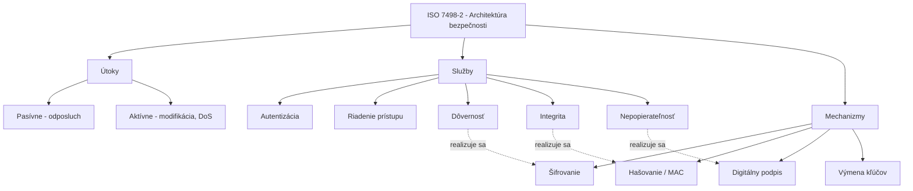

# Q02 — Popíšte, čím sa zaoberá tzv. „Architektúra bezpečnosti v RM OSI", aké časti obsahuje a akým spôsobom sa implementuje

## Kľúčové pojmy

- **RM OSI** = Referenčný Model Open Systems Interconnection — 7-vrstvový model sieťovej komunikácie
- **ISO 7498-2** — norma definujúca bezpečnostnú architektúru
- Útoky · Služby · Mechanizmy bezpečnosti
- [[concepts/IPsec]] · [[concepts/TLS]] · [[concepts/PKI]]

## Vysvetlenie

### Čím sa architektúra zaoberá

**Architektúra bezpečnosti** (norma **ISO 7498-2**) definuje **systematický rámec** na zaistenie bezpečnosti v rámci referenčného modelu OSI. Poskytuje:

- jednotnú **terminológiu** pre bezpečnostné požiadavky,
- **analýzu hrozieb** a rizík,
- definíciu **prostriedkov** na ich elimináciu,
- mapovanie **služby ↔ mechanizmus ↔ vrstva OSI**.

Norma odpovedá na tri otázky: **Čo nám hrozí? Čo chceme chrániť? Ako to urobíme?**

### Tri základné oblasti

**1) Útoky na bezpečnosť (Security Attacks)**
Identifikácia akcií, ktoré ohrozujú bezpečnosť informácií:

- **Pasívne útoky** — útočník iba **odposlúcha** (eavesdropping), neporušuje obsah. Cieľ: zisk informácie. *Príklad: zachytávanie nešifrovanej WiFi komunikácie.*
- **Aktívne útoky** — útočník **modifikuje** dáta alebo komunikáciu: podvrhnutie správy, replay, Denial of Service (DoS). Pozri [[Q05]] pre detailný rozklad (Destruction, Corruption, …).

**2) Služby bezpečnosti (Security Services)**
Vlastnosti, ktoré chceme z pohľadu používateľa zaistiť:

- **Autentizácia** — overenie identity entity alebo pôvodu dát ([[Q25]]).
- **Riadenie prístupu (Access Control)** — ochrana proti neoprávnenému použitiu zdrojov.
- **Dôvernosť dát (Confidentiality)** — ochrana pred neoprávneným čítaním.
- **Integrita dát (Integrity)** — zaručenie, že dáta neboli zmenené.
- **Nepopierateľnosť (Non-repudiation)** — dôkaz odoslania/prijatia, žiadna strana nemôže poprieť úkon.

**3) Mechanizmy bezpečnosti (Security Mechanisms)**
Konkrétne **technické nástroje** používané na realizáciu služieb (šifrovanie, podpisy, hašovanie, MAC, výmena kľúčov, certifikáty…). Podrobne v [[Q03]].

### Spôsob implementácie

Bezpečnostná architektúra sa implementuje prostredníctvom **vzťahu medzi službami a mechanizmami**. Služba je **abstraktná požiadavka** ("chcem dôvernosť"), mechanizmus je **konkrétna technika** ("použijem AES-256-GCM").

**Príklady mapovania služba ↔ mechanizmus:**

| Služba | Realizácia (mechanizmus) |
|---|---|
| Dôvernosť | Šifrovanie (AES, ChaCha20) |
| Integrita | Hašovacia funkcia, MAC, digitálny podpis |
| Autentizácia entít | Heslo, certifikát, výzva–odpoveď protokol |
| Nepopierateľnosť | Digitálny podpis ([[Q16]]) |

**Vrstvy implementácie** — mechanizmy sa nasadzujú v rôznych vrstvách RM OSI:

- **Sieťová (L3):** IPsec
- **Transportná (L4):** TLS / DTLS
- **Aplikačná (L7):** S/MIME (email), SSH, PGP

**Bezpečnostná správa** je súčasťou architektúry: zahŕňa správu kľúčov (key management), auditovanie, detekciu incidentov.

## Diagram

## Callouts

> [!summary] Čo musím vedieť na skúšku
> 1. **ISO 7498-2** — norma definujúca bezpečnostnú architektúru OSI.
> 2. **3 oblasti:** útoky, služby, mechanizmy.
> 3. **5 hlavných služieb:** autentizácia, riadenie prístupu, dôvernosť, integrita, nepopierateľnosť.
> 4. Implementácia = **mapovanie služby → mechanizmu → vrstvy OSI**.

> [!tip] Ako si to pamätať
> **„ÚSM"** — **Ú**toky, **S**lužby, **M**echanizmy. Ideš zhora: najprv identifikuješ **čo ti hrozí**, potom **čo chceš chrániť**, a nakoniec **akými nástrojmi**.

> [!warning] Častá chyba
> Nezamieňať **službu** (čo) a **mechanizmus** (ako). „Dôvernosť" nie je algoritmus — je to požiadavka. AES je mechanizmus, ktorý ju realizuje.

> [!example] Príklad
> Otvoríš si internetové bankovníctvo (HTTPS):
> - **Služba „autentizácia servera"** — realizuje sa **mechanizmom „X.509 certifikát + digitálny podpis"** — na **transportnej vrstve (TLS)**.
> - **Služba „dôvernosť"** — realizuje sa **mechanizmom „AES-256-GCM"** — na **transportnej vrstve (TLS rekord)**.

## Flashcards

Q:: Aké tri základné oblasti definuje ISO 7498-2?
A:: Útoky, služby a mechanizmy bezpečnosti.

Q:: Vymenuj 5 základných služieb bezpečnosti.
A:: Autentizácia, riadenie prístupu, dôvernosť, integrita, nepopierateľnosť.

Q:: Aký je rozdiel medzi službou a mechanizmom?
A:: Služba = abstraktná požiadavka (čo chcem). Mechanizmus = konkrétna technika (ako to spravím).

Q:: Na akej OSI vrstve pracuje IPsec a na akej TLS?
A:: IPsec na sieťovej (L3), TLS na transportnej (L4).

## Súvisiace

- [[Q03]] — Detail služieb a mechanizmov.
- [[Q04]] — Ako sa to spája do bezpečnej komunikácie.
- [[Q05]] — Klasifikácia útokov v modeli hrozieb.
