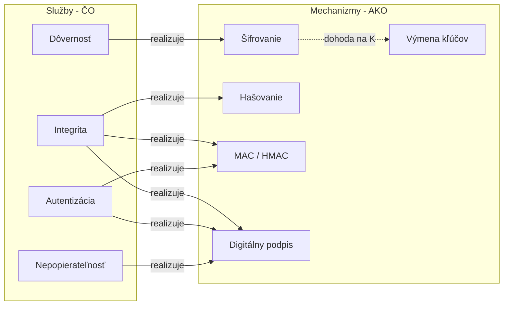

# Q03 — Uveďte a stručne charakterizujte služby bezpečnosti a kryptografické mechanizmy

## Kľúčové pojmy

- **CIA triáda** — Confidentiality, Integrity, Availability (dôvernosť, integrita, dostupnosť)
- [[concepts/MAC]] · [[concepts/HMAC]] · [[concepts/Digitálny-podpis]] · [[concepts/Diffie-Hellman]]
- [[concepts/AES]] · [[concepts/RSA]]

## Vysvetlenie

### 3.1 Služby bezpečnosti

**Služby bezpečnosti** reprezentujú **vlastnosti**, ktoré kryptografický systém poskytuje používateľovi na ochranu informácií. Sú to **abstraktné požiadavky** — definujú „čo", nie „ako".

**1) Dôvernosť (Confidentiality)**
Zabezpečuje, že informácia nie je sprístupnená neoprávneným subjektom. Dáta sú čitateľné iba pre toho, kto má kľúč.
*Príklad: WhatsApp — tvoje správy vidíš len ty a príjemca, nie samotný server.*

**2) Integrita dát (Integrity)**
Zaručuje, že dáta neboli neoprávnene (alebo nepozorovane) zmenené počas prenosu alebo uloženia.
*Príklad: keď stiahneš ISO Linux distra, overíš jeho SHA-256 haš — ak sedí, súbor nebol zmenený.*

**3) Autentizácia (Authentication)** — dva podtypy:

- **Autentizácia pôvodu dát (data-origin authentication)** — overenie, že dáta naozaj pochádzajú od deklarovaného odosielateľa.
- **Autentizácia entít (entity authentication)** — overenie identity účastníka komunikácie v reálnom čase (napr. pri prihlásení).

**4) Nepopierateľnosť (Non-repudiation)**
Žiadna strana nemôže neskôr poprieť, že vykonala daný úkon. Odosielateľ nemôže tvrdiť, že správu neodoslal; príjemca, že ju neprijal.
*Príklad: digitálne podpísaná elektronická faktúra — odosielateľ ju nemôže zaprieť pred súdom.*

**Bonus: Riadenie prístupu (Access Control)**
Ochrana proti neoprávnenému použitiu zdrojov (kto môže čo). V kryptografii sa rieši cez **autentizáciu + autorizáciu** (napríklad role-based access control).

### 3.2 Kryptografické mechanizmy

**Mechanizmy** sú **konkrétne algoritmy a postupy**, ktoré realizujú služby. Tu sú hlavné:

**Šifrovanie (Encryption)**
- Zaisťuje **dôvernosť**.
- Transformuje otvorený text na šifrový pomocou kľúča.
- **Symetrické** ([[concepts/AES]]) alebo **asymetrické** ([[concepts/RSA]], [[concepts/ElGamal]]).

**Digitálny podpis (Digital Signature)**
- Zaisťuje **integritu, autentizáciu pôvodu, nepopierateľnosť** (tri služby naraz!).
- Založený na **asymetrickej kryptografii**: odosielateľ podpisuje haš správy svojím **súkromným kľúčom**, ktokoľvek overí pomocou **verejného kľúča**.
- Detail: [[Q16]].

**Hašovacie funkcie (Hash Functions)**
- Vytvárajú **otlačok (digest)** správy fixnej dĺžky.
- Samotný haš zabezpečuje **integritu** (ak ho prenášame chráneným kanálom alebo podpíšeme).
- Detail: [[Q06]], [[Q07]], [[Q08]].

**Kódy pre autentizáciu správ (MAC — Message Authentication Code)**
- Zaisťuje **integritu + autentizáciu pôvodu** pomocou **zdieľaného tajného kľúča** (symetrické).
- Rozdiel oproti podpisu: MAC vie overiť len ten, kto má kľúč (obe strany), takže neposkytuje nepopierateľnosť.
- *Príklad:* [[concepts/HMAC]]-SHA256 = HMAC postavený nad SHA-256.

**Mechanizmy výmeny / dohody na kľúčoch**
- Umožňujú **bezpečne ustanoviť** spoločný kľúč cez nezabezpečený kanál.
- *Príklady:* [[concepts/Diffie-Hellman]], **ECDH** ([[Q20]]), **Key Encapsulation Mechanism (KEM)**.

## Diagram

## Tabuľka / Porovnanie

| Mechanizmus | Dôvernosť | Integrita | Autentizácia | Nepopierateľnosť |
|---|:-:|:-:|:-:|:-:|
| Šifrovanie | ✅ | ❌ | ❌ | ❌ |
| Haš | ❌ | ✅* | ❌ | ❌ |
| **MAC / HMAC** | ❌ | ✅ | ✅ | ❌ (zdieľaný kľúč) |
| **Digitálny podpis** | ❌ | ✅ | ✅ | ✅ |
| **Výmena kľúčov (DH)** | – (príprava) | – | – | – |

*Samotný haš poskytuje integritu len ak je chránený (cez podpis alebo MAC). Bez ochrany ho útočník prepočíta.*

## Callouts

> [!summary] Čo musím vedieť na skúšku
> - **4 hlavné služby:** dôvernosť, integrita, autentizácia, nepopierateľnosť.
> - **MAC = integrita + autentizácia** (zdieľaný kľúč); **podpis = + nepopierateľnosť** (verejný/súkromný kľúč).
> - Šifrovanie SAMO o sebe **nezaručuje integritu** — preto sa kombinuje (AES-GCM, ChaCha20-Poly1305 = AEAD).

> [!tip] Ako si to pamätať
> **„DIANe"** — **D**ôvernosť, **I**ntegrita, **A**utentizácia, **N**epopierateľnosť. (Vymysli si Diany ako tajného agenta).

> [!warning] Častá chyba
> Šifrovanie ≠ integrita! AES-CBC bez MAC dovoľuje útočníkovi „prepísať" niektoré bity. Vždy používaj **AEAD** mód (AES-GCM, ChaCha20-Poly1305), ktorý spája šifrovanie a MAC.

> [!example] Príklad
> WhatsApp: dôvernosť + integrita + autentizácia (cez Signal protokol).
> Bankový prevod podpísaný kvalifikovaným certifikátom: + nepopierateľnosť.

## Flashcards

Q:: Aký je rozdiel medzi MAC a digitálnym podpisom?
A:: MAC používa zdieľaný tajný kľúč (obe strany ho majú) — preto neposkytuje nepopierateľnosť. Podpis používa asymetrický pár (súkromný kľúč len odosielateľ).

Q:: Aké služby naraz poskytuje digitálny podpis?
A:: Integritu, autentizáciu pôvodu a nepopierateľnosť.

Q:: Prečo samotné šifrovanie nestačí?
A:: Nezabezpečuje integritu — útočník môže šifru modifikovať a príjemca to nezistí. Treba AEAD alebo MAC.

Q:: Čo je AEAD?
A:: Authenticated Encryption with Associated Data — režim, ktorý súčasne šifruje a generuje MAC. Príklady: AES-GCM, ChaCha20-Poly1305.

## Súvisiace

- [[Q01]] — Symetrika / asymetrika ako základ mechanizmov.
- [[Q02]] — Architektúra OSI, do ktorej tieto služby zapadajú.
- [[Q04]] — Ako sa služby spájajú do celej bezpečnej komunikácie.
- [[Q16]] — Digitálny podpis detailne.
