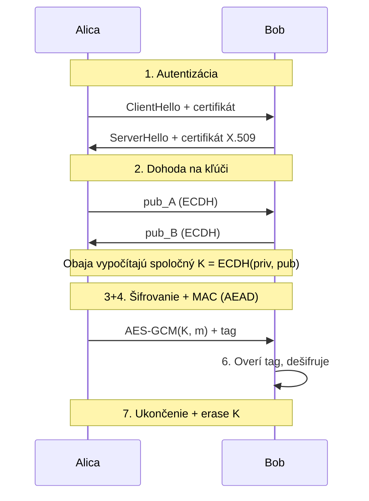

# Q04 — Uveďte jednotlivé kroky pre zaistenie bezpečnej komunikácie

## Kľúčové pojmy

- **Alica & Bob** — štandardné mená účastníkov v kryptografii
- [[concepts/PKI]] · [[concepts/X.509]] · [[concepts/Diffie-Hellman]]
- **Hybridné šifrovanie** — asymetrika + symetrika
- [[concepts/PFS]] — Perfect Forward Secrecy

## Vysvetlenie

Bezpečná komunikácia medzi dvoma entitami (tradične Alica a Bob) v moderných systémoch prebieha v **siedmich logických krokoch**. V praxi väčšinu z nich rieši protokol ako TLS 1.3 alebo Signal, ale na skúške ti pomôže poznať každý krok zvlášť.

### 1) Identifikácia a autentizácia entít

Pred výmenou dát musia Alica a Bob **overiť identitu** druhej strany. V praxi:
- **Certifikáty X.509** vydané certifikačnou autoritou (CA) v rámci [[concepts/PKI]].
- Server posiela svoj certifikát, klient overí podpis CA → vie, že komunikuje s pravým serverom.
- Voliteľná **vzájomná autentizácia (mTLS)** — klient tiež posiela certifikát.

### 2) Dohoda na kľúčoch (Key Establishment / Exchange)

Cieľ: ustanoviť **spoločný tajný symetrický kľúč** $K$ cez nezabezpečený kanál.
- **Asymetrický mechanizmus**: [[Q20]] (ECDH), Diffie-Hellman, RSA-KEM.
- **Ephemeral** (dočasné) kľúče → poskytujú **PFS** (Perfect Forward Secrecy): aj keď útočník v budúcnosti získa dlhodobý kľúč, staré relácie zostávajú bezpečné.

### 3) Zaistenie dôvernosti (šifrovanie)

Zašifrovanie skutočných dát **symetrickou** šifrou (lebo je rýchla):
- AES-256-GCM, ChaCha20-Poly1305 → moderný štandard (AEAD).
- Vstup: otvorený text $m$, kľúč $K$, nonce → výstup: šifrový text $c$.

### 4) Zaistenie integrity a autentizácie pôvodu

K šifrovanej správe sa pripojí:
- **MAC** (HMAC-SHA256) — ak sa overuje sa zdieľaným kľúčom, alebo
- **Digitálny podpis** ([[Q16]]) — ak treba aj **nepopierateľnosť**.
- V AEAD móde (GCM) je MAC integrovaný priamo v šifrovaní.

### 5) Bezpečný prenos

Odoslanie dát cez nezabezpečenú sieť (Internet, WiFi, …). Útočník (Eva) môže komunikáciu zachytávať, ale bez kľúča je nepoužiteľná.

### 6) Spracovanie u príjemcu

Bob (príjemca):
1. **Overí integritu / podpis** (MAC alebo digitálny podpis).
2. Ak overenie zlyhá → správu **odmietne** (nedešifruje!).
3. Ak overenie prejde → **dešifruje** symetrickým kľúčom.

> [!warning] Poradie!
> **„Encrypt-then-MAC"** — najprv šifruj, potom MAC nad šifrou. Pri overení: **najprv overuj MAC, potom dešifruj.** Inak hrozia útoky typu padding oracle.

### 7) Ukončenie relácie a likvidácia kľúčov

- **Bezpečné vymazanie** dočasných kľúčov z pamäte (memset_s, secure_erase).
- Uzavretie spojenia (TLS close_notify alarm).
- Logovanie / audit.

## Diagram

## Callouts

> [!summary] Čo musím vedieť na skúšku
> 7 krokov: **Autentizácia → Dohoda kľúča → Šifrovanie → Integrita → Prenos → Dešifrovanie → Cleanup**. Hybridný princíp: asymetrika len na ustanovenie kľúča, symetrika na šifrovanie dát.

> [!tip] Ako si to pamätať
> Predstav si **stretnutie tajných agentov**: 1) preukážu sa pasmi, 2) dohodnú heslo dňa, 3) povedia správu šepkanú, 4) podpíšu zapečatenú obálku, 5) cez kuriéra, 6) overenie pečate + čítanie, 7) spálenie hesla.

> [!warning] Častá chyba
> Zabudnúť na **autentizáciu pred výmenou kľúčov** → útok Man-in-the-Middle ([[Q26]]). Eva sa môže vydávať za Boba a urobiť ECDH s oboma stranami.

> [!example] Príklad
> TLS 1.3 handshake to spája dohromady: certifikát + ECDH(E) + HKDF (odvodenie kľúčov) + AEAD (AES-GCM alebo ChaCha20-Poly1305).

## Flashcards

Q:: Prečo sa v praxi nepoužíva asymetrika na šifrovanie samotnej správy?
A:: Je príliš pomalá. Asymetrika sa použije len na ustanovenie symetrického kľúča (hybridné šifrovanie).

Q:: Čo je Perfect Forward Secrecy (PFS)?
A:: Vlastnosť, kedy kompromitácia dlhodobého (statického) kľúča neumožňuje dešifrovať staré relácie. Dosahuje sa použitím *ephemeral* (jednorazových) kľúčov v ECDH.

Q:: Aké je správne poradie pri prijímaní AEAD správy?
A:: Najprv overiť MAC/tag, potom dešifrovať. Inak hrozia útoky typu padding oracle.

## Súvisiace

- [[Q03]] — Služby, ktoré zaisťujeme.
- [[Q16]] — Detailný digitálny podpis (krok 4).
- [[Q20]] — ECDH (krok 2).
- [[Q26]] — MitM útoky pri zle navrhnutej autentizácii.
