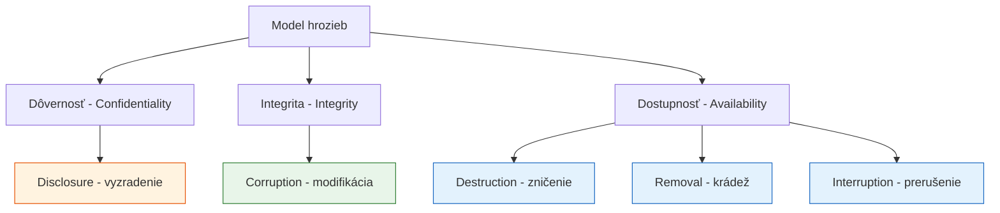

# Q05 — Vysvetlite význam pojmov súvisiacich s modelmi hrozieb: Destruction, Corruption, Removal, Disclosure, Interruption

## Kľúčové pojmy

- **CIA triáda** — Confidentiality, Integrity, Availability
- **Model hrozieb (threat model)** — formálny opis toho, čo a kto môže ohroziť systém
- [[concepts/MitM]] · DoS · DDoS

## Vysvetlenie

Týchto **päť pojmov** popisuje rôzne typy útokov v rámci modelu hrozieb. Klasifikujú sa **podľa toho, ktorý aspekt CIA triády ohrozujú**.

> [!tip] Mnemonika — kategorizácia podľa CIA
> - **Dôvernosť** napadá **Disclosure**.
> - **Integritu** napadá **Corruption**.
> - **Dostupnosť** napadá **Destruction, Removal, Interruption** (tri rôzne spôsoby ako spôsobiť, že systém nie je k dispozícii).

### 1) Destruction (Zničenie)
**Útok na dostupnosť.** Fyzické alebo logické **zničenie** dát či sieťových zdrojov, čím sa stávajú **trvalo nepoužiteľnými**.
*Príklad:* ransomware šifrujúci pevné disky bez možnosti obnovy; útok na priemyselné riadiace systémy (Stuxnet, ktorý fyzicky zničil centrifúgy).

### 2) Corruption (Modifikácia / korupcia)
**Útok na integritu.** Neautorizovaná **modifikácia** dát či aktív. Útočník zmení obsah správy alebo súboru tak, aby informácia bola nesprávna.
*Príklad:* útočník zmení sumu na bankovom príkaze pred jeho podpisom; injekcia malvéru do firmware.

### 3) Removal (Odobratie / krádež)
**Útok na dostupnosť** (a často aj na dôvernosť). Zahŕňa **krádež**, odobratie alebo stratu informácií či zdrojov.
*Príklad:* odcudzenie pevného disku/notebooku, vymazanie kritickej databázy bez backupov, exfiltrácia firemných dát.

### 4) Disclosure (Vyzradenie / odhalenie)
**Útok na dôvernosť.** Neautorizovaný prístup k aktívam alebo dátam. Citlivé informácie sa dostanú do rúk nepovolanej osoby.
*Príklad:* odpočúvanie WiFi (eavesdropping), únik z databázy hesiel (Disclosure scenár roku — únik LinkedIn 2012 → 117 M hesiel).

### 5) Interruption (Prerušenie)
**Útok na dostupnosť.** Spôsobuje **prerušenie služieb** alebo komunikácie, ktoré sa stávajú dočasne nepoužiteľnými.
*Príklad:* **DoS / DDoS** útok zahlcujúci server; prerušenie podmorského kábla; jamming WiFi.

## Diagram

## Tabuľka / Porovnanie

| Útok | Cieľ (CIA) | Dôsledok | Reálny príklad |
|---|---|---|---|
| **Destruction** | Dostupnosť | Trvalá strata dát | Ransomware Wiper (NotPetya) |
| **Corruption** | Integrita | Zmenená / podvrhnutá informácia | Falšovanie podpisu, MitM s úpravou |
| **Removal** | Dostupnosť / Dôvernosť | Odstránenie alebo krádež zdroja | Krádež HDD, exfiltrácia DB |
| **Disclosure** | Dôvernosť | Únik citlivých dát | LinkedIn 2012, Equifax 2017 |
| **Interruption** | Dostupnosť | Dočasné prerušenie služby | DDoS, výpadok DNS |

## Callouts

> [!summary] Čo musím vedieť na skúšku
> Všetkých 5 pojmov a **ku každému uveď, ktorú zložku CIA triády porušuje**. Naučiť aspoň jeden príklad ku každému.

> [!tip] Ako si to pamätať
> Anglické **"DCRDI"** — alebo si predstav tri „D" útoky na dostupnosť: **D**estruction, **R**emoval, **I**nterruption (~zničil/ukradol/prerušil). Ostatné dve: **D**isclosure (odhalil ↔ dôvernosť), **C**orruption (zmenil ↔ integrita).

> [!warning] Častá chyba
> **Removal** sa občas mylne radí len pod dôvernosť (lebo dáta unikli). Ale ak ich útočník zmazal/zobral preč, tak ich obeť **nemá k dispozícii** — preto patrí pod dostupnosť (resp. obe).

> [!example] Príklad zo života
> Útočník vnikne do firemnej siete:
> - Skopíruje databázu zákazníkov (**Disclosure** + **Removal**).
> - Zmení faktúry (**Corruption**).
> - Vymaže ich (**Destruction**).
> - Položí firemný web cez DDoS (**Interruption**).
> Jeden incident, päť kategórií útoku.

## Flashcards

Q:: Ktorú zložku CIA triády porušuje Disclosure?
A:: Dôvernosť (Confidentiality).

Q:: Aký je rozdiel medzi Destruction a Removal?
A:: Destruction zničí dáta na mieste (sú nepoužiteľné). Removal ich odoberie/ukradne (zmiznú zo systému).

Q:: Pod ktorú kategóriu patrí DoS / DDoS?
A:: Interruption — útok na dostupnosť.

Q:: Ktorý útok je MitM (Man-in-the-Middle) so zmenou správy?
A:: Corruption (útok na integritu).

## Súvisiace

- [[Q02]] — Útoky ako súčasť architektúry bezpečnosti.
- [[Q03]] — Mechanizmy, ktoré týmto útokom bránia.
- [[Q26]] — Konkrétne útoky na autentizačné protokoly (replay, MitM, …).
