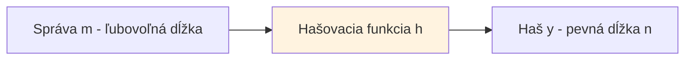

# Q06 — Formálna definícia hašovacích funkcií, požadované vlastnosti, hodnotenie bezpečnosti, príklady použitia

## Kľúčové pojmy

- **Haš / hash / fingerprint / digest** — krátky otlačok dlhšej správy
- **Preimage / 2nd preimage / collision resistance** — tri bezpečnostné vlastnosti
- [[concepts/Birthday-attack]] — útok narodením (Birthday paradox)
- [[concepts/SHA-2]] · [[concepts/SHA-3]] · MD5

## Vysvetlenie

### 6.1 Formálna definícia

**Kryptografická hašovacia funkcia** je zobrazenie
$$h : \{0,1\}^* \to \{0,1\}^n$$
ktoré prevádza binárny reťazec **ľubovoľnej dĺžky** na binárny reťazec **pevnej dĺžky** $n$ bitov.

- **Vstup** $x$: ľubovoľne dlhá správa (prakticky obmedzená napr. $2^{64}$ bitov).
- **Výstup** $y = h(x)$: hašový kód (digest, otlačok, fingerprint).
- Typické dĺžky: SHA-256 → 256 b, SHA-512 → 512 b.

### 6.2 Tri základné bezpečnostné vlastnosti

**1) Preimage resistance — odolnosť proti nájdeniu vzoru** (jednosmernosť)
Pre dané $y$ je výpočtovo neuskutočniteľné nájsť $x$ také, že $h(x) = y$.
→ Funkcia sa správa ako **jednosmerná** (one-way).
*Útok hrubou silou: $2^n$ pokusov.*

**2) Second preimage resistance — odolnosť proti druhému vzoru**
Pre danú správu $x_1$ je neuskutočniteľné nájsť **inú** $x_2 \neq x_1$, takú že $h(x_1) = h(x_2)$.
*Útok hrubou silou: $2^n$ pokusov.*

**3) Collision resistance — odolnosť proti kolíziám**
Je neuskutočniteľné nájsť **akékoľvek** dve rôzne správy $x_1 \neq x_2$, pre ktoré $h(x_1) = h(x_2)$.
- Kolízie **existujú** (lebo vstup je nekonečný a výstup konečný), nesmú byť však efektívne nájditeľné.
- *Útok narodením (birthday): $2^{n/2}$ pokusov* — preto na 128-bitovú bezpečnosť potrebujeme **256-bitový haš**.

> [!tip] Rebríček prísnosti
> Collision resistance ⇒ 2nd preimage resistance ⇒ (zvyčajne) preimage resistance. Najsilnejšia podmienka je collision resistance.

### 6.3 Hodnotenie bezpečnosti

Posudzuje sa **zložitosť najlepšieho známeho útoku**:

| Vlastnosť | Ideálna zložitosť | Praktická hranica „bezpečné" |
|---|---|---|
| Preimage | $2^n$ | min. 128 b |
| 2nd preimage | $2^n$ | min. 128 b |
| **Collision** (birthday) | $2^{n/2}$ | min. **256 b** (= 128 b sec) |

**Štrukturálne útoky** — okrem brute-force:
- **Length extension attack** — Merkle–Damgård funkcie (SHA-1, SHA-2) → bližšie [[Q07]].
- **Diferenciálna a lineárna kryptoanalýza**.
- **Multikolízie** (Jouxov útok) — pri iteračnej konštrukcii ľahšie ako u náhodného orákula.

### 6.4 Príklady použitia

- **Digitálny podpis** ([[Q16]]) — namiesto celej správy sa podpisuje len haš (rýchlosť + bezpečnosť).
- **Kontrola integrity** — overenie, či stiahnutý súbor nebol zmenený (SHA-256 sumy).
- **Bezpečné ukladanie hesiel** — namiesto plaintextu sa ukladá haš + **salt** (náhodný prídavok) → bcrypt, scrypt, Argon2.
- **MAC** (cez [[concepts/HMAC]]) — integrita + autentizácia.
- **Blockchain** (Bitcoin, Git) — každý blok obsahuje haš predchádzajúceho → reťazenie.
- **Proof-of-Work** — hľadanie haša s mnohými nulovými bitmi na začiatku.
- **Identifikácia dát** — Git commit ID, P2P súborové siete.

## Diagram

## Tabuľka / Porovnanie

| Funkcia | Dĺžka (b) | Konštrukcia | Stav | Poznámka |
|---|---|---|---|---|
| MD5 | 128 | Merkle–Damgård | ❌ Prelomená | Kolízie nájdené 2004 |
| SHA-1 | 160 | Merkle–Damgård | ❌ Prelomená | SHAttered 2017 |
| **SHA-256** | 256 | Merkle–Damgård | ✅ Bezpečná | Štandard SHA-2 |
| SHA-512 | 512 | Merkle–Damgård | ✅ | Rýchlejšia na 64-bit |
| **SHA3-256** | 256 | Houba (Keccak) | ✅ | NIST štandard od 2015 |
| BLAKE2/3 | 256+ | Modifikácia | ✅ | Veľmi rýchla |

## Callouts

> [!summary] Čo musím vedieť na skúšku
> 1. Formálne $h: \{0,1\}^* \to \{0,1\}^n$.
> 2. **Tri vlastnosti:** preimage, 2nd preimage, collision resistance.
> 3. Pre kolízie sa pri $n$-bitovom haši efektívna bezpečnosť je $n/2$ kvôli **birthday paradoxu**.
> 4. Príklady použitia: podpis, integrita, heslá+salt, blockchain.

> [!tip] Ako si to pamätať
> **„1-2-K"** — **1**. nájdi vzor pre daný haš (preimage), **2**. nájdi druhý vzor pre danú správu, **K**olízia — nájdi ľubovoľnú dvojicu rovnakého haša. Náročnosť rastie a útok klesá zo strany útočníka.

> [!warning] Častá chyba
> Mýliť **n** a **n/2**: pre 128 b bezpečnosť proti kolíziám potrebujeme **256-bitový haš**, nie 128-bitový. MD5 (128 b) → kolízie sa nájdu za pár sekúnd.

> [!example] Príklad — narodeninový paradox
> Koľko ľudí musí byť v miestnosti, aby s pravdepodobnosťou > 50% mali dvaja rovnaký dátum narodenia? Iba **23**, nie 183. Rovnako: pre 128-b haš stačí $2^{64}$ skúšok na nájdenie kolízie — to je len ~10 miliárd, čo je dnes výpočtovo dosiahnuteľné.

## Flashcards

Q:: Čo je preimage resistance?
A:: Pre dané $y$ je neuskutočniteľné nájsť $x$ také, že $h(x) = y$. Funkcia je jednosmerná.

Q:: Prečo musí mať haš dĺžku aspoň 256 bitov?
A:: Kvôli birthday paradoxu — efektívna bezpečnosť proti kolíziám je $n/2$. 256 b → 128 b bezpečnosť.

Q:: Prečo sa pri ukladaní hesiel pridáva salt?
A:: Aby útočník nemohol použiť precomputed rainbow tables — každé heslo má unikátny salt, takže ten istý plaintext dáva rôzny haš pre rôznych používateľov.

Q:: Aké tri vlastnosti musí mať kryptografická haš funkcia?
A:: Preimage resistance, second-preimage resistance, collision resistance.

## Súvisiace

- [[Q07]] — Merkle–Damgård konštrukcia (SHA-1, SHA-2).
- [[Q08]] — Houbová konštrukcia (SHA-3).
- [[Q09]] · [[Q10]] — Lamport / Winternitz: podpisy stavané len na hašoch.
- [[Q16]] — Použitie haša v digitálnom podpise.
