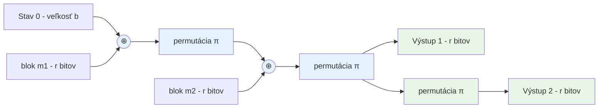

# Q08 — Princíp konštrukcie hašovacích funkcií typu „houba" (SHA-3), príklady využitia

## Kľúčové pojmy

- **Sponge construction** (hubová konštrukcia)
- **Keccak** — algoritmus vyhravší súťaž NIST SHA-3
- **Rate** $r$ + **Capacity** $c$ — dve časti vnútorného stavu
- **Permutácia** namiesto kompresnej funkcie
- **XOF** = e**X**tendable-**O**utput **F**unction (premenlivá dĺžka výstupu)
- [[concepts/AEAD]] · [[concepts/Sponge-construction]]

## Vysvetlenie

### 8.1 Princíp „huby" (Sponge construction)

Hubová konštrukcia je rámec použitý v algoritme **SHA-3 (Keccak)**, ktorý NIST vybral v 2012 a štandardizoval v 2015 (FIPS 202). Na rozdiel od Merkle–Damgård ([[Q07]]) **nepoužíva kompresnú funkciu, ale iterovanú permutáciu** $\pi$.

**Vnútorný stav** má **b bitov** (pre Keccak $b = 1600$), rozdelený na:
- **Rate $r$** — časť stavu, ktorá **interaguje** so vstupom/výstupom. Veľkosť bloku spracovania.
- **Capacity $c$** — **skrytá** časť stavu, ktorá nikdy nie je priamo vystavená. **Určuje bezpečnosť** — kapacita $c$ poskytuje $c/2$ bitov bezpečnosti proti kolíziám.
- Vzťah: $b = r + c$.

**Proces má dve fázy:**

**A) Absorbing phase (pohlcovanie)**
1. Vstupná správa sa doplní (10*1 padding) a rozdelí na bloky veľkosti $r$.
2. Každý blok sa **XORuje** s prvými $r$ bitmi aktuálneho stavu.
3. Na celý stav ($b$ bitov) sa aplikuje permutácia $\pi$ (Keccak-f).
4. Opakuje sa, kým nie sú všetky bloky pohltené.

**B) Squeezing phase (žmýkanie)**
1. Z aktuálneho stavu sa vyberie prvých $r$ bitov ako časť haša.
2. Ak treba dlhší výstup, aplikuje sa znova $\pi$ a vyberie ďalších $r$ bitov.
3. Opakuje sa, kým nie je výstup dostatočne dlhý.

**Permutácia Keccak-f**[1600] — 24 rúnd, každá pozostáva z piatich krokov: $\theta, \rho, \pi, \chi, \iota$.

### 8.2 Vlastnosti a výhody SHA-3

✅ **Odolnosť voči length extension attack** — capacity $c$ nie je nikdy vystavená navonok, takže útočník nemá ako pokračovať v hašovaní bez znalosti celého stavu.

✅ **Flexibilita parametrov** — rovnakou konštrukciou dostaneme hašovacie funkcie rôznych dĺžok len **zmenou $r$ a $c$**:

| Funkcia | Výstup | $r$ (b) | $c$ (b) | Bezpečnosť |
|---|---|---|---|---|
| SHA3-224 | 224 b | 1152 | 448 | 112 b |
| SHA3-256 | 256 b | 1088 | 512 | 128 b |
| SHA3-384 | 384 b | 832 | 768 | 192 b |
| SHA3-512 | 512 b | 576 | 1024 | 256 b |
| **SHAKE128** | ľubovoľne (XOF) | 1344 | 256 | 128 b |
| **SHAKE256** | ľubovoľne (XOF) | 1088 | 512 | 256 b |

✅ **Iný matematický základ** než SHA-2 → ak by sa našla slabina v jednej rodine, druhá zostáva bezpečná (defense in depth).

⚠️ **Pomalšia v softvéri** než SHA-2 na bežných CPU (bez špeciálnej HW akcelerácie).

### 8.3 Príklady využitia

- **Klasické hašovanie** — SHA3-224/256/384/512 pre integritu, digitálne podpisy.
- **XOF — SHAKE128, SHAKE256** — výstup ľubovoľnej dĺžky:
  - **KDF** (Key Derivation Function) — odvodenie kľúčov rôznych dĺžok.
  - Náhrada za PRNG.
- **Autentizované šifrovanie (AEAD)** — schémy ako **Keyak**, **Ketje**, **Ascon** (NIST LWC víťaz 2023) využívajú princíp huby pre súčasné šifrovanie + integritu.
- **Prúdové šifry a PRNG** — hubu možno použiť ako základ pre prúd kľúčov.
- **Postkvantové podpisy** — SLH-DSA (SPHINCS+) využíva SHA-3 / SHAKE.

## Diagram

(Modrá = pohlcovanie, zelená = žmýkanie.)

## Callouts

> [!summary] Čo musím vedieť na skúšku
> 1. **Houba = stav $b = r + c$** s permutáciou $\pi$ (Keccak-f).
> 2. **Capacity** $c$ je tajná → poskytuje $c/2$ bitov bezpečnosti.
> 3. **Dve fázy:** absorbing (XOR vstupu + permutácia) a squeezing (výstup + permutácia).
> 4. **Odolná voči length extension** → rieši slabinu MD.
> 5. **XOF** (SHAKE) = výstup ľubovoľnej dĺžky.

> [!tip] Ako si to pamätať
> Hubka v drezi: **najprv nasaje vodu** (pohlcovanie vstupu cez XOR), potom **ju vyžmýkaš** (squeezing). Tajná „vnútorná štruktúra" hubky (capacity) sa nikdy nedostane von.

> [!warning] Častá chyba
> Zamieňať **bezpečnosť** = $n$ (dĺžka výstupu) s **bezpečnosťou** = $c/2$ (polovica kapacity). SHA3-256 má 256 b výstup, ale **bezpečnosť proti kolíziám** je $c/2 = 128$ b.

> [!example] Príklad — XOF
> Potrebuješ z hesla odvodiť 3 rôzne kľúče (šifrovanie + MAC + IV). Klasická haš vráti len 256 b. **SHAKE256(password, 768 bits)** vráti 96 bajtov — z nich vyberieš 32 b pre každý kľúč.

## Flashcards

Q:: Čo je rate a capacity v hubovej konštrukcii?
A:: Rate $r$ = časť stavu interagujúca so vstupom/výstupom (veľkosť bloku). Capacity $c$ = skrytá časť, ktorá určuje bezpečnosť ($c/2$ bitov).

Q:: Prečo je SHA-3 odolná voči length extension attack?
A:: Lebo capacity $c$ nie je nikdy vystavená navonok. Útočník nemá celý vnútorný stav, takže nemôže pokračovať v hašovaní.

Q:: Čo je XOF a aké funkcie z rodiny SHA-3 sú XOFs?
A:: Extendable-Output Function — výstup ľubovoľnej dĺžky. SHAKE128 a SHAKE256.

Q:: Aké štyri kroky tvoria každú rúnd Keccak-f?
A:: $\theta$, $\rho$, $\pi$, $\chi$, $\iota$ (päť krokov, ale prijal sa aj zápis 4–5 podľa toho ako sa skombinujú).

## Súvisiace

- [[Q06]] — Bezpečnostné vlastnosti haš funkcií.
- [[Q07]] — Konkurenčná Merkle–Damgård konštrukcia a jej slabiny.
- [[Q13]] — Hash_DRBG generátory čerpajúce z haš funkcií.
