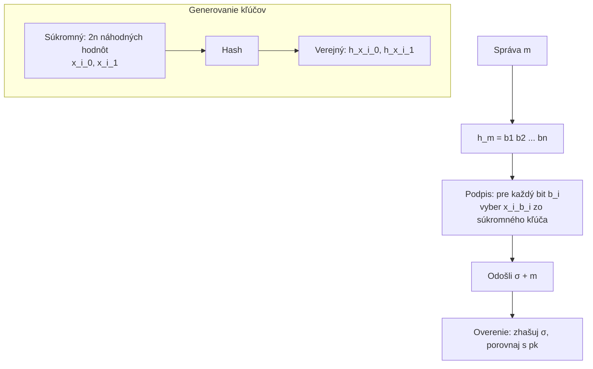

# Q09 — Princíp jednorazového podpisu Lamport, výhody a nevýhody

## Kľúčové pojmy

- **OTS** = One-Time Signature (jednorazový podpis)
- **Lamportova schéma** (Leslie Lamport, 1979)
- **Postkvantová bezpečnosť** — odolnosť voči kvantovým počítačom
- **Merkle tree** — strom haší (umožňuje viacnásobné použitie OTS)

## Vysvetlenie

### 9.1 Princíp

Lamportova schéma jednorazového podpisu je založená **iba na bezpečnosti hašovacej funkcie** a jej jednosmernosti. Žiadna faktorizácia, žiadny diskrétny logaritmus → **odolná voči kvantovým útokom**.

Označme:
- $h$ — kryptografická haš funkcia (napr. SHA-256),
- $n$ — dĺžka výstupu haša ($n = 256$ b).

**A) Generovanie kľúčov**

**Súkromný kľúč:**
Vygenerujeme **$2n$ náhodných hodnôt** dĺžky $n$ bitov, usporiadaných do $n$ párov:
$$sk = \big( (x_{1,0}, x_{1,1}), (x_{2,0}, x_{2,1}), \dots, (x_{n,0}, x_{n,1}) \big)$$

**Verejný kľúč:**
Každú z hodnôt **zahašujeme**:
$$pk = \big( (h(x_{1,0}), h(x_{1,1})), \dots, (h(x_{n,0}), h(x_{n,1})) \big)$$

Veľkosť: $2n$ hodnôt × $n$ bitov = $2n^2$ bitov ≈ 16 KB pre SHA-256.

**B) Podpísanie správy** $m$

1. Vypočítaj haš správy: $H = h(m) = b_1 b_2 \dots b_n$ (postupnosť $n$ bitov).
2. Pre každý bit $b_i$ vyber **jednu** z dvoch hodnôt súkromného kľúča:
   - Ak $b_i = 0$ → použiješ $x_{i,0}$.
   - Ak $b_i = 1$ → použiješ $x_{i,1}$.
3. Podpis $\sigma = (s_1, s_2, \dots, s_n)$ obsahuje **$n$ hodnôt** zo súkromného kľúča.

**C) Overenie podpisu**

Príjemca má: správu $m$, podpis $\sigma$, verejný kľúč $pk$.

1. Vypočíta $H = h(m)$.
2. Pre každý bit $b_i$:
   - Zhašuje hodnotu z podpisu: $h(s_i)$.
   - Porovná s príslušnou pozíciou vo verejnom kľúči podľa bitu $b_i$.
3. Ak všetky porovnania sedia → podpis je **platný**.

### 9.2 Výhody

✅ **Postkvantová odolnosť** — bezpečnosť stojí iba na jednosmernosti haša. Žiadny kvantový algoritmus (Shor) nevadí — len Grover, ktorý odoláme dlhším hašom.

✅ **Vysoká rýchlosť** — operácie sú „len" hašovanie, oveľa rýchlejšie než modulárne umocňovanie RSA.

✅ **Jednoduchosť** — algoritmus sa dá vysvetliť na pár riadkov; implementácia je triviálna.

### 9.3 Nevýhody

⚠️ **Jednorazovosť** — každý pár kľúčov sa smie použiť na podpis **iba jednej** správy. Ak by Alica podpísala dve rôzne správy rovnakým kľúčom, útočník by zlúčil vyzradené časti súkromného kľúča a vedel by podvrhnúť podpis na inú správu.

⚠️ **Veľké kľúče a podpis** — pre 256-b haš:
- súkromný kľúč: ~16 KB,
- verejný kľúč: ~16 KB,
- podpis: ~8 KB.

Pre porovnanie: ECDSA podpis = 64 B (≈ 100× menej).

⚠️ **Správa kľúčov** — pre prakticky použiteľnú schému (viacnásobné podpisy) treba kombinovať s **Merkle stromom** (XMSS, SPHINCS+).

## Diagram

## Tabuľka / Porovnanie

| | Lamport OTS | Winternitz WOTS ([[Q10]]) | ECDSA |
|---|---|---|---|
| Základ bezpečnosti | iba haš | iba haš | DLP nad ECC |
| Kvantová odolnosť | ✅ | ✅ | ❌ (Shor) |
| Veľkosť podpisu | ~8 KB | ~2 KB | 64 B |
| Rýchlosť podpísania | Veľmi rýchla | Pomalšia (mnoho hašovaní) | Rýchla |
| Jednorazovosť | ✅ áno | ✅ áno | ❌ |

## Callouts

> [!summary] Čo musím vedieť na skúšku
> 1. Súkromný kľúč: **$n$ párov náhodných hodnôt**, verejný kľúč: ich haše.
> 2. Podpis = pre každý bit haša správy vyber **jednu** hodnotu z páru.
> 3. Bezpečnosť iba na **jednosmernosti haša** → postkvantová.
> 4. **JEDNORAZOVOSŤ** — opakované použitie = katastrofa.

> [!tip] Ako si to pamätať
> Predstav si **$n$ zámkov** (= bity haša správy). Pre každý zámok máš **dva kľúče v zásuvke** — jeden pre `0`, druhý pre `1`. Podpis = vytiahneš správny kľúč podľa bitu. Overovateľ má **odtlačky** kľúčov (haše) a porovná.

> [!warning] Častá chyba
> Mýliť veľkosť kľúča s veľkosťou podpisu. Podpis obsahuje **iba $n$** hodnôt (jednu z každého páru), nie všetky $2n$. Verejný kľúč však obsahuje všetky $2n$ hašov.

> [!example] Príklad
> Správa „ahoj" → SHA-256 = `2c1b3a...` → bity `0010 1100 0001 ...`. Podpis pre prvý znak `0`: vyber $x_{1,0}$, pre druhý `0`: $x_{2,0}$, pre tretí `1`: $x_{3,1}$, atď. Ak by si tento kľúč použil pre inú správu s prvým bitom `1`, prezradíš aj $x_{1,1}$ a útočník má **oba** kľúče v prvom páre → môže podpísať čokoľvek s prvým bitom 0 alebo 1.

## Flashcards

Q:: Prečo je Lamportov podpis postkvantovo bezpečný?
A:: Stojí len na bezpečnosti haš funkcie (jednosmernosti). Kvantové algoritmy ako Shor nepomôžu — len Grover, čo zvládneme dlhšími hašmi.

Q:: Čo sa stane, ak Lamportov kľúč použijem dvakrát?
A:: Útočník skombinuje vyzradené časti súkromného kľúča z oboch podpisov a podvrhne podpis na ľubovoľnú správu, ktorej bity sú „pokryté" videnými hodnotami.

Q:: Aká je veľkosť Lamportovho súkromného kľúča pre SHA-256?
A:: $2n \cdot n = 2 \cdot 256 \cdot 256 = 131{,}072$ bitov ≈ 16 KB.

Q:: Ako sa Lamportovo schéma upravuje pre viac podpisov?
A:: Spája sa s Merkle stromom — listy stromu sú Lamportove verejné kľúče, koreň je jediný „master" verejný kľúč. Tak vzniká XMSS / SPHINCS+.

## Súvisiace

- [[Q06]] — Vlastnosti haša, ktoré tento podpis využíva.
- [[Q10]] — Winternitz: optimalizácia veľkosti.
- [[Q16]] — Klasický digitálny podpis (RSA, ECDSA) pre porovnanie.
- [[Q37]] — Postkvantová kryptografia (hash-based rodina).
