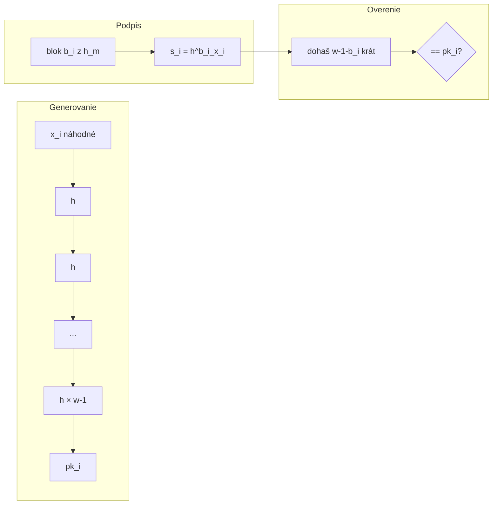

# Q10 — Princíp jednorazového podpisu Winternitz, výhody a nevýhody

## Kľúčové pojmy

- **WOTS** = Winternitz One-Time Signature
- **Winternitzov parameter $w$** — koľko bitov správy spracovávame naraz (typicky $w = 4, 8, 16$)
- **Hašovací reťazec** (hash chain)
- **Kontrolný súčet (checksum)** — bráni „dopredu-haš" útoku
- **WOTS+** — moderná varianta s lepšou bezpečnosťou (používaná v SPHINCS+, XMSS)

## Vysvetlenie

### 10.1 Motivácia

Lamport ([[Q09]]) je jednoduchý, ale **má obrovské kľúče** (16 KB), pretože pre každý **bit** správy potrebujeme samostatný kľúč. Winternitz to optimalizuje: **podpisuje viac bitov naraz** pomocou **hašovacieho reťazca**.

Princíp: namiesto $h(x)$ ako verejnej hodnoty použijeme $h^{w-1}(x)$ (haš aplikovaný $w-1$-krát). Hodnoty zo strednej úrovne reťazca slúžia ako podpis.

### 10.2 Algoritmus pre $w = 256$ (8-bitové bloky)

Označme:
- $h$ — hašovacia funkcia s výstupom $n$ b (SHA-256 → $n = 256$ b),
- $w$ — Winternitzov parameter, napr. $w = 256$ pre 8-bitové bloky,
- $\ell = \lceil n / \log_2(w) \rceil + \ell_{\mathrm{cs}}$ — celkový počet blokov (bloky správy + checksum položky).

**A) Generovanie kľúčov**

**Súkromný kľúč:** $\ell$ náhodných hodnôt $x_1, x_2, \dots, x_\ell$ (každá $n$ b).

**Verejný kľúč:** každú hodnotu zhašujeme **$w-1$ krát**:
$$pk_i = h^{w-1}(x_i) = \underbrace{h(h(\dots h(x_i)))}_{w-1\text{krát}}$$

(Niekedy sa všetky $pk_i$ spoja a zahashujú raz, čím sa získa jediný kompaktný verejný kľúč.)

**B) Podpísanie správy** $m$

1. Vypočítaj haš $H = h(m)$.
2. Rozdeľ $H$ na bloky veľkosti $\log_2(w)$ — napr. pre $w = 256$ na **bajty** $b_1, b_2, \dots, b_k$.
3. Pripoj **kontrolný súčet** $C = \sum (w - 1 - b_i)$ (chráni pred útokom).
4. Pre každý blok $b_i$ aplikuj haš $b_i$ krát na zodpovedajúcu hodnotu súkromného kľúča:
$$s_i = h^{b_i}(x_i)$$
Podpis: $\sigma = (s_1, s_2, \dots, s_\ell)$.

**C) Overenie**

1. Príjemca rozbije $h(m)$ na bloky $b_i$ + vypočíta checksum.
2. Pre každý $s_i$ z podpisu pokračuje v hašovaní **(w − 1 − b_i)-krát**:
$$pk_i' = h^{w-1-b_i}(s_i)$$
3. Porovná $pk_i'$ s verejným kľúčom $pk_i$. Ak všetky sedia → podpis platný.

### 10.3 Prečo kontrolný súčet?

Bez neho by mohol útočník **prelomiť podpis**: vidí podpis pre správu s blokom $b_i$, dohašuje ďalšie kroky a vytvorí platný podpis pre správu, kde má daný blok hodnotu $b_i + k$ pre $k > 0$. Kontrolný súčet zaisťuje, že **zníženie ktoréhokoľvek $b_i$ zvýši checksum** — tak útočník nedokáže podvrhnúť obe časti naraz.

### 10.4 Výhody a nevýhody

✅ **Menšia veľkosť** — pri $w = 16$ je veľkosť kľúčov **8× menšia** než Lamport (pri rovnakej bezpečnosti).
✅ **Postkvantová odolnosť** — len haš funkcia.
✅ **Parametrizovateľný** — voľbou $w$ → kompromis medzi veľkosťou a rýchlosťou.

⚠️ **Vyššia výpočtová náročnosť** — iteratívne hašovanie ($w-1$ krát) je drahšie než jedno hašovanie.
⚠️ **Stále jednorazový** — zakaždým nový kľúčový pár.
⚠️ **Komplexita** — kontrolný súčet treba implementovať správne; chyba znamená kompletný kolaps bezpečnosti.

## Diagram

## Tabuľka / Porovnanie

| | Lamport | **Winternitz (w=16)** | WOTS+ |
|---|---|---|---|
| Veľkosť pk | $2n^2$ b | $\ell n$ b (~8× menšie) | ~rovnaké ako WOTS |
| Veľkosť podpisu | $n^2$ b | $\ell n$ b (~8× menšie) | rovnaké ako WOTS |
| Operácie pri podpise | $n$ hašov (vyberanie) | ~$\ell \cdot w/2$ hašov | rovnaké + bitmasks |
| Operácie pri overení | $n$ hašov | ~$\ell \cdot w/2$ hašov | rovnaké |
| Bezpečnosť pri kvantových útokoch | ✅ | ✅ | ✅ silnejšia |
| Použitie v praxi | Iba historicky | XMSS, LMS, SPHINCS+ | XMSS, SPHINCS+ |

## Callouts

> [!summary] Čo musím vedieť na skúšku
> 1. WOTS = optimalizovaný Lamport — podpisuje **viac bitov naraz**.
> 2. Verejný kľúč = $h^{w-1}(x)$, podpis = medzistredný haš $h^{b_i}(x)$.
> 3. **Nutný kontrolný súčet** proti dopredu-haš útoku.
> 4. **Stále jednorazový**, ale výrazne menší než Lamport.
> 5. Základ pre **XMSS, LMS, SPHINCS+** (postkvantové podpisové schémy).

> [!tip] Ako si to pamätať
> Predstav si **rebríček s w priečkami**. Súkromný kľúč je na zemi ($x$), verejný kľúč na vrchole ($h^{w-1}(x)$). Podpis = poviem ti, **na ktorej priečke som zastavil** ($s = h^{b_i}(x)$). Ty od priečky dohore dôjdeš na vrchol a porovnáš.

> [!warning] Častá chyba
> Vynechať **kontrolný súčet** alebo počítať pripočítateľnú hodnotu zle. Bez checksumu vie útočník jednoducho „zvýšiť" hodnoty blokov dohašovaním a podpis odpovedá inej (vyššej) správe.

> [!example] Príklad — úspora veľkosti
> 256-b haš + $w = 16$ (4-bit bloky):
> - 64 blokov + ~3 checksum položky = $\ell \approx 67$.
> - Veľkosť pk: $67 \cdot 256$ b ≈ 2 KB (oproti 16 KB pre Lamport).

## Flashcards

Q:: Čo je Winternitzov parameter $w$?
A:: Počet bitov správy spracovávaných naraz (resp. dĺžka hašovacieho reťazca = $w - 1$). Väčšie $w$ → menšie kľúče, ale viac hašovania.

Q:: Prečo WOTS potrebuje kontrolný súčet?
A:: Aby útočník nemohol „dohašovať" podpis na podpis vyššej hodnoty bloku. Checksum sa správa opačne — pri zvyšovaní bloku klesá → nedá sa podvrhnúť obe časti súčasne.

Q:: V čom je rozdiel medzi WOTS a Lamportom?
A:: Lamport podpisuje **bit po bite** s dvomi hodnotami v páre. WOTS podpisuje **bloky bitov** pomocou hašovacieho reťazca → výrazne menšie kľúče za cenu pomalšieho výpočtu.

Q:: V akých moderných schémach sa WOTS+ používa?
A:: XMSS, LMS, SPHINCS+ (SLH-DSA NIST štandard 2024). Sú to stateful resp. stateless hash-based podpisové schémy.

## Súvisiace

- [[Q09]] — Lamport (klasický predchodca).
- [[Q06]] — Vlastnosti haša ktoré WOTS využíva.
- [[Q37]] — Postkvantové rodiny (hash-based).
