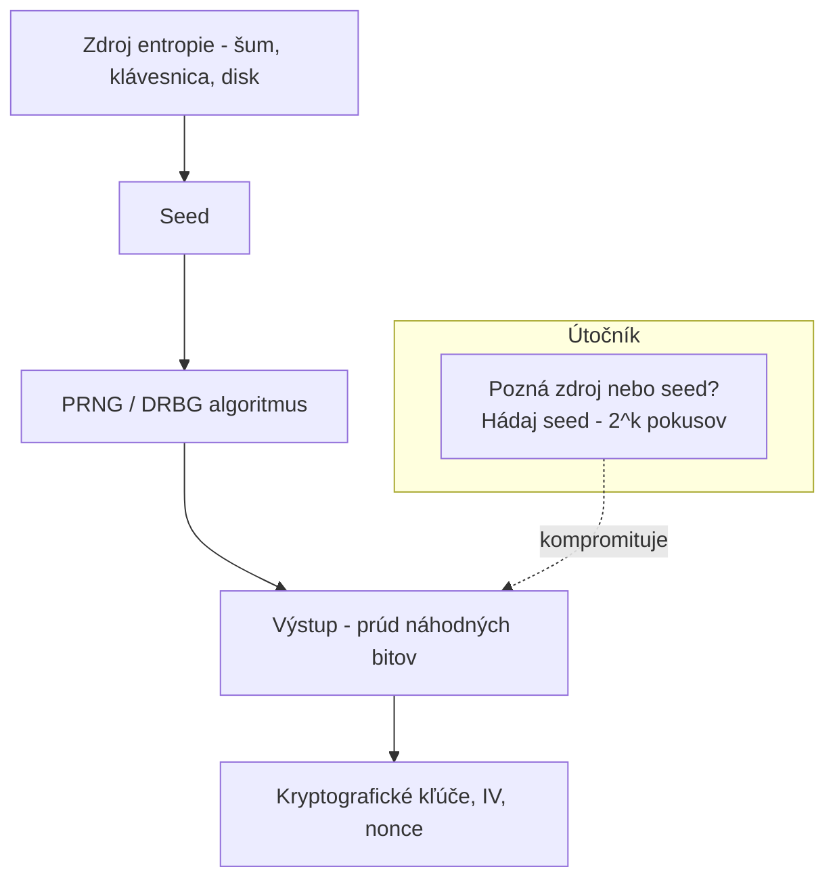

# Q11 — Ako súvisí hodnota entropie s bezpečnosťou kryptografických generátorov náhodných čísel

## Kľúčové pojmy

- **Entropia** $H$ — miera nepredvídateľnosti
- **Shannonova entropia** vs. **min-entropia** $H_\infty$
- **Seed** — vstupná hodnota pre PRNG
- **PRNG / CSPRNG / TRNG** — pseudo / kryptograficky-bezpečný / pravý RNG

## Vysvetlenie

### 11.1 Význam entropie pre kryptografiu

**Entropia** $H$ je v kryptografii **kľúčová miera neurčitosti** zdroja dát. Pre RNG platí: **čím vyššia entropia, tým ťažšie útočníkovi predpovedať výstup**.

Existujú dve hlavné definície:

**Shannonova entropia**
$$H(X) = -\sum_i p_i \log_2 p_i$$
- Vyjadruje **priemerné** množstvo informácie na jednu vzorku.
- Pre kryptografiu je **príliš optimistická** — neberie do úvahy útočníka, ktorý uhádne najpravdepodobnejšiu hodnotu.

**Min-entropia $H_\infty$** (kľúčová pre kryptografiu)
$$H_\infty(X) = -\log_2 \max_i p_i$$
- Zodpovedá pravdepodobnosti **najpravdepodobnejšej** hodnoty.
- Ak má zdroj $n$ bitov, ale min-entropiu $k$ bitov → bezpečnosť je ako pri ideálne náhodnom reťazci dĺžky **iba $k$**.

> [!tip] Príklad rozdielu
> Hod kockou: pravdepodobnosti 1/6 pre 1–5, ale 50% pre 6 (manipulovaná).
> Shannonova entropia: $\approx 1{,}5$ b.
> Min-entropia: $-\log_2(0{,}5) = 1$ b. (Útočník uhádne 6 v 50% prípadov!)

### 11.2 Dopad nedostatočnej entropie

Ak generujeme **256-b kľúč**, ale zdroj entropie poskytne len **40 b skutočnej neurčitosti**:
- Útočník nemusí prehľadávať $2^{256}$ kľúčov,
- stačí mu prehľadať **iba $2^{40}$ seedov** → ~1 bilión, dnes triviálne.

**Dôsledky:**
- **Predvídateľnosť kľúčov** — aj keď je AES bezpečné, slabo náhodný kľúč sa uhádne.
- **Kompromitácia vnútorného stavu** — pri PRNG stačí pri znalosti seedu rekonštruovať celý budúci prúd.

### 11.3 Reálne incidenty

**Debian OpenSSL Bug (2008)**
- Kvôli chybe v patchovaní OpenSSL Debian distribútor odstránil sber entropie zo zásobníka.
- OpenSSL generoval **iba ~32 000 unikátnych SSH kľúčov** pre všetky procesy.
- Útočníci si vygenerovali zoznam a prelomili všetky zranené servery (~milióny SSH kľúčov, certifikátov).

**Android PRNG Bug (2013)**
- Chyba v Java SecureRandom Androidu → slabé soukromé kľúče v Bitcoin peňaženkách.
- Krádeže ~5800 BTC z affected wallet.

**IoT zariadenia — early boot entropy**
- Po štarte nie je dostatok entropie (chýbajú user vstupy, žiadny disk traffic).
- IoT zariadenia generujú **identické / predvídateľné kľúče** → masívne prelomené populácie.

## Diagram

## Tabuľka / Porovnanie

| Typ entropie | Vzorec | Použitie v praxi |
|---|---|---|
| Shannonova | $-\sum p_i \log_2 p_i$ | Teória informácie, kompresia |
| **Min-entropia** | $-\log_2 \max p_i$ | **Kryptografia — určuje bezpečnosť** |
| Rényiho ($\alpha$) | Zovšeobecnenie | Teoretická analýza |

## Callouts

> [!summary] Čo musím vedieť na skúšku
> 1. **Min-entropia** je správna miera (nie Shannon).
> 2. Bezpečnosť kľúča = **min-entropia seedu**, nie dĺžka výstupu.
> 3. Nedostatočná entropia = úplná kompromitácia (Debian 2008, Android 2013).

> [!tip] Ako si to pamätať
> **„Útočník hádha to najpravdepodobnejšie"** — preto min-entropia, nie priemer. Ak je pravdepodobnosť najpravdepodobnejšej hodnoty $p$, bezpečnosť je $-\log_2 p$.

> [!warning] Častá chyba
> Mýliť **dĺžku** kľúča s **bezpečnosťou** kľúča. 256-b kľúč zo zlého RNG má bezpečnosť seedu, nie 256 b.

> [!example] Príklad
> Server generuje TLS súkromné kľúče bezprostredne po štarte. /dev/urandom v Linuxe vráti „náhodné" bity, ale jadro ešte nenazbieralo dostatok entropie → kľúče sú odvodené z malého počiatočného stavu. Ten istý kód na 1000 IoT zariadeniach → 1000 identických kľúčov.

## Flashcards

Q:: Aký je rozdiel medzi Shannonovou entropiou a min-entropiou?
A:: Shannon = priemer informácie. Min-entropia = pravdepodobnosť najpravdepodobnejšej hodnoty. Kryptografia používa min-entropiu, lebo útočník hľadá najpravdepodobnejšiu možnosť.

Q:: Prečo bol Debian OpenSSL Bug taký katastrofálny?
A:: Odstránil sa sber entropie → OpenSSL produkoval len ~32 000 unikátnych SSH kľúčov. Útočníci si predpočítali zoznam a prelomili všetky servery so zranenými kľúčmi.

Q:: Ak má 256-b výstup PRNG min-entropiu seedu 80 b, koľko bitov bezpečnosti to poskytuje?
A:: 80 b — útočník prehľadá $2^{80}$ seedov, nie $2^{256}$ výstupov.

## Súvisiace

- [[Q12]] — Požiadavky na CSPRNG.
- [[Q13*]] — Príklady realizácie CSPRNG.
