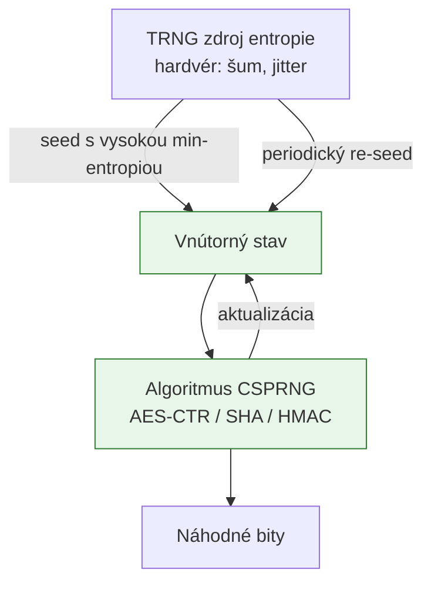

# Q12 — Aké sú požiadavky kladené na kryptograficky bezpečné generátory náhodných čísel

## Kľúčové pojmy

- **CSPRNG** = Cryptographically Secure Pseudo-Random Number Generator
- **Forward / Backward secrecy** v RNG zmysle
- **NIST SP 800-22, Diehard, TestU01** — sady štatistických testov
- **FIPS 140-2/3, AIS 20/31** — certifikačné štandardy

## Vysvetlenie

CSPRNG musí spĺňať **prísnejšie kritériá** než bežné PRNG (napr. pre simulácie). Rozdiel: pre simulácie stačí, aby výstup vyzeral náhodne; pre kryptografiu **nesmie byť predvídateľný ani pri čiastočnej znalosti**.

### 12.1 Štatistické požiadavky

Generátor musí produkovať postupnosti **štatisticky nerozlíšiteľné** od ideálne náhodných:

- **Rovnomerné rozdelenie** — všetky výstupy rovnako pravdepodobné.
- **Nezávislosť** — znalosť predchádzajúcich bitov **nedáva** žiadnu informáciu o budúcich.
- **Štatistické testy:**
  - **NIST SP 800-22** — sada 15 testov (frekvencia, runs, longest-run, FFT, …).
  - **Diehard** / **Dieharder** (George Marsaglia).
  - **TestU01** (Pierre L'Ecuyer) — najprísnejšia.

### 12.2 Kryptografické požiadavky (nepredvídateľnosť)

Toto **odlišuje** CSPRNG od bežných PRNG (napr. Mersenne Twister, ktorý je predvídateľný!):

**A) Odolnosť proti predpovedi (forward secrecy / next-bit test)**
Útočník, ktorý pozná **ľubovoľný počet predchádzajúcich bitov**, **nesmie** byť schopný s pravdepodobnosťou > 50 % uhádnuť **ďalší bit**.

Formálne: neexistuje polynomický algoritmus, ktorý by predikoval ďalší výstup.

**B) Odolnosť proti spätnému odvodeniu (backward secrecy / state compromise extension)**
Ak dôjde ku **kompromitácii vnútorného stavu** generátora v čase $t$, útočník **nesmie** byť schopný odvodiť čísla generované **pred** časom $t$.

Zabezpečuje sa:
- pravidelným **primiešavaním** novej entropie (re-seeding),
- aplikáciou **jednosmerných funkcií** na vnútorný stav.

### 12.3 Implementačné a bezpečnostné požiadavky

- **Vysoká entropia inicializácie** — seed musí pochádzať z kvalitného **TRNG** zdroja (hardvér: tepelný šum, jitter, kvantové javy).
- **Robustnosť** — generátor zostane bezpečný aj keď útočník čiastočne kontroluje **niektoré** zdroje entropie.
- **Bezpečné nakladanie so stavom** — vnútorný stav v chránenej pamäti, secure-erase pri ukončení.
- **Certifikácia:**
  - **FIPS 140-2 / FIPS 140-3** (USA štandard pre kryptografické moduly).
  - **AIS 20 / AIS 31** (Nemecký BSI štandard pre DRBG).
  - **NIST SP 800-90A/B/C** — séria noriem pre RNG dizajn, zdroje entropie, kompozíciu.

### 12.4 Príklady realizácie (prehľad — detail [[Q13]])

- **Blokové šifry v CTR móde:** AES-CTR_DRBG.
- **Hash-based:** Hash_DRBG (na báze SHA-256).
- **HMAC-based:** HMAC_DRBG (najbezpečnejšia z NIST DRBG).
- **Stream cipher:** ChaCha20 v Linux jadre.
- ❌ **Dual_EC_DRBG** — historicky kompromitovaný NSA backdoor (konštanty boli „šité na mieru"), dnes zakázaný.

## Diagram

## Tabuľka / Porovnanie

| Vlastnosť | PRNG (Mersenne, LCG) | **CSPRNG** |
|---|---|---|
| Štatistika | ✅ vyhovuje | ✅ vyhovuje |
| Predpoveď ďalšieho bitu | ❌ Možná pri 624 stavoch (MT) | ✅ Nepredvídateľný |
| Spätné odvodenie | ❌ Triviálne | ✅ Bránená jednosmernou funkciou |
| Periodicita | Veľmi vysoká ($2^{19937}-1$) | Pre praktické účely nekonečná |
| Vhodné pre kryptografiu | ❌ NIE | ✅ ÁNO |

## Callouts

> [!summary] Čo musím vedieť na skúšku
> 1. **Tri kategórie:** štatistika, nepredvídateľnosť, implementácia.
> 2. **Forward secrecy** (= žiadny next-bit test).
> 3. **Backward secrecy** (= štátne kompromitovanie neporušuje minulé výstupy).
> 4. **Štandardy:** NIST SP 800-90A, FIPS 140-3, AIS 20/31.

> [!tip] Ako si to pamätať
> CSPRNG má **dva smery odolnosti**: dopredu (nepredpovedať budúce bity) a dozadu (z aktuálneho stavu nerekonštruovať predchádzajúce). PRNG (Mersenne) zlyhá na **oboch**.

> [!warning] Častá chyba
> **NIKDY** nepoužívať `rand()`, Math.random(), Mersenne Twister pre kryptografiu. V Pythone: `random` ❌ → `secrets`/`os.urandom` ✅. V Jave: `Random` ❌ → `SecureRandom` ✅.

> [!example] Príklad zlyhania
> V hre v poker server používa Math.random() (Mersenne Twister). Útočník vidí pár prvých kariet → matematicky vypočíta vnútorný stav (624 hodnôt stačí na rekonštrukciu) → vie predpovedať všetky budúce karty. CSPRNG by to znemožnil.

## Flashcards

Q:: Aký je rozdiel medzi PRNG a CSPRNG?
A:: PRNG vyhovuje štatisticky, ale je predvídateľný (Mersenne Twister). CSPRNG je dodatočne nepredvídateľný a odolný proti kompromitácii stavu.

Q:: Čo je „next-bit test"?
A:: Test, či existuje polynomický algoritmus, ktorý z prvých $n$ bitov uhádne $(n+1)$-tý bit s pravdepodobnosťou > 50%. CSPRNG ho musí prejsť.

Q:: Aký NIST štandard definuje schválené DRBG?
A:: NIST SP 800-90A (algoritmy: Hash_DRBG, HMAC_DRBG, CTR_DRBG). SP 800-90B = zdroje entropie, 90C = konštrukcie.

Q:: Prečo bol Dual_EC_DRBG stiahnutý zo štandardov?
A:: Konštanty (body na eliptickej krivke) boli zvolené NSA tak, že kto pozná tajnú väzbu, vie predpovedať budúce výstupy. Backdoor odhalený 2013.

## Súvisiace

- [[Q11]] — Prečo je entropia kľúčová pre RNG.
- [[Q13]] — Konkrétne implementácie (CTR_DRBG, ChaCha20, …).
