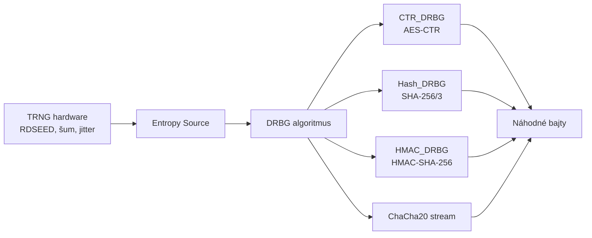

# Q13 — Uveďte príklady realizácie kryptograficky bezpečných generátorov náhodných čísel

## Kľúčové pojmy

- **DRBG** = Deterministic Random Bit Generator (deterministický generátor čerpajúci zo seedu)
- **CTR_DRBG / Hash_DRBG / HMAC_DRBG** — schválené NIST SP 800-90A algoritmy
- **AES-NI** — hardvérová akcelerácia AES v Intel/AMD CPU
- **RDRAND / RDSEED** — Intel hardvérové inštrukcie
- [[concepts/NIST-SP-800-90A]] · [[concepts/AES]] · [[concepts/ChaCha20]]

## Vysvetlenie

V praxi sa CSPRNG realizujú pomocou **robustných primitiv** (blokové šifry, haše, prúdové šifry). Hlavná referencia: **NIST SP 800-90A Rev. 1**.

### 13.1 CTR_DRBG (Counter mode DRBG)

**Princíp:** bloková šifra (najčastejšie **AES**) v **čítačovom režime (CTR)**.

**Fungovanie:**
- Vnútorný stav = `(K, V)` (kľúč + čítač).
- Výstup = `AES(K, V), AES(K, V+1), AES(K, V+2), ...`
- Po vygenerovaní sa stav aktualizuje cez ďalšie volania AES.
- Periodicky sa pridáva nová entropia (re-seed).

**Výhody:** veľmi rýchle (AES-NI inštrukcie procesoru).
**Štandard:** NIST SP 800-90A.

### 13.2 Hash_DRBG

**Princíp:** založený na **jednosmernej hašovacej funkcii** (SHA-2, SHA-3).

**Fungovanie:**
- Stav `V` (a counter `C`).
- Generovanie: opakované hašovanie `V` spolu s čítačom → výstup = haš.
- Aktualizácia: nový stav = `h(V || personalization)`.

**Výhody:** odolnosť proti spätnému odvodeniu vďaka jednosmernosti haša.

### 13.3 HMAC_DRBG

**Princíp:** používa **HMAC** mechanizmus (keyed-hash).

**Fungovanie:**
- Stav `(K, V)`.
- Výstup `V_i = HMAC(K, V_{i-1})`.
- Po generovaní: `K = HMAC(K, V || 0x00); V = HMAC(K, V)`.

**Vlastnosti:**
- **Považovaný za najbezpečnejší** z NIST DRBG schém.
- HMAC dáva silnejšie garancie než čistý haš proti niektorým útokom.
- Štandard pre TLS, kľúčové výmeny.

### 13.4 ChaCha20-based PRNG (Linux, OpenBSD)

**Princíp:** prúdová šifra ChaCha20 (Daniel J. Bernstein) → vstupom je 256-b kľúč + 96-b nonce + 32-b counter, výstupom prúd náhodných bitov.

**Použitie:**
- **Linux jadro** (`/dev/urandom`, `getrandom()` od 4.8) → použiváva **ChaCha20** alebo predtým SHA-1.
- **OpenBSD `arc4random`** (názov je historický — dnes ChaCha20, nie RC4).
- **macOS / iOS** → `arc4random_buf()` → ChaCha20.

**Výhoda:** vynikajúci softvérový výkon (bez HW akcelerácie), konštantný čas.

### 13.5 Dual_EC_DRBG (historicky)

Algoritmus založený na eliptických krivkách:
- Z dvoch bodov $P, Q$ na krivke generuje bity.
- **Kompromis:** ak kto vie skalar $d$ taký, že $P = dQ$, vie predpovedať výstup.
- NSA pravdepodobne vlastnila tento skalar (Snowden 2013).
- **Zákaz:** NIST stiahol algoritmus z SP 800-90A v 2014.

### 13.6 Hardvérové realizácie

**Intel RDRAND / RDSEED**
- CPU inštrukcie poskytujúce prístup k vstavanému RNG.
- **RDSEED** — surová entropia z hardware (TRNG).
- **RDRAND** — výstup CSPRNG (CTR_DRBG nad RDSEED).
- Rýchlosť: ~1 Gb/s.

**ARM, AMD** majú obdobné inštrukcie.

### 13.7 Realizácie na úrovni OS

| OS | API | Backend |
|---|---|---|
| **Linux** | `/dev/urandom`, `getrandom(2)` | ChaCha20 (od 5.18 BLAKE2s) |
| **Windows** | `BCryptGenRandom`, `RtlGenRandom` | CNG (Cryptography Next Gen), AES_CTR_DRBG |
| **macOS / iOS** | `SecRandomCopyBytes`, `arc4random` | ChaCha20 + Fortuna |
| **FreeBSD** | `/dev/random` | Fortuna |

## Diagram

## Tabuľka / Porovnanie

| DRBG | Základ | Rýchlosť | Použitie |
|---|---|---|---|
| **CTR_DRBG** | AES-CTR | Veľmi vysoká (AES-NI) | Windows CNG, HSM |
| **Hash_DRBG** | SHA-256 | Vysoká | NIST štandard, embedded |
| **HMAC_DRBG** | HMAC-SHA-256 | Vysoká | TLS, OpenSSL |
| **ChaCha20** | Stream cipher | Vysoká (no-HW) | Linux, OpenBSD, macOS |
| ~~Dual_EC_DRBG~~ | ECC | Pomalá | ❌ ZAKÁZANÝ |

## Callouts

> [!summary] Čo musím vedieť na skúšku
> Aspoň **3 príklady DRBG** (CTR, Hash, HMAC) + **prúdová ChaCha20** + jeden HW (RDRAND).
> **Dual_EC_DRBG** je výborná zmienka („kompromis NSA").
> NIST SP 800-90A je hlavný štandard.

> [!tip] Ako si to pamätať
> **„C-H-H-CH"** — CTR, Hash, HMAC, ChaCha. Štyri schémy postavené na 4 rôznych primitivách (bloková šifra, haš, HMAC, prúdová šifra).

> [!warning] Častá chyba
> Linuxový **/dev/random** vs. **/dev/urandom** — v moderných jadrách sú **rovnaké** (oba CSPRNG). Mýtus „random je bezpečnejší" je zastaraný; používaj `getrandom()`.

> [!example] Príklad — Linux boot
> 1. Boot loader pošle do jadra `boot_id` (kombo z PCR, RDSEED, hodín).
> 2. Jadro inicializuje **ChaCha20** key.
> 3. Pri každom prerušení (klávesnica, sieť) sa pridáva entropia (mixing).
> 4. `getrandom()` blokuje, kým nie je dostatok entropie (od 5.6).

## Flashcards

Q:: Aké tri DRBG schválil NIST SP 800-90A?
A:: Hash_DRBG, HMAC_DRBG, CTR_DRBG (Dual_EC_DRBG bol pôvodne 4., dnes zakázaný).

Q:: Aký algoritmus používa Linux `/dev/urandom` v moderných jadrách?
A:: ChaCha20 (od kernel 4.8); pred tým SHA-1 + custom mixing.

Q:: Aký je rozdiel medzi RDRAND a RDSEED?
A:: RDSEED = surová entropia z hardvéru (TRNG). RDRAND = výstup interného CTR_DRBG (CSPRNG) seedovaného RDSEEDom.

Q:: Prečo bol Dual_EC_DRBG považovaný za backdoor?
A:: Konštanty (body $P, Q$) boli zvolené NSA. Kto pozná diskrétny logaritmus $d$ s $P = dQ$, vie z 32 B výstupu predpovedať celý ďalší prúd.

## Súvisiace

- [[Q11]] — Entropia ako vstup pre DRBG.
- [[Q12]] — Aké požiadavky musia tieto realizácie spĺňať.
- [[Q08]] — SHA-3 / SHAKE ako možný základ XOF/PRNG.
