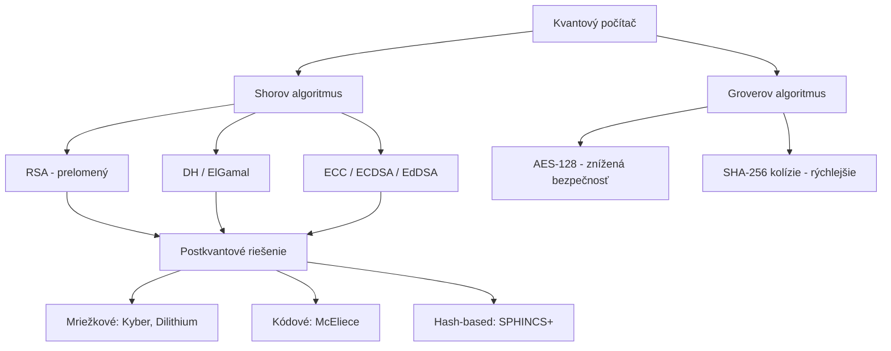

# Q14 — V čom spočíva hrozba využitia kvantových počítačov pre kryptografiu, uveďte príklady

## Kľúčové pojmy

- **Shorov algoritmus** — kvantová faktorizácia v polynomiálnom čase
- **Groverov algoritmus** — kvadratické zrýchlenie brute-force
- **PQC** = Post-Quantum Cryptography
- **„Harvest now, decrypt later"** — útok ukladaním šifry pre budúce dešifrovanie
- **ML-KEM (Kyber)** · **ML-DSA (Dilithium)** — NIST PQC víťazi

## Vysvetlenie

Hrozba kvantových počítačov spočíva v ich schopnosti riešiť určité matematické úlohy v **rádovo kratšom čase** než klasické počítače. Pre existujúce kryptosystémy to znamená **kompletný kolaps bezpečnosti**.

### 14.1 Dva hlavné algoritmy

**A) Shorov algoritmus (1994) — exponenciálne zrýchlenie**

- Rieši **faktorizáciu veľkých čísel** a **diskrétny logaritmus** v **polynomiálnom čase** $O((\log N)^3)$.
- Klasicky: faktorizácia 2048-b RSA = $\sim 2^{112}$ operácií ≈ stovky biliónov rokov.
- Kvantovo: rovnakú úlohu ~hodina (po dosiahnutí ~6 000 logických qubitov, ~milión fyzických).

**Dopad:** prelomenie **VŠETKEJ** dnešnej asymetrickej kryptografie:
- **RSA** ([[Q24]], [[Q33]]) — faktorizácia $N$.
- **Diffie-Hellman, ElGamal** — DLP nad $\mathbb{Z}_p$.
- **DSA, ECDSA, EdDSA** — DLP nad eliptickou krivkou (ECDLP).
- Certifikáty X.509, podpisy, TLS handshake, SSH kľúče.

**B) Groverov algoritmus (1996) — kvadratické zrýchlenie**

- Prehľadávanie **nestrukturovanej databázy** veľkosti $N$ v $O(\sqrt N)$ namiesto $O(N)$.
- Aplikácia: **brute-force** na symetrické šifry a kolízie hašov.

**Dopad:**
- **AES-128 → bezpečnosť 64 b** (Grover ho znevýhodňuje), čo je dnes nedostatočné.
- Riešenie: prejsť na **AES-256** (Grover dá 128 b) — stále bezpečné.
- Kolízie SHA-256 → $2^{85}$ namiesto $2^{128}$ → riešenie: SHA-384 / SHA-512.

> [!warning] Asymetrika vs. symetrika
> Asymetrika: **úplne stratená** (Shor → polynomiálne).
> Symetrika: **prežije** s dlhšími kľúčmi (Grover → len odmocnina).

### 14.2 „Harvest now, decrypt later"

**Kritická hrozba dneška** — útočníci dnes:
1. Odpočúvajú a **ukladajú** šifrovanú komunikáciu (banky, vláda, IP).
2. Dnes ju **nedokážu** dešifrovať.
3. Po príchode kvantového počítača (odhad: 10–25 rokov) ju **spätne** prelomia.

**Praktický dopad:** všetky dlhodobé tajomstvá (zdravotné záznamy, štátne tajomstvá, ekonomické dáta) treba **dnes** šifrovať aj postkvantovo, aj keď ešte nie sú kvantové počítače dostupné.

### 14.3 Konkrétne príklady dopadu

- **HTTPS / TLS** — útočník dnes nahrá zašifrovanú reláciu, neskôr ju dešifruje. Riešenie: hybrid (TLS 1.3 s ECDHE + Kyber).
- **Certifikáty / podpisy** — pri prelomení sa môžu falšovať. Riešenie: kvantovo-bezpečné podpisy (Dilithium, SPHINCS+).
- **VPN, IPsec** — rovnaký princíp ako TLS.
- **Bitcoin / kryptomeny** — kompromitácia ECDSA → útočník vie kradnúť mince zo známych verejných adries.

### 14.4 Riešenie — Postkvantová kryptografia (PQC)

PQC sú **klasické algoritmy** (bežiace na bežnom HW), ktorých bezpečnosť stojí na problémoch ťažkých aj **pre kvantové** počítače:

- **Mriežková** ([[Q38]], [[Q39]]) — Learning With Errors (LWE), SVP.
- **Kódová** ([[Q40]], [[Q41]]) — McEliece, Niederreiter.
- **Hash-based** ([[Q09]], [[Q10]]) — SPHINCS+, XMSS.
- **Multivariate polynomials** — Rainbow, GeMSS.
- **Izogénie** — SIKE (✗ prelomený 2022).

**NIST PQC štandardizácia (2016–2024):**
- **ML-KEM (Kyber)** — KEM, FIPS 203 (2024).
- **ML-DSA (Dilithium)** — signature, FIPS 204.
- **SLH-DSA (SPHINCS+)** — hash-based signature, FIPS 205.
- **FN-DSA (Falcon)** — pripravuje sa.

## Diagram

## Tabuľka / Porovnanie

| Algoritmus | Pre-kvantová bezpečnosť | Po Shorovi | Po Groverovi | Náhrada |
|---|---|---|---|---|
| RSA-2048 | 112 b | ❌ Prelomený | — | ML-KEM, Dilithium |
| ECDSA P-256 | 128 b | ❌ Prelomený | — | EdDSA → Dilithium |
| AES-128 | 128 b | OK | 64 b ⚠️ | AES-256 |
| AES-256 | 256 b | OK | 128 b ✅ | – |
| SHA-256 | 128 b kolízie | OK | 85 b ⚠️ | SHA-384 / SHA3-512 |
| ChaCha20 | 256 b | OK | 128 b ✅ | – |

## Callouts

> [!summary] Čo musím vedieť na skúšku
> 1. **Shor** = exponenciálne zrýchlenie ⇒ koniec **asymetriky** (RSA, DH, ECC).
> 2. **Grover** = kvadratické zrýchlenie ⇒ **dvojnásobok dĺžky kľúča** v symetrike.
> 3. **„Harvest now, decrypt later"** = motivácia migrovať už dnes.
> 4. **PQC** = klasické algoritmy odolné aj proti kvantu (NIST: Kyber, Dilithium, SPHINCS+).

> [!tip] Ako si to pamätať
> **„SHOR = Smashes Hard-Old-RSA"** (rozbije RSA).
> **„GROVER = Grows Roots Of brute-force"** (odmocnina prehľadávania).

> [!warning] Častá chyba
> Veriť, že „kvantový počítač" prelomí AES. **Nie!** AES-256 zostáva bezpečné aj po Groverovi (efektívne 128 b — dostatočné). Padajú **asymetrické** algoritmy postavené na faktorizácii a DLP.

> [!example] Príklad — Bitcoin
> Bitcoinová adresa obsahuje haš verejného kľúča (P2PKH). Pri prvom použití peňaženky sa zverejní celý verejný kľúč ECDSA. Útočník s kvantovým počítačom by zo verejného kľúča vypočítal súkromný (Shor cez ECDLP) a vykradol mince. Adresy, ktoré nikdy nevykonali transakciu, sú stále chránené hašom — ale tie sa rušia pri prvom použití.

## Flashcards

Q:: Aký kvantový algoritmus prelamuje RSA?
A:: Shorov algoritmus — rieši faktorizáciu v polynomiálnom čase.

Q:: Aký dopad má Groverov algoritmus na AES-128?
A:: Znižuje jeho efektívnu bezpečnosť na ~64 b (z $2^{128}$ na $2^{64}$ operácií). Riešenie: prejsť na AES-256.

Q:: Čo znamená „harvest now, decrypt later"?
A:: Útočník dnes zachytáva a ukladá zašifrovanú komunikáciu, ktorú v budúcnosti dešifruje s kvantovým počítačom. Preto treba migrovať na PQC už teraz.

Q:: Vymenuj 3 hlavné rodiny postkvantovej kryptografie.
A:: Mriežková (Kyber, Dilithium), kódová (McEliece), hash-based (SPHINCS+).

## Súvisiace

- [[Q15]] — Kvantová distribúcia kľúčov (alternatíva k PQC).
- [[Q37]] — Postkvantové rodiny detailne.
- [[Q38]] — LWE — základ mriežkovej PQC.
- [[Q40]] — McEliece — kódová PQC.
