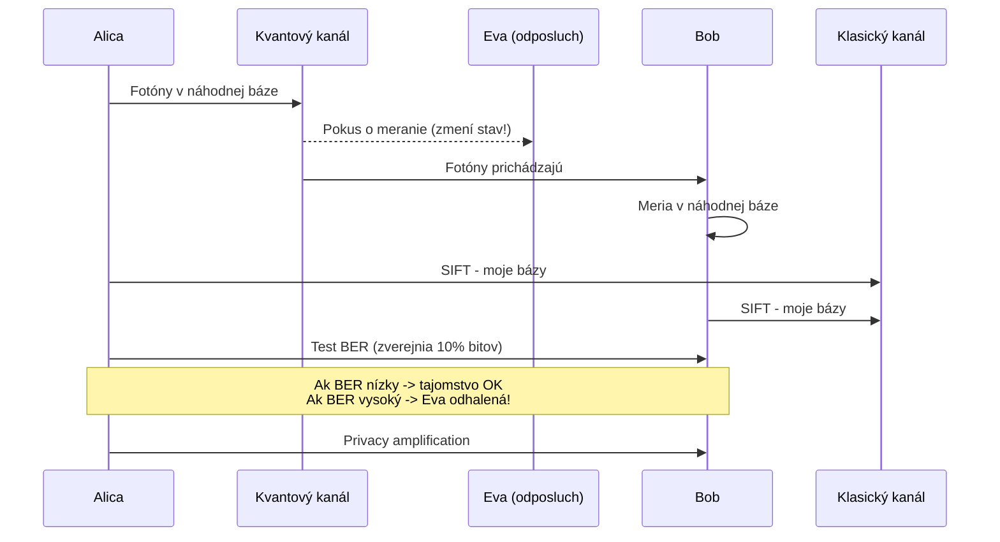

# Q15 — Dôvody použitia QKD, spôsob prenosu informácie, realizačné problémy, protokoly BB84, EPR, COW

## Kľúčové pojmy

- **QKD** = Quantum Key Distribution
- **Qubit** — kvantový bit
- **Heisenbergov princíp neurčitosti** — nemožno súčasne presne merať komplementárne veličiny
- **No-cloning teorem** — neznámy kvantový stav nemožno presne skopírovať
- **Bellove nerovnosti** — test kvantového previazania
- **Eva** — útočník (Eavesdropper)
- **BER** = Bit Error Rate

## Vysvetlenie

**QKD nie je metóda šifrovania dát** — je to technológia pre **bezpečné ustanovenie spoločného tajného kľúča** medzi dvoma stranami s využitím **fyzikálnych zákonov**. Kľúč sa potom použije v klasickej (symetrickej) šifre.

### 15.1 Dôvody použitia QKD

Hlavná motivácia: **bezpodmienečná bezpečnosť** (unconditional / information-theoretic security).

**A) Fyzika namiesto matematiky**
Klasická asymetrika (RSA, ECC) stojí na **predpokladanej** výpočtovej zložitosti. QKD stojí na **dokázaných** fyzikálnych zákonoch.

**B) Detekcia odposluchu**
Akýkoľvek pokus Evy o **meranie** alebo **kopírovanie** kvantového stavu **nevyhnutne zmení** tento stav (Heisenberg, No-cloning). Alica s Bobom to detekujú ako **zvýšené BER**.

**C) Odolnosť voči kvantovým počítačom**
QKD je imúnna voči Shorovi ([[Q14]]) — neopiera sa o faktorizáciu ani DLP.

### 15.2 Spôsob prenosu informácie

Informácia sa kóduje do **qubitov** — najčastejšie **jednotlivé fotóny**. Spôsoby kódovania:

- **Polarizácia** — uhol polarizácie (H/V, +45°/−45°).
- **Fázový posun** — relatívna fáza medzi dvoma optickými pulzami.
- **Time-bin encoding** — čas príchodu fotónu (skoro/neskoro v okne).

### 15.3 Realizačné problémy

⚠️ **Dosah a útlm** — fotóny v optickom vlákne zanikajú. **Klasické zosilňovače nemožno použiť** (No-cloning). Súčasný dosah: **~300 km vlákno, ~1200 km satelit**.

⚠️ **Žiadne kvantové opakovače** — pre dlhšie vzdialenosti sú nutné **trusted nodes**, kde sa kľúč dešifruje a znova zašifruje → bezpečnostné riziko.

⚠️ **Nízka rýchlosť (key rate)** — kbps až Mbps (klasika: Gbps).

⚠️ **Cena a infraštruktúra** — single-photon detektory, chladenie, dedikované optické trasy. Cena: stovky tisíc €.

⚠️ **Autentizácia** — QKD **neautentizuje** strany! Bez **predzdieľaného krátkeho tajomstva** alebo PKI dôjde k **MitM** ([[Q26]]) — Eva sa vydáva za Boba pre Alicu a opačne.

### 15.4 Protokoly QKD

#### BB84 (Bennett & Brassard, 1984)

Prvý a najznámejší. Používa **polarizáciu fotónov** v dvoch **bázach**:
- **Rektangulárna (+)** : 0 = horizontálna, 1 = vertikálna.
- **Diagonálna (×)** : 0 = +45°, 1 = −45°.

**Postup:**
1. **Alica** pošle Bobovi sériu fotónov — pre každý si **náhodne** vyberie bit (0/1) a bázu (+/×).
2. **Bob** pre každý prichádzajúci fotón si **náhodne** vyberie bázu merania.
3. Ak Bob meria v rovnakej báze → správny výsledok. Ak v inej → výsledok je **náhodný** (50% šanca).
4. **Sifting** — Alica a Bob si verejne (cez klasický kanál) povedia, ktoré **bázy** použili (nie výsledky). Ponechajú si len bity, kde sa **bázy zhodovali** (~50%).
5. **Test odposluchu (BER)** — porovnajú malý podiel zostávajúcich bitov. Ak BER < ~11% → bezpečné. Vyššie → Eva!
6. **Error correction + privacy amplification** — opravia chyby a zhustia kľúč pomocou univerzálnej haš funkcie.

#### EPR / Ekert91

Založený na **kvantovom previazaní (entanglement)**.

1. **Zdroj** generuje páry **previazaných fotónov** (Bell states).
2. Jeden ide k Alici, druhý k Bobovi.
3. Obaja merajú v náhodnej báze → výsledky sú **korelované** (ak Alica nameria H, Bob nameria H s daným uhlom).
4. **Test cez Bellove nerovnosti** — ak Eva zasiahla, previazanosť sa porušila a nerovnosti nie sú dodržané.

**Výhoda:** ani Alica ani Bob nepotrebujú dôverovať zdroju.

#### COW (Coherent One-Way) — ID Quantique

Praktický protokol pre optické siete.

1. Alica posiela **sekvencie koherentných pulzov**.
2. Bit 0 a 1 sú kódované **time-bin** (skorý/neskorý pulz).
3. Detekcia Evy: **interferencia** medzi susednými pulzmi.
4. Ak Eva pulz odkloní/zmeria → koherencia sa naruší → **viditeľnosť interferencie** u Boba klesne.

**Výhoda:** vysoká rýchlosť, kompatibilita s existujúcou optikou.

## Diagram

## Tabuľka / Porovnanie

| Protokol | Princíp | Výhody | Nevýhody |
|---|---|---|---|
| **BB84** | Polarizácia + 2 bázy | Najjednoduchší, najpoužívanejší | Vyžaduje single fotóny |
| **EPR (E91)** | Entanglement + Bell test | Device-independent možnosť | Zložitá realizácia (zdroj entaglementu) |
| **COW** | Time-bin + interferencia | Kompatibilný s telekom optikou | Iba unidirekčný |

## Callouts

> [!summary] Čo musím vedieť na skúšku
> 1. **QKD = ustanovenie kľúča**, nie šifrovanie dát.
> 2. Bezpečnosť stojí na **No-cloning** a **Heisenbergovi** — meranie zmení stav.
> 3. **BB84 = polarizácia + 2 bázy**, **EPR = entanglement + Bell**, **COW = time-bin**.
> 4. Limity: dosah ~300 km, autentizácia nutná zvonku, vysoká cena.

> [!tip] Ako si to pamätať
> **„BB84 = 2 Bázy 1984"**. **„EPR = Einstein-Podolsky-Rosen → previazanosť"**. **„COW = Coherent One-Way → kravy chodia v jednom smere"**.

> [!warning] Častá chyba
> Tvrdiť, že QKD je **nepriestrieľná**. Nie je — len **detekuje** odposluch. Aktívny MitM Eva vie obísť QKD, ak strany nie sú navzájom autentizované klasickými prostriedkami (PKI, predzdieľané tajomstvo).

> [!example] Príklad zo života
> Banky v ČR/SK majú QKD linky medzi datacentrami (ID Quantique). Kľúč z QKD → AES-256 šifruje hromadný prenos dát. Po prelomení AES (~100 rokov) by sa BB84 prepojenie aktualizovalo a kľúč zostane bezpečný.

## Flashcards

Q:: Prečo nie je QKD náhradou za asymetriku, ale doplnkom?
A:: QKD ustanovuje len kľúč. Šifrovanie dát zostáva symetrické (AES). Navyše QKD nedáva autentizáciu, takže treba klasické certifikáty alebo predzdieľané tajomstvo.

Q:: Čo je BB84 sifting?
A:: Verejné porovnanie použitých báz — Alica a Bob si ponechajú len bity, kde merali v rovnakej báze (~50% vstupu).

Q:: Aký fyzikálny princíp zaisťuje, že odposluch Evy zmení stav fotónu?
A:: No-cloning teorem (nemožno presne skopírovať neznámy kvantový stav) + Heisenbergov princíp neurčitosti.

Q:: Aký maximálny dosah má súčasná optická QKD?
A:: Cca 300 km vo vlákne (s útlmom). Cez satelit (Micius) ~1200 km. Pre väčšie vzdialenosti nutné trusted nodes.

## Súvisiace

- [[Q14]] — Hrozba kvantových počítačov (QKD je jednou z odpovedí).
- [[Q26]] — MitM útoky, ktoré QKD nerieši samostatne.
- [[Q37]] — PQC ako klasická (nehardvérová) alternatíva k QKD.
