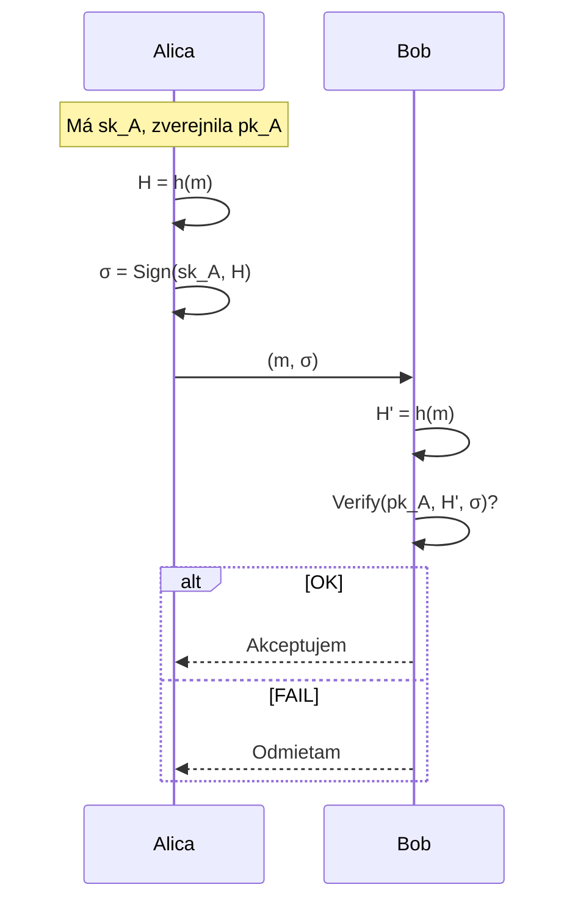

# Q16 — Vysvetlite, čo je digitálny podpis, formálnu definíciu, požiadavky a súčinnosť s hašovacou funkciou

## Kľúčové pojmy

- **Digitálny podpis** — asymetrický mechanizmus pre autentizáciu, integritu a nepopierateľnosť
- **Triplet `(KeyGen, Sign, Verify)`**
- **Hash-then-sign paradigm** — najprv haš, potom podpis
- [[concepts/RSA]] · [[concepts/ECDSA]] · [[concepts/EdDSA]]

## Vysvetlenie

Digitálny podpis je **kryptografický mechanizmus** založený na **asymetrickej kryptografii**, ktorý slúži na overenie:
- **pôvodu** (kto podpísal),
- **integrity** (zmena = neplatný podpis),
- **nepopierateľnosti** (podpisujúci sa nemôže zriecť).

Je **digitálnym ekvivalentom vlastnoručného podpisu**, ale s neporovnateľne vyššou bezpečnosťou.

### 16.1 Formálna definícia

Podpisová schéma $\mathcal{S} = (\text{KeyGen}, \text{Sign}, \text{Verify})$:

**A) Generovanie kľúčov $\text{KeyGen}(1^\lambda)$**
Stochastický algoritmus z bezpečnostného parametra $\lambda$ vygeneruje pár:
$$(sk, pk) \leftarrow \text{KeyGen}(1^\lambda)$$
- $sk$ — **súkromný kľúč** (signing key), musí ostať utajený.
- $pk$ — **verejný kľúč** (verification key), publikovaný.

**B) Podpísanie $\text{Sign}(sk, m)$**
Funkcia berúca súkromný kľúč a správu $m$, vracia podpis:
$$\sigma \leftarrow \text{Sign}(sk, m)$$

**C) Overenie $\text{Verify}(pk, m, \sigma)$**
Deterministická funkcia vracajúca binárnu hodnotu:
$$\text{Verify}(pk, m, \sigma) \in \{\text{true}, \text{false}\}$$

**Korektnosť:** pre platný pár kľúčov a ľubovoľnú správu platí
$$\text{Verify}(pk, m, \text{Sign}(sk, m)) = \text{true}.$$

### 16.2 Požadované vlastnosti

**1) Nefalšovateľnosť (Unforgeability)**
Iba držiteľ $sk$ môže vytvoriť platný podpis. Pre útočníka **bez** $sk$ je výpočtovo neuskutočniteľné podvrhnúť podpis.

Formálne sa hodnotí v modeloch [[Q36]]:
- **EUF-CMA** — pre žiadnu novú správu.
- **SUF-CMA** — žiadny nový podpis (silnejšie).

**2) Autentizácia**
Podpis **jednoznačne identifikuje** odosielateľa (majiteľa $sk$).

**3) Integrita**
Akákoľvek zmena v podpísanej správe — i o **jeden bit** — spôsobí, že overenie zlyhá.

**4) Nepopierateľnosť**
Odosielateľ nemôže neskôr tvrdiť, že podpis nevytvoril, lebo nikto iný nemá prístup k $sk$.

**5) Nepřenosnosť**
Podpis je **pevne spätý** s konkrétnou správou — nemožno ho „odstrihnúť" a pripojiť k inému dokumentu.

### 16.3 Súčinnosť s hašovacou funkciou

V praxi **nepodpisujeme priamo $m$**, ale jej **haš $h(m)$**. Dôvody:

**A) Efektivita**
Asymetrické operácie sú pomalé. RSA podpis 4 kB súboru by trval sekundy. Haš $h(m)$ má fixnú dĺžku (256 b) → konštantný čas podpisu.

**B) Bezpečnosť**
Priame podpisovanie dlhých správ RSA má **matematické slabiny** (multiplikatívny homomorfizmus → tvárnosť, pozri [[Q33]]). Haš tieto závislosti zničí.

**C) Praktická korektnosť**
Veľa schém (DSA, ECDSA) má **fixnú dĺžku vstupu** = veľkosť grupy.

**Postup (hash-then-sign):**

**Alica (odosielateľ):**
1. Vypočíta haš: $H = h(m)$.
2. Podpíše haš svojím súkromným kľúčom: $\sigma = \text{Sign}(sk_A, H)$.
3. Odošle Bobovi pár $(m, \sigma)$.

**Bob (príjemca):**
1. Prijme $(m, \sigma)$.
2. **Nezávisle** vypočíta haš: $H' = h(m)$.
3. Overí: $\text{Verify}(pk_A, H', \sigma) \stackrel{?}{=} \text{true}$.
4. Ak `true` → správa je autentická a nemenená.

## Diagram

## Tabuľka / Porovnanie

| Schéma | Základ | Veľkosť pk | Veľkosť podpisu | Postkvant.? |
|---|---|---|---|---|
| RSA-2048 | Faktorizácia | 256 B | 256 B | ❌ |
| ECDSA P-256 | ECDLP | 64 B | 64 B | ❌ |
| EdDSA Ed25519 | ECDLP (Edwards) | 32 B | 64 B | ❌ |
| Dilithium-3 | Mriežky | 1952 B | 3293 B | ✅ |
| SPHINCS+ | Haš | 32 B | ~17 kB | ✅ |

## Callouts

> [!summary] Čo musím vedieť na skúšku
> 1. Triplet **(KeyGen, Sign, Verify)** + korektnosť.
> 2. **5 vlastností:** nefalšovateľnosť, autentizácia, integrita, nepopierateľnosť, nepřenosnosť.
> 3. **Hash-then-sign** — efektivita + bezpečnosť.
> 4. Aliča → $\sigma = \text{Sign}(sk, h(m))$. Bob → $\text{Verify}(pk, h(m), \sigma)$.

> [!tip] Ako si to pamätať
> **MAC** = symetrický (zdieľaný kľúč) ⇒ nemá nepopierateľnosť.
> **Podpis** = asymetrický (verejný + súkromný) ⇒ má nepopierateľnosť (lebo iba majiteľ má $sk$).

> [!warning] Častá chyba
> Tvrdiť, že podpis **šifruje** správu. **NIE!** Podpis k správe **pridáva** kontrolnú hodnotu. Správa zostáva čitateľná. Pre dôvernosť potrebuješ **šifrovanie** (AES, RSA-OAEP).

> [!example] Príklad
> Stiahneš nový Linux ISO + súbor `SHA256SUMS.asc`. Vstavaný `gpg` overí, že `SHA256SUMS` je naozaj podpísané kľúčom Ubuntu maintainera. Potom porovnáš `sha256sum ubuntu.iso` so súčtom v súbore. Dvojvrstvové: GPG overí súbor sumov, sumy overia ISO.

## Flashcards

Q:: Aký triplet algoritmov definuje digitálny podpis?
A:: $(\text{KeyGen}, \text{Sign}, \text{Verify})$ s korektnosťou $\text{Verify}(pk, m, \text{Sign}(sk, m)) = \text{true}$.

Q:: Prečo sa podpisuje haš, nie celá správa?
A:: Efektivita (haš má fixnú malú dĺžku), bezpečnosť (haš eliminuje matematické slabiny ako multiplikatívny homomorfizmus RSA), kompatibilita (DSA/ECDSA majú fixný vstup).

Q:: Aký kľúč použije Alica pri podpise a aký Bob pri overení?
A:: Alica = svoj **súkromný** kľúč $sk_A$ na podpis. Bob = **verejný** kľúč Aliče $pk_A$ na overenie.

Q:: Aký je rozdiel medzi MAC a digitálnym podpisom v kontexte nepopierateľnosti?
A:: MAC používa zdieľaný kľúč → obe strany ho majú → ani jedna nedokáže preukázať druhej, kto MAC vytvoril. Podpis používa asymetrický pár → len odosielateľ má $sk$ → nepopierateľnosť.

## Súvisiace

- [[Q06]] — Vlastnosti hašovacej funkcie použitej pred podpisom.
- [[Q17]] — Časové razítko ako rozšírenie podpisu.
- [[Q33]] / [[Q34]] — Slabiny raw RSA a padding (OAEP/PSS).
- [[Q35]] — EdDSA: moderný štandard.
- [[Q36]] — Formálne modely bezpečnosti (EUF-CMA, SUF-CMA).
- [[Q42]] — Vzťah k eIDAS a právnemu rámcu.
