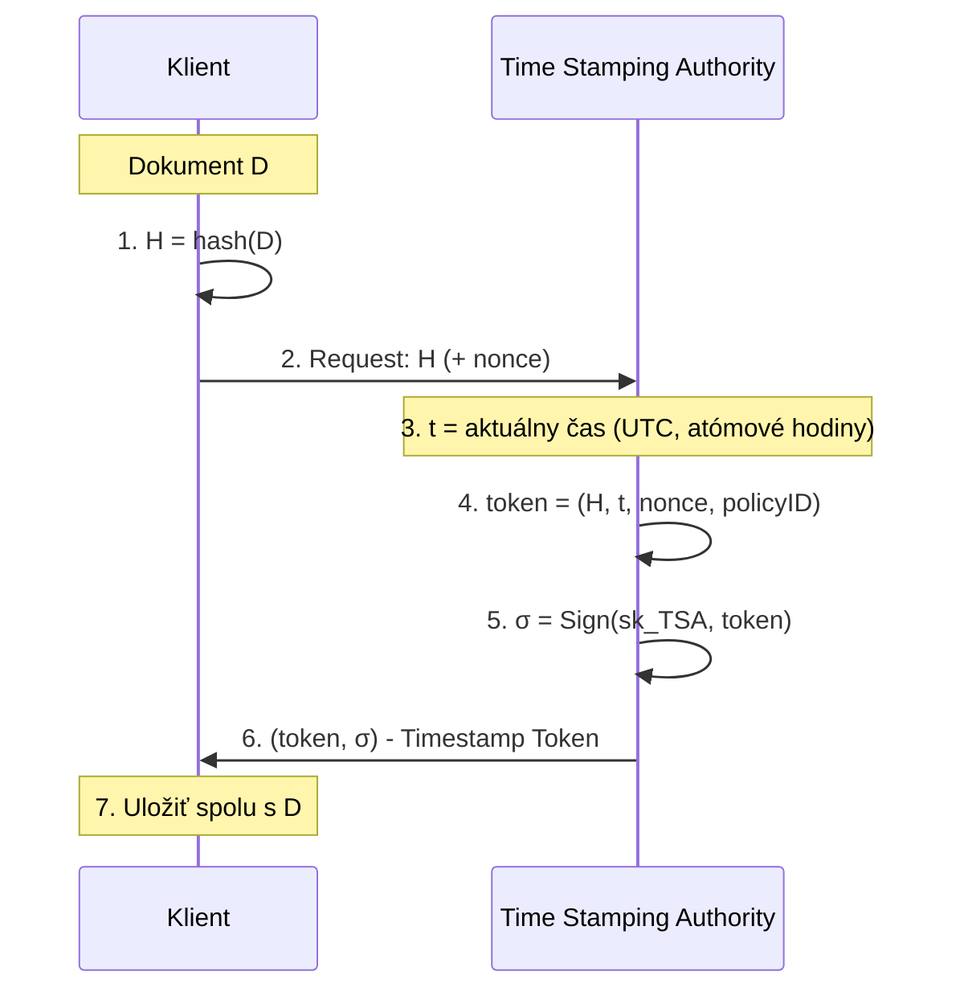
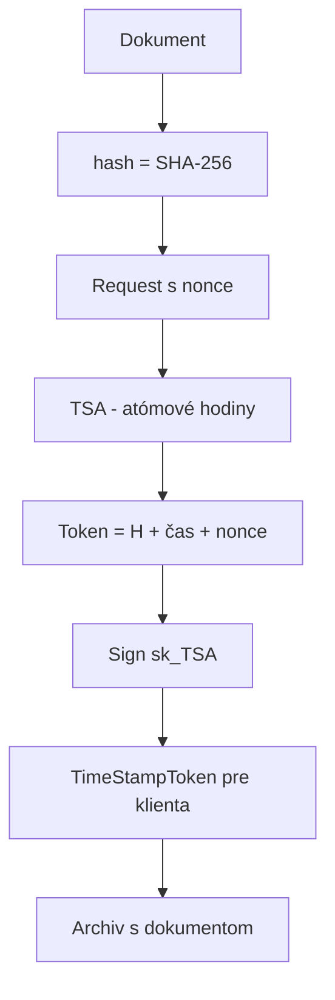

# Q17 — Vysvetlite, čo je časové razítko, ako sa vytvára, aké sú naňho kladené požiadavky

## Kľúčové pojmy

- **Časové razítko (Time Stamp)** — kryptografický dôkaz existencie dát v čase
- **TSA** = Time Stamping Authority (autorita časových razítok)
- **RFC 3161** — IETF štandard protokolu pre časové razítka
- **HSM** = Hardware Security Module
- **UTC** — Coordinated Universal Time

## Vysvetlenie

**Digitálne časové razítko** je kryptografický prostriedok, ktorý **preukazuje existenciu konkrétnych dát** (dokumentu, správy) **v určitom časovom okamihu** a zaisťuje, že od daného okamihu **dáta neboli zmenené**.

### 17.1 Účel

**A) Dôkaz existencie**
Potvrdzuje, že dokument existoval **pred časom uvedeným v razítku**. Rieši problém **„zpětného datování"** — niekto nemôže neskôr tvrdiť, že podpísal o rok skôr.

**B) Dlhodobá validácia**
Umožňuje overiť digitálne podpisy aj **po vypršaní platnosti** (alebo revokácii) certifikátu podpisujúceho.
- Keď certifikát vyprší (typicky 1–3 roky), bez razítka by sa podpis stal neoveriteľným.
- Razítko dokumentuje, že v **dobe podpisu** bol certifikát platný.

**C) Právna váha**
Podľa **eIDAS** ([[Q18]]) majú **kvalifikované elektronické časové razítka** právnu domnienku presnosti dátumu/času a integrity dát.

### 17.2 Spôsob vytvárania (RFC 3161)

Vytváranie prebieha v súčinnosti s **dôveryhodnou treťou stranou — Autoritou časových razítok (TSA)**.

**Kroky podľa RFC 3161:**

1. **Klient** vypočíta haš dokumentu: $H = h(D)$.
2. **Pošle iba haš** (nie celý dokument) → ochrana **súkromia + úspora pásma**.
3. **TSA** prijme haš a pripojí **aktuálny čas** zo synchronizovaného zdroja (atómové hodiny, GPS).
4. TSA vytvorí `TimeStampToken` = $(H, t, nonce, policyID, …)$.
5. TSA tento celok **digitálne podpíše** svojím súkromným kľúčom.
6. TSA pošle podpísaný token späť klientovi.
7. Klient ho **uloží** spolu s dokumentom.

### 17.3 Požiadavky

| Požiadavka | Vysvetlenie |
|---|---|
| **Dôveryhodnosť zdroja času** | UTC synchronizácia, neovplyvniteľný klientom |
| **Integrita** | Akákoľvek zmena v dokumente alebo čase → token neplatný |
| **Nepopierateľnosť** | TSA nesmie poprieť vydanie razítka, ani sa nesmie dať falšovať |
| **Bezpečnosť kľúčov TSA** | Súkromný kľúč TSA chránený v **HSM** (Hardware Security Module) |
| **Štandardizácia** | RFC 3161, ETSI EN 319 421, eIDAS |
| **Auditovateľnosť** | Logovanie všetkých vydaných razítok |
| **Vysoká dostupnosť** | TSA musí byť permanentne online |

### 17.4 Dôležité poznámky

- TSA **nevidí obsah** dokumentu, len jeho haš → **súkromie zachované**.
- Razítko **nie je** dôkaz, že dokument je **správny** — len že **existoval v čase $t$**.
- **Long-term archive** používa nadnárazívanie razítok: keď algoritmus starne, nový razítko podpíše starý (timestamp renewal).

## Diagram

## Callouts

> [!summary] Čo musím vedieť na skúšku
> 1. **Účel:** dôkaz existencie + dlhodobá validácia + právna váha.
> 2. **Protokol:** RFC 3161 — klient pošle **haš** (nie dokument), TSA vráti **podpísaný token** (haš + čas).
> 3. **Požiadavky:** dôveryhodný čas (UTC), integrita, nepopierateľnosť, HSM, štandardizácia.
> 4. **eIDAS:** kvalifikované razítko = právna domnienka presnosti.

> [!tip] Ako si to pamätať
> Predstav si **poštovú pečiatku** — bezpečnostná pečiatka s dátumom. Pošta (TSA) potvrdí, že daný list (haš) existoval **v daný deň**. Pošta nevie obsah listu, len pečiatkuje obálku (haš).

> [!warning] Častá chyba
> Časové razítko **NIE JE** podpis dokumentu — je len **dôkaz času**. Podpis dokumentu od autora zostáva v dokumente; razítko sa naňho pridáva ako **„obal"**.

> [!example] Príklad
> Elektronická faktúra:
> 1. Firma podpíše faktúru (RSA-PSS).
> 2. Pošle haš faktúry TSA.
> 3. TSA vráti `Timestamp Token` s aktuálnym časom.
> 4. Faktúra + podpis + razítko → archív.
> 5. O 5 rokov, keď firemný certifikát už vypršal, razítko stále preukáže: „V čase $t$ podpis bol platný."

## Flashcards

Q:: Čo posiela klient na TSA — celý dokument alebo iba haš?
A:: Iba haš. Zachováva sa tým súkromie (TSA nevidí obsah) a šetrí pásmo.

Q:: Aký IETF dokument štandardizuje protokol pre časové razítko?
A:: RFC 3161 (Time-Stamp Protocol — TSP).

Q:: Prečo je časové razítko dôležité pri dlhodobej archivácii?
A:: Keď vyprší podpisový certifikát, razítko dokumentuje, že v čase podpisu bol certifikát platný a dokument existoval — podpis je teda stále preukázateľný.

Q:: Aký druh hardvéru používa TSA na ochranu svojho podpisového kľúča?
A:: HSM (Hardware Security Module) — fyzicky zabezpečený modul, kľúč ho neopustí v plaintexte.

## Súvisiace

- [[Q16]] — Digitálny podpis, na ktorý razítko nadväzuje.
- [[Q18]] — eIDAS definícia kvalifikovaného časového razítka.
- [[Q42]] — Právny rámec eIDAS detailne.
