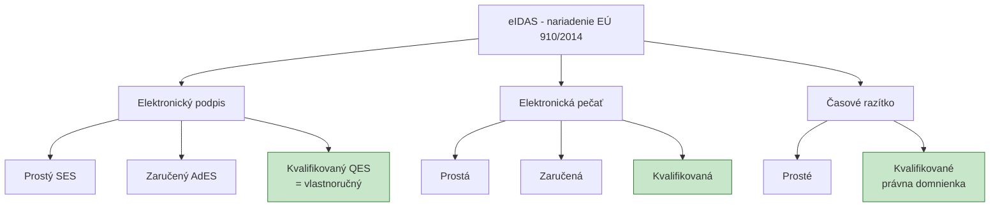

# Q18 — V súvislosti s nariadením eIDAS vysvetlite pojmy: elektronický podpis, elektronická pečať a časové razítko

## Kľúčové pojmy

- **eIDAS** = electronic IDentification, Authentication and trust Services
- Nariadenie EÚ č. **910/2014** (od 1. 7. 2016), aktualizácia **eIDAS 2.0** (2024)
- **SES / AdES / QES** — Simple / Advanced / Qualified Electronic Signature
- **QSCD** = Qualified Signature Creation Device
- **QTSP** = Qualified Trust Service Provider

## Vysvetlenie

**Nariadenie EÚ č. 910/2014 (eIDAS)** definuje **právny rámec** pre elektronickú identifikáciu a služby vytvárajúce dôveru v rámci EÚ. Zaisťuje:
- vzájomné uznávanie elektronických podpisov medzi členskými štátmi,
- jednotné kategórie pre podpisy, pečate a časové razítka,
- právnu váhu pre kvalifikované elektronické dokumenty.

### 18.1 Tri úrovne elektronických podpisov

#### A) Elektronický podpis (prostý — SES)

**Definícia:** dáta v elektronickej podobe, **pripojené k iným elektronickým dátam alebo s nimi logicky spojené**, ktoré podpisujúca osoba používa **k podpísaniu**.

**Príklady:**
- Naskenovaný vlastnoručný podpis vložený do PDF.
- Kliknutie na tlačidlo „Súhlasím" v aplikácii.
- Napísanie mena na konci e-mailu.

**Vlastnosti:**
- ⚠️ Najnižšia preukaznosť.
- ⚠️ Nie je možné jednoznačne preukázať identitu podpisujúceho.
- ✅ Stačí pre bežné nezáväzné akcie.

#### B) Zaručený elektronický podpis (Advanced Electronic Signature — AdES)

Musí spĺňať **štyri** prísnejšie kritériá:

1. **Jednoznačné spojenie** s podpisujúcou osobou.
2. Umožňuje **identifikáciu** podpisujúcej osoby.
3. Vytvorený **dátami pre vytváranie podpisov** (súkromný kľúč), ktoré osoba môže používať **pod svojou výhradnou kontrolou**.
4. **Detekcia akejkoľvek následnej zmeny** dát (integrita).

**Technicky:** typicky **PKI** s **certifikátom** vydaným dôveryhodnou autoritou, podpis cez RSA-PSS / ECDSA / EdDSA.

#### C) Kvalifikovaný elektronický podpis (Qualified — QES)

**Najvyššia úroveň.** Je to zaručený podpis, ktorý je navyše:

1. Vytvorený pomocou **kvalifikovaného prostriedku pre vytváranie podpisov (QSCD)**:
   - čipová karta s podpisom (eID, občiansky preukaz s čipom),
   - USB token (Yubikey s PKCS#11),
   - vzdialené HSM (cloudové „remote signing").
2. Založený na **kvalifikovanom certifikáte**, ktorý vydal **kvalifikovaný poskytovateľ služieb vytvárajúcich dôveru (QTSP)** — v ČR napr. PostSignum, eIdentity; v SK Disig, Slovenská pošta.

**Právny účinok:** podľa eIDAS má **stat. rovnaký účinok ako vlastnoručný podpis** v celej EÚ.

### 18.2 Elektronická pečať (Electronic Seal)

**Obdoba elektronického podpisu** určená pre **právnické osoby** (firmy, úrady).

| | Podpis | Pečať |
|---|---|---|
| Subjekt | Fyzická osoba | Právnická osoba |
| Účel | Prejav vôle | Zaručenie pôvodu / integrity |
| Príklad | „Ja, Martin, podpisujem zmluvu" | „Faktúra od firmy ABC s.r.o." |

**Tri úrovne:** prostá / zaručená / kvalifikovaná — analogicky ako podpisy.

**Príklady použitia:**
- Faktúry zo systémov ERP,
- výpisy z obchodného registra,
- automatické dokumenty z eGov portálov.

### 18.3 Elektronické časové razítko

**Definícia (eIDAS):** dáta v elektronickej podobe, ktoré **prepájajú iné elektronické dáta s konkrétnym časom** a preukazujú, že tieto dáta v danom okamihu **existovali**.

**Detail vytvárania a požiadavky:** [[Q17]].

**Tri úrovne:**
- **Prosté časové razítko** — bez špecifických požiadaviek.
- **Kvalifikované časové razítko** — vydané kvalifikovaným poskytovateľom (QTSA):
  - Musí byť presné (UTC, atómové hodiny).
  - Musí byť integritne chránené.
  - **Užíva právnu domnienku** presnosti dátumu a integrity dát.

## Diagram

## Tabuľka / Porovnanie

| Úroveň | Požiadavky | Právna váha | Príklady |
|---|---|---|---|
| **SES** | Žiadne | Nízka | Sken podpisu, „Súhlasím" |
| **AdES** | Jednoznačnosť, výhradná kontrola, integrita | Stredná | Bežný PDF podpis cez certifikát |
| **QES** | AdES + QSCD + kvalifikovaný cert. | = vlastnoručný | Občiansky preukaz, mojeID |

## Callouts

> [!summary] Čo musím vedieť na skúšku
> 1. eIDAS = nariadenie EÚ 910/2014.
> 2. **Tri úrovne podpisu:** SES, AdES, **QES** (= vlastnoručný).
> 3. **Pečať** = pre právnické osoby, **rovnaká hierarchia**.
> 4. **Kvalifikované časové razítko** = právna domnienka času.
> 5. **QSCD + QTSP** sú technické základy QES.

> [!tip] Ako si to pamätať
> Hierarchia podpisov: **SES → AdES → QES** — od „kliknutia" po „rovnaké ako vlastnoručný".
> **„Q je qualified — najvyššia liga."**

> [!warning] Častá chyba
> Mýliť **podpis** (fyzická osoba) a **pečať** (právnická osoba). Firemný účtovník nemôže „pečatiť" sám — pečať patrí firme; podpis patrí osobe.

> [!example] Príklad
> Pri kúpe nehnuteľnosti elektronicky:
> - **SES** by stačila pre overovanie identity v chate predávajúceho.
> - **AdES** stačí pre nezáväznú rezerváciu.
> - **QES** (kvalifikovaný podpis cez eID) je nutný pre **vklad do katastra** — legálne ekvivalentný papierovému notárovi.

## Flashcards

Q:: Čo je QSCD?
A:: Qualified Signature Creation Device — kvalifikovaný prostriedok pre vytváranie podpisov (čipová karta, USB token, vzdialené HSM).

Q:: Aký je rozdiel medzi elektronickým podpisom a pečaťou?
A:: Podpis = fyzická osoba (prejav vôle). Pečať = právnická osoba (záruka pôvodu/integrity dát organizácie).

Q:: Aký právny účinok má QES podľa eIDAS?
A:: Rovnaký právny účinok ako vlastnoručný podpis v celej EÚ.

Q:: Čo musí byť pre kvalifikované časové razítko?
A:: Vydané kvalifikovaným poskytovateľom (QTSA), presný čas (UTC), integritne chránené. Užíva právnu domnienku presnosti.

## Súvisiace

- [[Q16]] — Digitálny podpis (technický základ).
- [[Q17]] — Časové razítko detailne (RFC 3161).
- [[Q42]] — Vzťah digitálneho podpisu k eIDAS, eIDAS 2.0 a EUDI Wallet.
