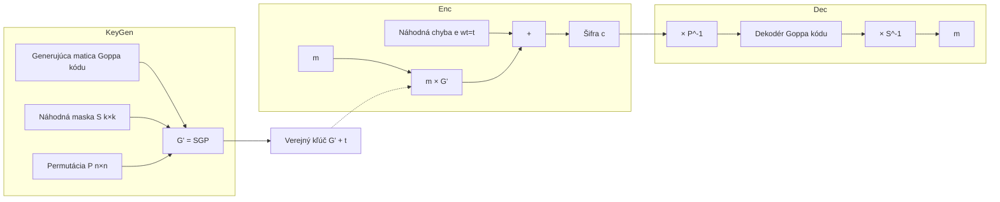

# Q19 — Znázornite, popíšte princíp činnosti asymetrického kryptosystému McEliece

## Kľúčové pojmy

- **McEliece** (Robert McEliece, 1978) — **prvý** asymetrický systém na lineárnych kódoch
- **Goppa kód** — špeciálna trieda lineárnych kódov s efektívnym dekodérom
- **Generujúca matica $G$** — definuje kód
- **Maska $S$** + **permutácia $P$** — „zamaskujú" štruktúru
- **NP-ťažký problém** dekódovania obecného lineárneho kódu

## Vysvetlenie

> [!info] Vzťah k [[Q40]]
> Q19 je **základný úvod** do McEliece, Q40 je **podrobný rozpis** s presnými maticovými operáciami. Obe sa môžu na skúške opýtať — Q19 sa pýta na *princíp*, Q40 na *kroky*.

### 19.1 Základný princíp

McEliece bol **historicky prvý** asymetrický systém založený na **teórii opravných lineárnych kódov**. Dnes je jedným z najvýznamnejších kandidátov **postkvantovej kryptografie (PQC)**.

**Bezpečnosť stojí na:** obtiažnosti **dekódovania obecného lineárneho kódu** — to je **NP-ťažký** problém. Žiadny kvantový algoritmus (Shor) tento problém neefektívne nerieši.

**Hlavná myšlienka:** vziať lineárny kód, pre ktorý **existuje efektívny dekodér** (napr. Goppa kód), a **zamaskovať** ho tak, aby pre vonkajšieho pozorovateľa vyzeral ako **obecný náhodný** lineárny kód (pre ktorý je dekódovanie výpočtovo neuskutočniteľné).

### 19.2 Generovanie kľúčov

**1) Výber kódu**
Zvolí sa binárny $(n, k)$-lineárny **Goppa kód** $\mathcal{C}$, ktorý dokáže opraviť **$t$ chýb**. Nech $G$ je jeho generujúca matica typu $k \times n$.

Typické parametre Classic McEliece (NIST PQC):
- $n = 6960$, $k = 5413$, $t = 119$.

**2) Maska (scrambling)**
Náhodná **binárna regulárna matica** $S$ typu $k \times k$ — slúži na **premiešanie riadkov**.

**3) Permutácia**
Náhodná **permutačná matica** $P$ typu $n \times n$ — slúži na **premiešanie stĺpcov**.

**4) Kľúče**
- **Verejný kľúč:** $G' = S \cdot G \cdot P$ — vyzerá ako náhodná matica lineárneho kódu. Aj parameter $t$.
- **Súkromný kľúč:** trojica $(S, G, P)$ — alebo ekvivalent umožňujúci efektívne dekódovanie $\mathcal{C}$.

### 19.3 Šifrovanie

Alica chce poslať Bobovi správu $m$ (binárny vektor dĺžky $k$):

1. Vypočíta kódové slovo: $c' = m \cdot G'$.
2. Vygeneruje **náhodný chybový vektor $e$** dĺžky $n$ s práve **$t$ jednotkami** (váha $w(e) = t$).
3. Šifrový text: $$c = c' + e = m \cdot G' + e$$

Šifrový text je teda kódové slovo **posunuté o úmyselnú chybu**, ktorú bez znalosti $S, G, P$ nemožno efektívne odstrániť.

### 19.4 Dešifrovanie

Bob obdrží $c$:

1. **Odstránenie permutácie:**
$$c \cdot P^{-1} = (mSG + e) \cdot P^{-1} = (mS)G \cdot P P^{-1} + eP^{-1} = (mS)G + eP^{-1}$$
Vektor $e \cdot P^{-1}$ má **stále váhu $t$** (permutácia len pozície prehadzuje).

2. **Dekódovanie:** Bob použije **efektívny dekodér Goppa kódu** (Patterson algoritmus) → z $(mS)G + eP^{-1}$ získa čisté slovo $(mS)$.

3. **Odstránenie masky:**
$$m = (mS) \cdot S^{-1}$$

### 19.5 Výhody a nevýhody

✅ **Vysoká bezpečnosť** — od 1978 **žiadny prielom** ani klasický, ani kvantový.
✅ **Rýchlosť šifrovania / dešifrovania** — len maticové operácie nad $GF(2)$.

⚠️ **Obrovský verejný kľúč** — pre Classic McEliece-348864: ~262 kB; pre `mceliece8192128`: ~1.3 MB.
⚠️ **Nárast dát** — $|c| = n > k = |m|$ (cca 30% expanze).

## Diagram

## Callouts

> [!summary] Čo musím vedieť na skúšku
> 1. **Goppa kód** + **maska $S$** + **permutácia $P$** = trik.
> 2. **Verejný kľúč** $G' = SGP$, **súkromný** $(S, G, P)$.
> 3. **Šifrovanie:** $c = mG' + e$ s váhou $t$.
> 4. **Dešifrovanie:** odstráň permutáciu → dekóduj Goppa → odstráň masku.
> 5. **Bezpečnosť:** NP-ťažké dekódovanie obecného lineárneho kódu (postkvant.).

> [!tip] Ako si to pamätať
> **„Zamaskovaný Goppa kód"** — Bob vie tajnú štruktúru (Goppa) a vie chyby opraviť. Útočník vidí len „náhodný kód" → nemá efektívny dekodér.

> [!warning] Častá chyba
> Mýliť **maticu $S$** (mieša riadky/kľúčové informácie) a **maticu $P$** (mieša stĺpce/pozície). Pri dešifrovaní sa najprv ruší **$P$** (lebo bola aplikovaná „zvonku"), potom dekóduje, a nakoniec ruší **$S$**.

> [!example] Príklad — prečo bezpečné
> Útočník má $G'$ a $c = mG' + e$. Aby získal $m$, musí dekódovať obecný kód $G'$ (NP-ťažké). Bob vie, že kód je **Goppa** + pozná $S, P$ → vie dekódovať v polynomiálnom čase.

## Flashcards

Q:: Aký matematický problém zabezpečuje McEliece?
A:: NP-ťažký problém dekódovania obecného (náhodne vyzerajúceho) lineárneho kódu.

Q:: Čo obsahuje verejný a čo súkromný kľúč McEliece?
A:: Verejný: $G' = SGP$ + parameter $t$. Súkromný: matice $(S, G, P)$.

Q:: Aké sú typické problémy s McEliece v praxi?
A:: Obrovský verejný kľúč (stovky kB až MB), nárast veľkosti šifrového textu.

Q:: Prečo je McEliece kandidát PQC?
A:: Pretože jeho bezpečnosť stojí na NP-ťažkom probléme (dekódovanie), ktorý nie je efektívne riešiteľný ani kvantovými algoritmami (Shor nefunguje).

## Súvisiace

- [[Q40]] — Detailný rozpis (matice, dimenzie, vzorce).
- [[Q41]] — Niederreiter, duálna varianta s kontrolnou maticou.
- [[Q37]] — Postkvantové rodiny (kódová kryptografia).
- [[Q14]] — Hrozba kvantových počítačov — motivácia PQC.
