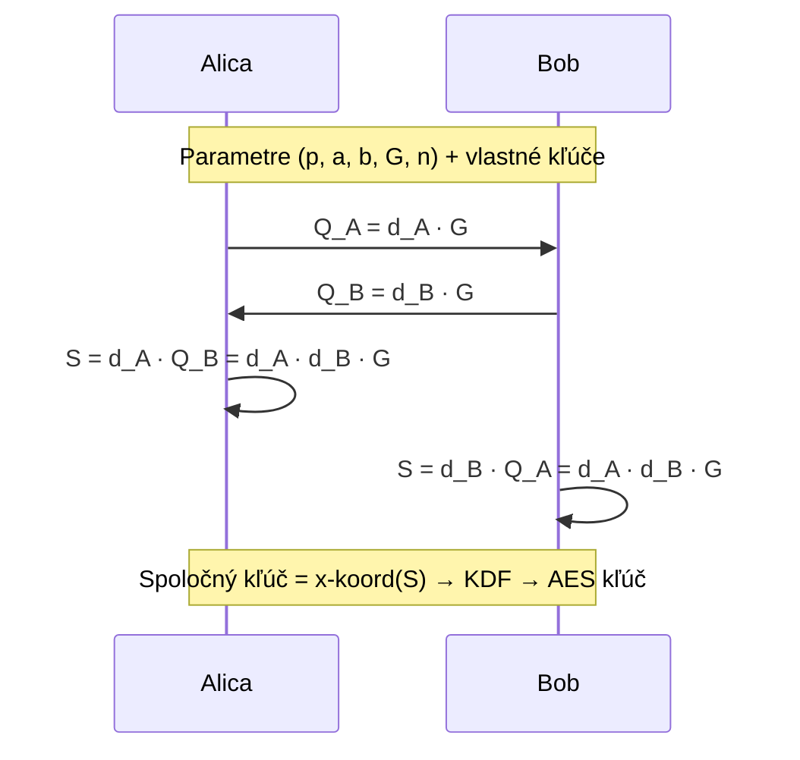

# Q20 — Asymetrický systém ECDH nad Fp: účel, parametre, kľúče, funkcia

> [!warning] Poznámka
> Táto otázka je podľa zadania **zvyčajne preskakovaná na skúške**, ale v poznámkach ju necháme pre úplnosť a kontext.

## Kľúčové pojmy

- **ECDH** = Elliptic Curve Diffie-Hellman
- **Eliptická krivka** $E$ nad konečným telesom $\mathbb{F}_p$
- **ECDLP** = Elliptic Curve Discrete Logarithm Problem
- **Skalárne násobenie** $kP$ — opakované sčítavanie bodov
- **Doménové parametre** $(p, a, b, G, n)$

## Vysvetlenie

**ECDH** je variant **klasického Diffie-Hellmanovho** protokolu, ktorý používa **matematiku eliptických kriviek** nad konečným telesom $\mathbb{F}_p$ (prvočíselné teleso).

### 20.1 Účel

ECDH slúži na **bezpečnú dohodu na zdieľanom symetrickom kľúči** (relačnom) medzi dvoma stranami **cez nezabezpečený kanál**. Vzniknutý kľúč sa potom použije v symetrickej šifre (AES).

**Hlavná výhoda oproti klasickému DH:**
- Pri rovnakej bezpečnostnej úrovni má **podstatne kratšie kľúče**.
- DH-3072 ≈ ECDH-256.
- Rýchlejšia, menšia spotreba energie → vhodné pre **mobilné a IoT** zariadenia.

### 20.2 Doménové parametre

Pred výmenou kľúčov sa **strany dohodnú na verejných parametroch** (typicky štandardizovaných — NIST P-256, Curve25519, …):

| Parameter | Význam |
|---|---|
| $p$ | Veľké prvočíslo → teleso $\mathbb{F}_p$ |
| $a, b$ | Parametre krivky $y^2 = x^3 + ax + b \pmod p$ |
| $G$ | Generujúci bod (base point) na krivke |
| $n$ | Rád bodu $G$ — prvočíselný |

**Podmienka nesingularity:** $4a^3 + 27b^2 \not\equiv 0 \pmod p$.

### 20.3 Výpočet kľúčov

Každá strana si nezávisle vygeneruje:

**Súkromný kľúč** — náhodné celé číslo $d \in [1, n-1]$.
- Alica: $d_A$. Bob: $d_B$.

**Verejný kľúč** — bod na krivke:
- Alica: $Q_A = d_A \cdot G$.
- Bob: $Q_B = d_B \cdot G$.

**Pozn:** výpočet $kP$ (skalárny násobok) je rýchly. Inverzný problém — z $Q$ a $G$ vypočítať $d$ — je **ECDLP** = výpočtovo veľmi ťažký.

### 20.4 Funkcia systému (protokol)

1. Alica a Bob si vymenia verejné kľúče $Q_A$, $Q_B$.
2. Alica vypočíta: $S = d_A \cdot Q_B = d_A \cdot d_B \cdot G$.
3. Bob vypočíta: $S = d_B \cdot Q_A = d_A \cdot d_B \cdot G$.
4. Vďaka **komutativite** skalárneho násobenia obaja získajú **rovnaký bod** $S$.
5. Ako kľúč sa použije **x-súradnica** $S$ (alebo jej haš cez **KDF** — HKDF).

### 20.5 Bezpečnosť

Útočník vidí $Q_A$, $Q_B$, $G$. Musí vypočítať $S = d_A d_B G$ bez znalosti $d_A$ alebo $d_B$.
- To je **ECDH problém** — verí sa, že je rovnako ťažký ako **ECDLP**.
- Pri 256-bitovej krivke (P-256) je bezpečnosť ~128 b.

⚠️ **Kvantová zraniteľnosť:** Shorov algoritmus rieši ECDLP polynomiálne → po príchode kvantových počítačov ECDH **padne**. Pozri [[Q14]], náhrada [[Q38]] (Kyber).

## Tabuľka / Porovnanie

| | Klasický DH | ECDH |
|---|---|---|
| Skupina | $\mathbb{Z}_p^*$ | Body eliptickej krivky |
| Operácia | Modulárne umocňovanie | Skalárne násobenie |
| Veľkosť kľúča (~128 b sec) | 3072 b | 256 b |
| Rýchlosť | Pomalšia | Rýchlejšia |
| Štandardné krivky | – | P-256, Curve25519, secp256k1 |

## Callouts

> [!summary] Čo musím vedieť na skúšku
> 1. **Účel:** ustanovenie spoločného kľúča cez nezabezpečený kanál.
> 2. **Parametre:** $(p, a, b, G, n)$.
> 3. **Kľúče:** súkromný = skalár $d$, verejný = bod $Q = dG$.
> 4. **Spoločné tajomstvo:** $S = d_A Q_B = d_B Q_A = d_A d_B G$.
> 5. Bezpečnosť stojí na **ECDLP**.

> [!tip] Ako si to pamätať
> Predstav si **bicykel** na ceste (krivke). Súkromný kľúč = počet otáčok pedálom. Verejný kľúč = poloha bicykla. Sčítanie smerov dáva ten istý cieľ — bez ohľadu na poradie.

> [!warning] Častá chyba
> ECDH **neautentizuje** strany! Bez autentizácie hrozí MitM — Eva môže vykonať ECDH s oboma stranami a všetko dešifrovať/prešifrovať. Riešenie: certifikáty (TLS) alebo Ephemeral ECDH s podpisom (ECDHE).

> [!example] Príklad
> TLS 1.3 handshake: server pošle `key_share` extension s ephemeral $Q_S = d_S G$ podpísaným RSA/ECDSA certifikátom. Klient pošle svoje $Q_C = d_C G$. Obaja vypočítajú $S = d_S d_C G$. Z `x(S)` cez HKDF sa odvodia šifrovacie kľúče.

## Flashcards

Q:: Čo je ECDLP?
A:: Elliptic Curve Discrete Logarithm Problem — pre daný bod $Q = dG$ na krivke nájsť skalár $d$. Je výpočtovo ťažký na klasických počítačoch, ale Shor ho lúsje na kvantových.

Q:: Aké sú doménové parametre ECDH?
A:: $p$ (prvočíslo), $a, b$ (koeficienty krivky $y^2 = x^3 + ax + b$), $G$ (generujúci bod), $n$ (rád $G$).

Q:: Prečo ECDH-256 ≈ DH-3072 z hľadiska bezpečnosti?
A:: Klasický DH čelí efektívnejším útokom (Index Calculus) než ECDH. ECDLP nemá zatiaľ subexponenciálne útoky, preto stačia menšie kľúče.

## Súvisiace

- [[Q23]] — DLP — všeobecnejší problém.
- [[Q24]] — Faktorizácia (RSA) ako iná trapdoor.
- [[Q14]] — Kvantová zraniteľnosť ECDH.
