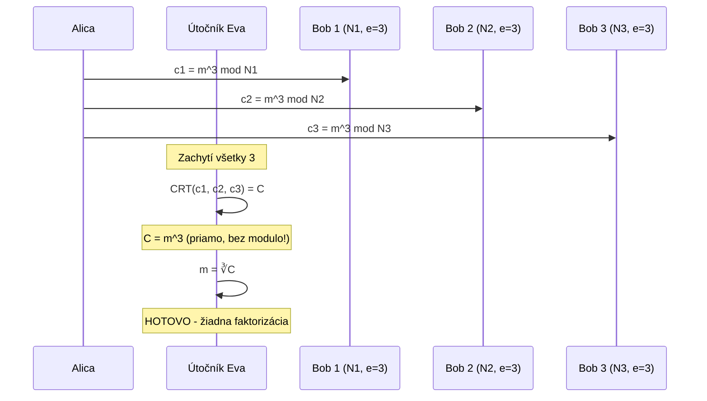

# Q21 — Popíšte Hastadov útok na systém RSA s malým verejným exponentom

## Kľúčové pojmy

- **Hastadov útok** (Johan Håstad, 1985) — broadcast attack na RSA
- **Malý verejný exponent $e$** — typicky $e = 3$
- **CRT** = Chinese Remainder Theorem (Čínska veta o zvyškoch)
- **RSA-OAEP** — padding ako obrana

## Vysvetlenie

### 21.1 Princíp útoku

**Hastadov broadcast útok** zneužíva situáciu, keď je **rovnaká správa $m$** odoslaná **viacerým príjemcom**, ktorí všetci používajú **rovnaký malý verejný exponent $e$** (typicky $e = 3$).

**Scenár:** Alica posiela identickú správu $m$ trom príjemcom s verejnými kľúčmi $(N_1, 3), (N_2, 3), (N_3, 3)$.

Útočník zachytí tri šifrové texty:
$$c_1 = m^3 \pmod{N_1}$$
$$c_2 = m^3 \pmod{N_2}$$
$$c_3 = m^3 \pmod{N_3}$$

**Predpoklad:** moduly $N_1, N_2, N_3$ sú po dvoch nesúdeliteľné (čo je pri správne generovaných RSA kľúčoch takmer isté).

**Krok 1 — CRT:** Útočník použije **Čínsku vetu o zvyškoch** na nájdenie unikátneho čísla $C$ v rozsahu $[0, N_1 N_2 N_3 - 1]$ splňujúceho:
$$C \equiv m^3 \pmod{N_i} \quad i = 1, 2, 3$$

**Krok 2 — kľúčová úvaha:** Pretože $m < N_i$ pre všetky $i$, platí:
$$m^3 < N_1 N_2 N_3$$

Číslo $C$ nájdené cez CRT je tiež menšie ako $N_1 N_2 N_3$, takže:
$$C = m^3 \quad (\text{ako celé číslo, bez modulo!})$$

**Krok 3 — odmocnina:** Útočník jednoducho vypočíta **klasickú tretiu odmocninu** $C$ nad reálnymi číslami (Newtonova metóda):
$$m = \sqrt[3]{C}$$

**Bez nutnosti faktorizovať modul!**

### 21.2 Pre $e = 3$ — koľko šifier stačí?

Pre $e = 3$ stačia **3 zachytené šifrové texty**. Vo všeobecnosti pre verejný exponent $e$ stačí **$e$ šifrových textov**.

### 21.3 Hastadovo zovšeobecnenie

Håstad dokázal, že útok funguje aj keď **správy nie sú identické**, ale majú **lineárnu závislosť**:
$$m_i = a_i \cdot m + b_i$$

(Napr. obsahujú **fixné ID príjemcu** alebo **časové razítko**.)

Ak Alica posiela $m_1, m_2, \dots, m_k$ a útočník pozná koeficienty $a_i, b_i$ → vie rekonštruovať $m$, ak má aspoň $k \geq e$ šifrových textov.

### 21.4 Obrana proti útoku

**A) Bezpečný padding — RSA-OAEP** ([[Q34]])
RSA-OAEP **pridá ku správe náhodný seed** pred šifrovaním. Aj keď je správa rovnaká, zašifrované hodnoty sú vždy iné → CRT nedá $m^3$ priamo.

**B) Väčší verejný exponent**
Štandardný $e = 65537 = 2^{16} + 1$:
- Stále rýchly (len 17 bitov, takže pár modulárnych umocnení).
- Útok by potreboval **> 65 000 zachytených šifier** s rovnakou správou → prakticky nemožné.

**C) Striktné používanie RSA-OAEP / PKCS#1 v2.x**
Nikdy nepoužívať „raw RSA" (učebnicové).

## Diagram

## Callouts

> [!summary] Čo musím vedieť na skúšku
> 1. **Scenár:** rovnaká správa, malý $e$ (=3), viac príjemcov.
> 2. **Trik:** CRT zlúči 3 šifry, $m^3 < \prod N_i$ → odmocnina celých čísel.
> 3. **Obrana:** OAEP padding (randomizácia) + $e = 65537$.

> [!tip] Ako si to pamätať
> **„Tri rovnaké šifry s $e=3$ → CRT → odmocnina"**. Útok nepotrebuje faktorizáciu! Je to **algebraický** trik, nie kryptoanalytický.

> [!warning] Častá chyba
> Veriť, že malé $e$ je „bezpečné, lebo modulo $N$ je obrovské". Áno, $m^3 \mod N$ vyzerá náhodne pre **jednu** šifru. Ale **CRT zo troch šifier** prebije modulo a vidíš $m^3$ ako celé číslo.

> [!example] Príklad
> Banka pošle rovnakú reklamnú správu trom zákazníkom, každý má svoj RSA kľúč s $e=3$. Útočník zachytí všetky tri TLS spojenia (ak nepoužívajú PFS). CRT spojí šifry, odmocnina → plaintext. Riešenie: TLS_RSA → TLS_ECDHE_RSA (s PFS).

## Flashcards

Q:: Koľko šifrových textov stačí pre Hastadov útok pri $e = 3$?
A:: Tri (vo všeobecnosti $e$ šifier).

Q:: Aký matematický nástroj Hastadov útok používa?
A:: Čínsku vetu o zvyškoch (CRT) na zlúčenie šifier modulo rôznych $N_i$.

Q:: Aké sú dve hlavné obrany proti Hastadovmu útoku?
A:: 1) RSA-OAEP padding (randomizácia šifrovania). 2) Veľký verejný exponent $e = 65537$.

Q:: Ako Hastad zovšeobecnil útok pre neidentické správy?
A:: Ak sú $m_i = a_i m + b_i$ (lineárne závislé) a útočník pozná koeficienty, vie rekonštruovať $m$ s $e$ šiframi.

## Súvisiace

- [[Q24]] — Faktorizácia (iný útok na RSA).
- [[Q33]] — Slabiny raw RSA.
- [[Q34]] — RSA-OAEP ako obrana.
