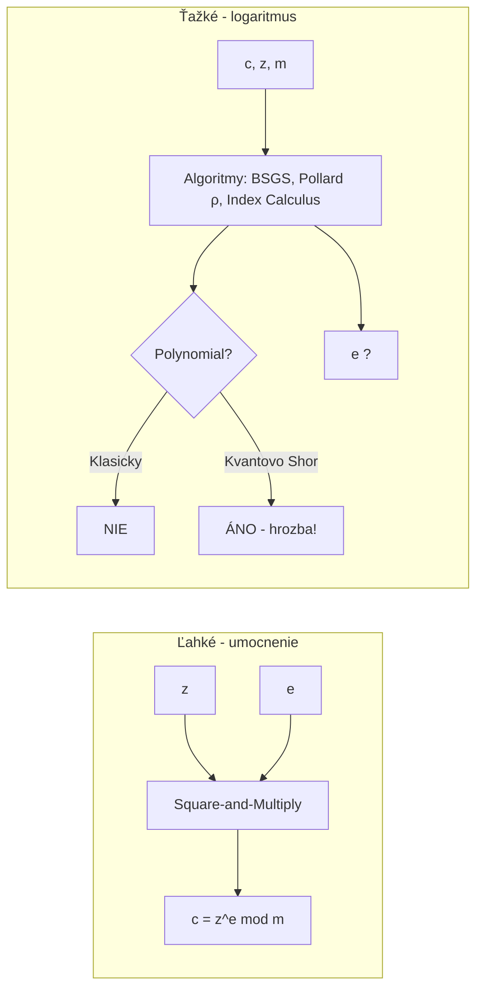

# Q23 — Vzťah $c \equiv z^e \pmod m$ — o aký matematický problém ide, prečo je ťažký, kde sa využíva

## Kľúčové pojmy

- **DLP** = Discrete Logarithm Problem (problém diskrétneho logaritmu)
- **Jednosmerná funkcia** (one-way function)
- **Square-and-Multiply** — rýchly algoritmus pre umocňovanie
- **Index Calculus** — najlepší klasický útok na DLP nad $\mathbb{Z}_p^*$
- **Pohlig-Hellman, Baby-step Giant-step, Pollard $\rho$** — ďalšie algoritmy

## Vysvetlenie

### 23.1 Identifikácia problému

Vzťah:
$$c \equiv z^e \pmod m$$

Ak poznáme $c$, $z$, $m$ a hľadáme $e$, ide o **problém diskrétneho logaritmu (DLP)** v multiplikatívnej grupe celých čísel modulo $m$:
$$e = \log_z c \pmod{\text{ord}(z)}$$

### 23.2 Prečo je to (ťažký) matematický problém?

DLP vykazuje typické vlastnosti **jednosmernej funkcie**:

**Dopredný smer (umocňovanie) — ľahký**
Ak poznáme $z$ a $e$, vypočítať $c = z^e \mod m$ je veľmi rýchle — aj pre obrovské čísla.
- Algoritmus **Square-and-Multiply:** namiesto $e-1$ násobení stačí $\sim \log_2 e$ operácií.
- Príklad: $z^{2^{1000}} \mod m$ → ~1000 modulárnych umocnení (sekundy).

**Inverzný smer (logaritmus) — ťažký**
Z $c$, $z$, $m$ vypočítať $e$ je výpočtovo **extrémne náročné**:
- **Pre náhodne zvolené veľké prvočíslo $m$** (typicky 2048–3072 b) **neexistuje** algoritmus v polynomiálnom čase.
- Najlepší klasický útok: **Index Calculus** so subexponenciálnou zložitosťou $\exp(O(\log m^{1/3}))$.
- Pre **eliptické krivky** (ECDLP) je ešte ťažší — neexistuje Index Calculus → musí stačiť Pollard $\rho$ s plne exponenciálnou zložitosťou $O(\sqrt n)$.

### 23.3 Kryptografické systémy založené na DLP

| Systém | Použitie | DLP nad čím |
|---|---|---|
| **Diffie–Hellman (DH)** | Výmena kľúčov | $\mathbb{Z}_p^*$ |
| **ECDH** ([[Q20]]) | Výmena kľúčov | Eliptická krivka |
| **ElGamal** | Šifrovanie + podpis | $\mathbb{Z}_p^*$ |
| **DSA** | Podpis | Podgrupa $\mathbb{Z}_p^*$ |
| **ECDSA** | Podpis | Eliptická krivka |
| **EdDSA** ([[Q35]]) | Podpis | Twisted Edwards |
| **Schnorr** ([[Q32]]) | Podpis, identifikácia | Podgrupa $\mathbb{Z}_p^*$ |

### 23.4 Kvantová zraniteľnosť

⚠️ **Shorov algoritmus** rieši DLP (aj ECDLP) v polynomiálnom čase. Pri postavení dostatočne veľkého kvantového počítača **všetky uvedené systémy padnú**. Pozri [[Q14]], náhrada [[Q38]] (mriežková kryptografia).

## Diagram

## Tabuľka / Porovnanie

| Algoritmus | Zložitosť | Použitie |
|---|---|---|
| **Square-and-Multiply** (dopredu) | $O(\log e)$ | Rýchle umocnenie |
| **Brute-force** | $O(p)$ | Naivné, nemožné pri veľkých p |
| **Baby-step Giant-step** | $O(\sqrt p)$ | Generická grupa |
| **Pollard $\rho$** | $O(\sqrt p)$ | Pamäťovo úsporné |
| **Index Calculus** | $\exp(O(\log p^{1/3}))$ | Iba $\mathbb{Z}_p^*$, nie EC |
| **Shor (kvantovo)** | $O((\log p)^3)$ | Všetko padá |

## Callouts

> [!summary] Čo musím vedieť na skúšku
> 1. Vzťah $c = z^e \mod m$, hľadáme $e$ → **DLP**.
> 2. **Ľahký dopredu** (Square-and-Multiply), **ťažký späť** (klasicky subexponenciálne).
> 3. Bezpečnosť: **DH, ElGamal, DSA, ECDSA, EdDSA, Schnorr**.
> 4. **Shor** ho prelomí na kvantových počítačoch.

> [!tip] Ako si to pamätať
> **DLP = „diskrétny logaritmus"** — keby sme pracovali nad reálnymi číslami, log je triviálny ($\log_2 8 = 3$). Ale modulo $m$ je „skok" cyklický a hodnoty sa „premiešavajú" → nedá sa použiť bisekcia ako pri reálnom log.

> [!warning] Častá chyba
> Mýliť DLP nad $\mathbb{Z}_p^*$ a ECDLP nad eliptickou krivkou. ECDLP je **bezpečnejšie pri rovnakej dĺžke** — neexistuje preňho Index Calculus. Preto ECDH-256 ≈ DH-3072.

> [!example] Príklad
> Diffie-Hellman: $p = 23$, generátor $g = 5$, súkromné $a = 6$, $b = 15$.
> $A = 5^6 \mod 23 = 8$, $B = 5^{15} \mod 23 = 19$.
> Spoločný $K = 19^6 = 8^{15} = 2 \mod 23$.
> Útočník vidí $g=5, A=8, p=23$ → musí vyriešiť $5^a \equiv 8 \pmod{23}$. Pri $p = 23$ vie hneď ($a = 6$). Pri $p$ s 2048 bitmi je to výpočtovo neuskutočniteľné.

## Flashcards

Q:: O aký matematický problém ide vo vzťahu $c \equiv z^e \pmod m$, ak hľadáme $e$?
A:: Problém diskrétneho logaritmu (DLP).

Q:: Prečo je DLP považovaný za ťažký problém?
A:: Pre veľký prvočíselný modul $m$ neexistuje polynomický klasický algoritmus. Najlepší známy (Index Calculus) má subexponenciálnu zložitosť.

Q:: Aký kvantový algoritmus prelomí DLP?
A:: Shorov algoritmus — pracuje v polynomiálnom čase.

Q:: Vymenuj 3 kryptosystémy stavané na DLP.
A:: Diffie-Hellman, ElGamal, DSA / ECDSA / Schnorr / EdDSA (ľubovoľné tri).

## Súvisiace

- [[Q20]] — ECDH (DLP nad eliptickou krivkou).
- [[Q24]] — Faktorizácia ako iná trapdoor.
- [[Q32]] — Schnorrov podpis postavený na DLP.
- [[Q14]] — Kvantové prelomenie DLP.
