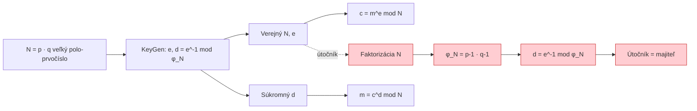

# Q24 — Aký kryptografický systém sa opiera o problém faktorizácie? Popíšte problém faktorizácie a uveďte príklad prelomenia

## Kľúčové pojmy

- **Faktorizácia** — rozklad zloženého čísla na prvočíselné súčinitele
- **Trapdoor one-way function** — jednosmerná funkcia s „padacími dvierkami"
- **Eulerova funkcia $\varphi(N)$** — počet čísel ≤ N nesúdeliteľných s N
- **RSA** = Rivest-Shamir-Adleman (1977)
- **GNFS** = General Number Field Sieve (najlepší klasický algoritmus)

## Vysvetlenie

### 24.1 Definícia problému faktorizácie

**Celočíselná faktorizácia** spočíva v nájdení **prvočíselného rozkladu** zloženého čísla $N$:
$$N = p_1^{a_1} \cdot p_2^{a_2} \cdot \dots \cdot p_k^{a_k}$$

V kryptografii sa typicky pracuje s **polo-prvočíslami** (semi-primes):
$$N = p \cdot q$$
kde $p, q$ sú veľké prvočísla podobnej veľkosti (~1024 b každé pre 2048-b modul).

**Vlastnosti:**

- **Dopredu (násobenie):** $N = p \cdot q$ veľmi rýchlo, aj pre 1024-b čísla.
- **Späť (faktorizácia):** **extrémne ťažké** — pre dostatočne veľké $N$ neexistuje klasický algoritmus v polynomiálnom čase.

Toto je **trapdoor one-way function**: trapdoor = znalosť činiteľov $p, q$.

### 24.2 Najlepšie známe algoritmy faktorizácie

| Algoritmus | Zložitosť | Použiteľný do |
|---|---|---|
| Trial division | $O(\sqrt N)$ | malé $N$ |
| Pollard $\rho$ | $O(N^{1/4})$ | ~60 cifr |
| Quadratic Sieve (QS) | $\exp(\sqrt{\log N \log\log N})$ | ~110 cifr |
| **General Number Field Sieve (GNFS)** | $\exp(O((\log N)^{1/3}))$ | **dnes najlepší** |
| **Shor (kvantovo)** | $O((\log N)^3)$ | budúcnosť — koniec RSA |

**Rekord:** RSA-829 (250 desať. cifr ≈ 829 b) faktorizované v 2020 (Boudot et al.) — ~2700 CPU-rokov.

### 24.3 Kryptosystémy založené na faktorizácii

**A) RSA (Rivest–Shamir–Adleman, 1977)**
- Najpoužívanejší asymetrický systém: šifrovanie + podpisy.
- $N = pq$, $\varphi(N) = (p-1)(q-1)$, $e \cdot d \equiv 1 \pmod{\varphi(N)}$.
- Šifrovanie: $c = m^e \mod N$. Dešifrovanie: $m = c^d \mod N$.

**B) Rabinov kryptosystém** ([[Q31]])
- $c = m^2 \mod N$. Bezpečnosť **dokázateľne ekvivalentná** faktorizácii.
- Nevýhoda: 4 možné dešifrovania.

**C) Paillier (homomorfné šifrovanie)**
- Aditívne homomorfizmus → vhodné pre e-voľby a privacy-preserving computation.

### 24.4 Útok faktorizáciou na RSA (príklad)

Bezpečnosť RSA stojí na predpokladanej obtiažnosti faktorizácie. Keď útočník faktorizuje $N$, systém **úplne padá**:

**Krok 1 — Faktorizácia**
Útočník použije GNFS / Shor a získa $p, q$ z verejne dostupného $N$.

**Krok 2 — Výpočet Eulerovej funkcie**
$$\varphi(N) = (p-1)(q-1)$$

**Krok 3 — Výpočet súkromného kľúča**
Súkromný kľúč $d$ je multiplikatívna inverzia $e$ modulo $\varphi(N)$:
$$d = e^{-1} \pmod{\varphi(N)}$$
(Rozšírený Euklidov algoritmus, ms.)

**Krok 4 — Kompromis**
Útočník dešifruje akúkoľvek zachytenú správu:
$$m = c^d \pmod N$$

Tiež môže **podvrhnúť podpis** ako keby bol majiteľ kľúča.

### 24.5 Reálny príklad: RSA-768 (2009)

- 768-b modul → 232 desatinných cifr.
- Faktorizovaný v 2009 (Kleinjung et al.) — **2,5 roka** CPU času.
- Po tomto NIST odporučil minimum **2048 b** (až 3072 b pre nové systémy).

## Diagram

## Callouts

> [!summary] Čo musím vedieť na skúšku
> 1. **Faktorizácia $N = pq$** = trapdoor pre RSA.
> 2. Klasicky: GNFS, subexponenciálne. **Kvantovo: Shor** v polynomiálnom čase.
> 3. **Útok na RSA cez faktorizáciu:** $N → p,q → \varphi(N) → d$ — systém padá úplne.
> 4. RSA-768 prelomený 2009, dnes minimum **2048 b**.

> [!tip] Ako si to pamätať
> RSA stojí na **jednom riadku matematiky**: ak vieš faktorizovať $N$, vieš všetko. To je **dôvod**, prečo budujeme RSA na ťažko-faktorizovateľných číslach (dve veľké prvočísla podobnej veľkosti).

> [!warning] Častá chyba
> Veriť, že RSA-1024 je „stále bezpečné". NIE — od ~2030 je hraničné. NIST už odporúča minimum 2048 b, pre 30+ rokov očakávanej životnosti **3072 b** alebo prejsť na **postkvantové KEM (Kyber)**.

> [!example] Príklad — malý RSA
> $p = 11, q = 13 → N = 143, \varphi(N) = 120$.
> $e = 7, d = 7^{-1} \mod 120 = 103$. Verejný $(143, 7)$, súkromný $103$.
> Útočník vidí $N = 143$ → triviálne faktorizuje $p = 11, q = 13$ → $\varphi = 120$ → $d = 103$. Padá za pár ms.

## Flashcards

Q:: Aký najlepší klasický algoritmus rieši faktorizáciu?
A:: General Number Field Sieve (GNFS) so subexponenciálnou zložitosťou.

Q:: Aký kvantový algoritmus prelomí RSA?
A:: Shorov — rieši faktorizáciu v polynomiálnom čase.

Q:: Aký je postup útoku na RSA, ak útočník dokáže faktorizovať $N$?
A:: $N → p, q → \varphi(N) = (p-1)(q-1) → d = e^{-1} \mod \varphi(N)$. So $d$ dešifruje a podpisuje.

Q:: Aký kryptosystém má dokázateľne ekvivalentnú bezpečnosť faktorizácii?
A:: Rabinov kryptosystém.

## Súvisiace

- [[Q21]] — Iný útok na RSA bez faktorizácie (Hastad).
- [[Q23]] — Druhá trapdoor: DLP.
- [[Q31]] — Rabinov systém — dokázateľná ekvivalencia faktorizácii.
- [[Q33]] — Slabiny raw RSA.
