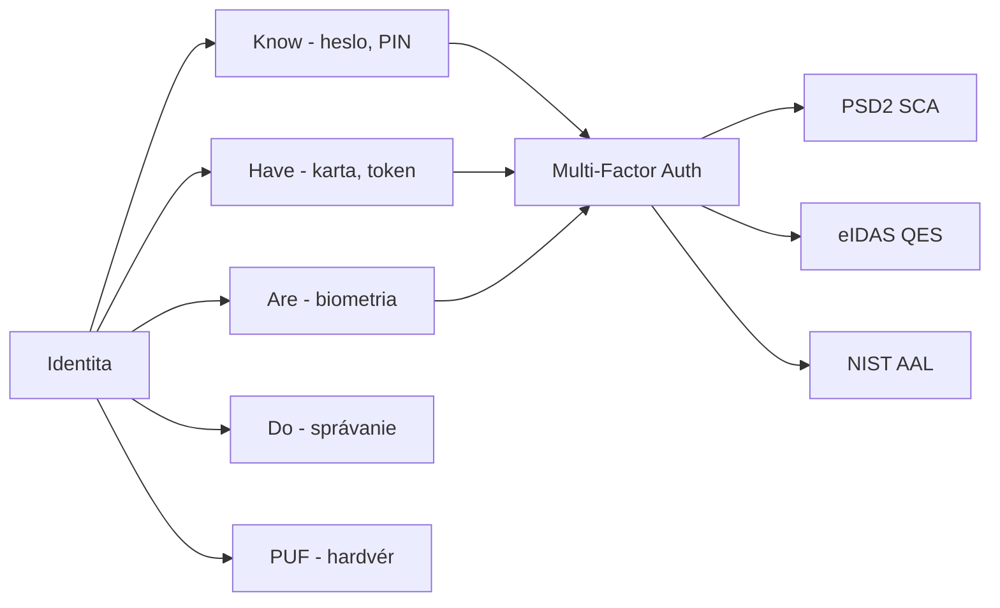

# Q25 — Pomocou čoho možno overiť identitu entity? Kritériá výberu autentizačnej metódy

## Kľúčové pojmy

- **Autentizácia** vs. **autorizácia** (kto si vs. čo môžeš)
- **MFA / 2FA** — Multi/Two-Factor Authentication
- **PUF** = Physical Unclonable Function
- **FAR / FRR** — False Acceptance / False Rejection Rate (biometria)
- **eIDAS, PSD2, NIST 800-63** — regulácie

## Vysvetlenie

**Autentizácia** je proces **overenia deklarovanej identity** entity (používateľa, zariadenia, procesu). Identitu možno overiť pomocou niekoľkých **faktorov** — kategórií dôkazov.

### 25.1 Faktory overenia identity

**1) Znalosť tajnej informácie (Something you know)**
Entita preukazuje, že **vie** určité tajomstvo.
- Príklady: **heslo**, **PIN**, kontrolná otázka, passphrase.
- Slabiny: dá sa zabudnúť, ukradnúť (phishing), uhádnuť (brute force).

**2) Vlastníctvo predmetu (Something you have)**
Entita preukazuje vlastníctvo **fyzického alebo logického tokenu**.
- Príklady: **čipová karta**, **HW token** (YubiKey), mobil (SMS, push, TOTP), autentizačný kľúč v súbore.
- Slabiny: dá sa stratiť, ukradnúť, klonovať (slabé karty).

**3) Biometrické charakteristiky (Something you are)**
Unikátne **fyzické vlastnosti** entity.
- Príklady: **odtlačok prsta**, **sken očnej dúhovky**, geometria tváre (FaceID), DNA.
- Slabiny: nie sú revokovateľné (ak ukradnú odtlačok, máš problém na celý život).

**4) Behaviorálne charakteristiky (Something you do)**
Špecifické **správanie** entity.
- Príklady: **dynamika písania** na klávesnici, **rozpoznanie hlasu**, štýl chôze, mouse dynamics.
- Slabiny: variabilita (nálada, choroba), nižšia presnosť.

**5) Fyzické neklonovateľné funkcie (PUF)**
Pre **hardware** — využitie unikátnych fyzikálnych odchýlok pri výrobe čipu.
- Príklad: SRAM PUF — pri zapnutí má každý čip jedinečný vzor počiatočných hodnôt.
- Použitie: IoT, čipové karty bez stored keys.

### 25.2 Multi-faktorová autentizácia (MFA)

**Kombinácia minimálne dvoch rôznych faktorov** z vyššie uvedených kategórií.

| Typ | Príklad |
|---|---|
| **1FA** | Heslo |
| **2FA** | Heslo + SMS kód |
| **MFA** | Heslo + YubiKey + odtlačok prsta |

> [!warning] Pozor: dva faktory rovnakej kategórie nie sú 2FA!
> Heslo + bezpečnostná otázka = stále len **„something you know"**. Reálna 2FA musí kombinovať **rôzne kategórie**.

**Regulačné požiadavky:**
- **PSD2** (bankovníctvo EÚ) — povinné Strong Customer Authentication (SCA) = 2FA.
- **eIDAS** — kvalifikovaný podpis vyžaduje min. 2FA (čipová karta + PIN).
- **NIST 800-63** — Authenticator Assurance Levels (AAL1-3).

### 25.3 Kritériá výberu autentizačnej metódy

| Kritérium | Vysvetlenie | Príklad rozhodnutia |
|---|---|---|
| **Bezpečnosť** | Aké kritické sú dáta? Aké útoky odoláme? | Banka: nutné MFA + FIDO2 |
| **Použiteľnosť (UX)** | Rýchlosť, frustrácia, error rate | FaceID > písanie 12-znak hesla |
| **Náklady** | Pořízenie + prevádzka | HW tokeny ~30 € / kus + správa |
| **Kontext použitia** | Prostredie, fyzické podmienky | Rukavice → nie odtlačok prsta |
| **Legislatíva** | eIDAS, PSD2, GDPR, sektorové normy | Banka v EÚ → SCA |
| **Spoľahlivosť** | FAR / FRR pri biometrii | FaceID FAR ~1 / 1 000 000 |

**FAR** (False Acceptance Rate) — pravdepodobnosť, že systém **prijme** neoprávneného. (Hodne zlé!)
**FRR** (False Rejection Rate) — pravdepodobnosť, že **odmietne** oprávneného. (Frustrácia.)
**EER** (Equal Error Rate) — bod, kde FAR = FRR.

## Diagram

## Tabuľka / Porovnanie

| Faktor | Bezpečnosť | Použiteľnosť | Náklady | Revokovateľnosť |
|---|---|---|---|---|
| Heslo | Nízka | Stredná | Nulové | ✅ Zmeň heslo |
| SMS OTP | Stredná | Vysoká | Nízke | ✅ |
| TOTP (app) | Vysoká | Vysoká | Nízke | ✅ |
| HW token (FIDO2) | Veľmi vysoká | Vysoká | Stredné | ✅ |
| Odtlačok prsta | Stredná-vysoká | Veľmi vysoká | Nízke (vstavané) | ❌ |
| FaceID | Vysoká | Veľmi vysoká | Vstavané | ❌ |
| Hlas | Stredná | Vysoká | Nízke | ❌ |

## Callouts

> [!summary] Čo musím vedieť na skúšku
> 1. **5 faktorov:** know, have, are, do, PUF.
> 2. **MFA** = kombinácia **rôznych kategórií**.
> 3. **Kritériá:** bezpečnosť, UX, náklady, kontext, legislatíva, spoľahlivosť.
> 4. **FAR/FRR** pri biometrii.

> [!tip] Ako si to pamätať
> **„KHAaD"** — **K**now, **H**ave, **A**re (you), **a**lebo **D**o (behavior). + **P**UF pre hardvér. Znalosť → vlastníctvo → identita (biometria) → správanie.

> [!warning] Častá chyba
> Tvrdiť, že **„dlhšie heslo = MFA"**. Nie — MFA vyžaduje **rôzne typy** faktorov. Dlhé heslo je stále len jeden faktor.

> [!example] Príklad
> Internet banking: prihlásenie cez heslo (know) + push notifikácia v mobilnej app (have). Pri platbe nad 30 € navyše PIN do mobilnej app (know — ale samostatne uložený). Toto spĺňa PSD2 SCA.

## Flashcards

Q:: Aké sú 4 hlavné faktory autentizácie?
A:: Know (znalosť), Have (vlastníctvo), Are (biometria), Do (behaviorálne charakteristiky). + 5. PUF pre hardvér.

Q:: Prečo sú „heslo + bezpečnostná otázka" len 1FA?
A:: Lebo obe sú „something you know" — patria do tej istej kategórie. MFA vyžaduje **rôzne** kategórie.

Q:: Čo je FAR a FRR v biometrii?
A:: FAR = False Acceptance Rate (prijatie neoprávneného — bezpečnostná chyba). FRR = False Rejection Rate (odmietnutie oprávneného — UX chyba).

Q:: Prečo je biometria problematická z hľadiska revokovateľnosti?
A:: Odtlačok prsta / dúhovka sa nemení. Ak útočník získa biometrické dáta (data breach), používateľ ich nemôže „zmeniť" tak ako heslo.

## Súvisiace

- [[Q26]] — Autentizačné protokoly (ako sa to v praxi prenáša).
- [[Q43]] — Ideové návrhy: autentizácia vzdialeného prístupu.
