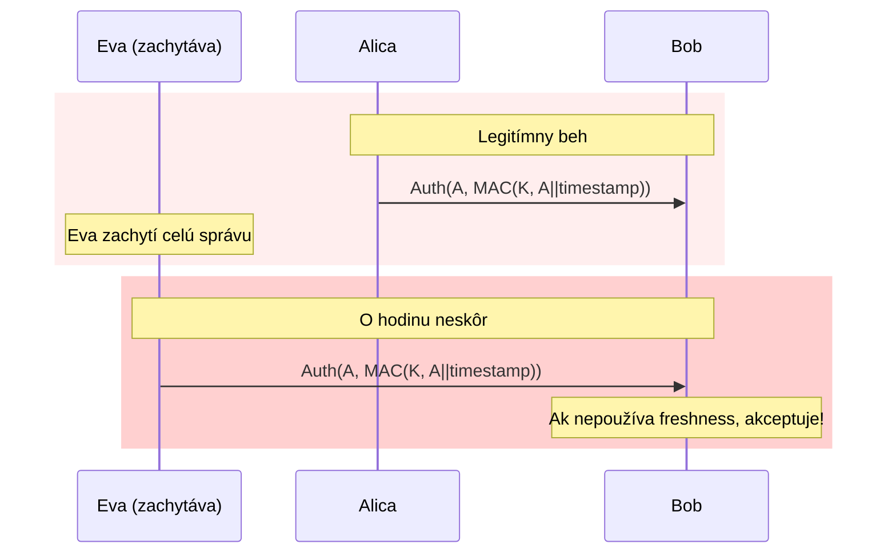

# Q26 — Na akom princípe pracujú autentizačné protokoly? Premenné parametre a útoky

## Kľúčové pojmy

- **Prover / Verifier** — strana preukazujúca / overujúca
- **Nonce** = Number used ONCE
- **Replay attack, MitM, parallel session, reflection** — typy útokov
- **Challenge-response** princíp

## Vysvetlenie

### 26.1 Princíp autentizačných protokolov

Autentizačné protokoly slúžia na overenie **identity entít** (používateľov, serverov) v komunikačnej sieti. Pracujú na princípe **výmeny správ**, ktoré preukazujú identitu pomocou **kryptografických mechanizmov**.

**Základné princípy:**

**A) Preukazovanie znalosti tajomstva (zero-knowledge or close)**
Prover preukazuje Verifierovi, že **pozná tajomstvo** (kľúč, heslo), **bez toho aby ho priamo poslal**.
- Príklady: challenge-response, Schnorr identifikačný protokol ([[Q32]]), Zero-Knowledge Proofs.

**B) Využitie kryptografických primitív**
- Symetrické šifrovanie (Kerberos),
- Hašovacie funkcie (challenge ↔ hash(secret || challenge)),
- MAC, HMAC,
- Digitálne podpisy (TLS, SSH).

**C) Časové a stavové aspekty**
- Overenie prebieha v **reálnom čase** (živá relácia, nie historický záznam).
- Žiadny replay starých správ.

**Typy:**

- **Jednosmerné** — len jedna strana sa autentizuje (klient → server pri prihlasovaní).
- **Vzájomné (mutual authentication)** — obe strany si overia identitu navzájom (mTLS, EAP-TLS).

### 26.2 Premenné parametre (Parametre čerstvosti)

Aby boli protokoly **odolné voči replay útokom**, používajú **parametre čerstvosti (freshness parameters)**:

**A) Nonce (Number used ONCE)**
- Náhodné alebo pseudonáhodné **jednorazové číslo**.
- Druhá strana ho musí zahrnúť do odpovede (napr. v haši alebo šifre).
- Tým preukáže, že odpoveď bola vytvorená **v aktuálnej relácii**.

**B) Časové razítka (Timestamps)**
- Aktuálny čas zahrnutý v správe.
- Príjemca overí, či zpráva prišla v **definovanom časovom okne** (napr. ±5 min).
- ⚠️ Vyžaduje **synchronizáciu hodín** medzi entitami (NTP).

**C) Sekvenčné čísla (Sequence numbers)**
- Čítače správ. Každá správa má unikátne, postupne rastúce číslo.
- Detekcia chýbajúcich alebo opakovaných správ.
- Použitie: TLS rekordy, IPsec.

### 26.3 Útoky na autentizačné protokoly

**1) Replay attack (útok zopakovaním)**
Útočník zachytí platnú zprávu z minulej komunikácie a **pošle ju neskôr znovu**, aby sa vydával za legitímnu entitu.
- Obrana: nonce, timestamps, sequence numbers.

**2) Man-in-the-Middle (MitM)**
Útočník sa **vkladá medzi** Alicu a Boba, zachytáva a prípadne upravuje správy.
- Alica verí, že komunikuje s Bobom, a opačne. Eva číta / mení obsah.
- Obrana: silná vzájomná autentizácia, certifikáty PKI, fingerprint verifikácia.

**3) Parallel session attack**
Útočník otvorí **niekoľko paralelných** relácií a využíva **challenge z jednej** na získanie platnej **odpovede v druhej**.
- Príklad: Bob pošle nonce $N_B$; Eva spustí druhý protokol s Bobom a pošle mu $N_B$ ako svoj challenge; Bob jej dá odpoveď; tú Eva použije v pôvodnej relácii.

**4) Reflection attack**
Útočník pošle Verifierovi jeho **vlastnú challenge späť**, čím donúti Verifiera, aby sa nevedomky autentizoval útočníkovi.
- Obrana: identita preverera v každej správe (asymetrické challenge-response).

**5) Interleaving attack**
Kombinácia správ z **rôznych behov protokolu** na oklamanie účastníka.

**6) Útok s orákulom**
Útočník využíva legitímnych účastníkov ako **„oracle"** na vykonanie kryptografických operácií (napr. dešifrovať daný ciphertext, podpísať nonce) a získa tak informácie použiteľné na útok.

## Diagram — Replay attack

## Tabuľka — Obrana

| Útok | Obrana |
|---|---|
| Replay | Nonce, timestamp, sequence number |
| MitM | Vzájomná autentizácia + PKI, fingerprint check |
| Parallel session | Identita v challenge, role-aware protokol |
| Reflection | Asymetrický challenge (klient ≠ server) |
| Interleaving | Stavová logika protokolu, session ID |
| Oracle | Limity volaní, padding (OAEP, PSS), proof-of-possession |

## Callouts

> [!summary] Čo musím vedieť na skúšku
> 1. **Princíp:** preukázanie znalosti tajomstva bez jeho odhalenia.
> 2. **3 typy freshness:** nonce, timestamp, sequence number.
> 3. **6 útokov:** replay, MitM, parallel, reflection, interleaving, oracle.
> 4. Každému útoku **vedz protijed** (obranu).

> [!tip] Ako si to pamätať
> **„Replay zápas → nonce"**. **„MitM medzi nami → certifikáty"**. **„Reflection = zrkadlo"** — odzrkadlí mu jeho vlastnú výzvu.

> [!warning] Častá chyba
> Mýliť **MitM** (aktívne sa vkladá) s **odpočúvaním** (pasívne). MitM môže meniť obsah, eavesdrop len číta.

> [!example] Príklad
> SSH má fingerprint kontrolu (Trust On First Use, TOFU). Pri prvom spojení sa zobrazí fingerprint servera. Ak sa neskôr zmení → varovanie „MAN-IN-THE-MIDDLE ATTACK!". Bez tejto kontroly by Eva mohla vykonať MitM s vlastným SSH kľúčom.

## Flashcards

Q:: Čo je nonce a na čo slúži?
A:: Number used once — náhodné jednorazové číslo. Slúži na ochranu pred replay útokom (každá zpráva je unikátna).

Q:: Aký je rozdiel medzi MitM a replay útokom?
A:: MitM je aktívna intercepcia v reálnom čase (zachytáva + upravuje). Replay je opakovanie skoršie zachytenej platnej správy.

Q:: Čo je reflection attack?
A:: Útočník pošle Verifierovi jeho vlastnú challenge späť ako svoju. Verifier nevedomky odpovie, čím dáva útočníkovi platný proof.

Q:: Ako sa bráni replay útok pri použití symetrickej kryptografie?
A:: Zahrnutím nonce / timestamp / sequence number do správy chránenej MAC-om.

## Súvisiace

- [[Q25]] — Faktory autentizácie (čo sa vlastne preukazuje).
- [[Q27]] — BAN logika analyzuje tieto protokoly.
- [[Q05]] — Threat modelling kategórie.
