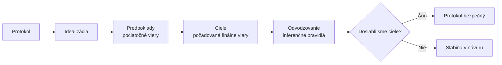

# Q27 — Na čo sa využíva BAN logika, čím sa zaoberá, o akú logiku ide?

> [!warning] Poznámka
> Otázka je podľa zadania **zvyčajne preskakovaná**, ale tvorí základ pre [[Q28]]-[[Q30]].

## Kľúčové pojmy

- **BAN logika** = **B**urrows–**A**badi–**N**eedham logic (1989)
- **Epistemická modálna logika** — logika znalostí a presvedčenia
- **Logic of belief** — logika viery
- **Formálna verifikácia protokolov**

## Vysvetlenie

### 27.1 Definícia a typ logiky

**BAN logika** (pomenovaná podľa autorov **Michael Burrows, Martín Abadi, Roger Needham**, 1989) je **formálna metóda na analýzu a verifikáciu autentizačných protokolov**.

**Typ logiky:** **epistemická modálna logika**, konkrétne **logika viery (logic of belief)**.

**Rozdiel od klasickej logiky:**

| Klasická logika | BAN logika |
|---|---|
| Pravda / nepravda objektívne | **Viera** subjektu v pravdivosť |
| Statická | **Dynamická** — vier sa mení v čase |
| „X je pravda" | „A verí, že X" |

BAN logika modeluje, **ako sa menia stavy vier (viery)** účastníkov protokolu v priebehu výmeny správ. Sleduje, čo ktorá strana **„verí"** o:
- pôvode správ,
- platnosti / čerstvosti kľúčov,
- dôveryhodnosti ostatných strán.

### 27.2 Účel a využitie

**Hlavný cieľ:** odhaliť **chyby v návrhu** protokolov, ktoré by viedli k bezpečnostným incidentom (replay, podvrhnutie identity, atď.).

**A) Formálna verifikácia**
Matematický dôkaz, že protokol po dokončení **skutočne dosiahol deklarované ciele**.
Príklad cieľa: *„Alica verí, že zdieľa kľúč $K$ s Bobom a že tento kľúč je čerstvý."*

**B) Analýza dôvery**
Jasné definovanie **predpokladov (assumptions)**, na ktorých bezpečnosť protokolu stojí. Často odhalí, že protokol potrebuje skrytý predpoklad → ukáže slabé miesto.

**C) Optimalizácia**
Odhalenie **nadbytočných správ** v protokole, ktoré neprispievajú k posilneniu vier.

**Historický význam:** BAN sa použila na analýzu mnohých klasických protokolov — odhalila chyby v Needham-Schroeder, ktoré spôsobili Lowe attack (1995).

### 27.3 Základné pojmy a notácia (predpríprava na [[Q28]]-[[Q29]])

| Notácia | Význam |
|---|---|
| $P \mid \equiv X$ | P verí X (P believes X) |
| $P \triangleleft X$ | P vidí X (P sees X — prijal správu obsahujúcu X) |
| $P \mid \sim X$ | P vyslovil X (P said X — niekedy v minulosti odoslal správu obsahujúcu X) |
| $P \Rightarrow X$ | P má jurisdikciu nad X (autorita pre tento výrok) |
| $\#(X)$ | X je čerstvé (fresh — nebolo v aktuálnom behu protokolu predtým povedané) |
| $P \stackrel{K}{\leftrightarrow} Q$ | P a Q zdieľajú kľúč K (môžu ho používať na komunikáciu) |
| $\{X\}_K$ | X zašifrované kľúčom K |

### 27.4 Postup analýzy (prehľad — detail [[Q30]])

1. **Idealizácia** — preklad reálnych správ do BAN notácie.
2. **Stanovenie predpokladov** — počiatočné viery účastníkov.
3. **Definovanie cieľov** — čo má protokol dosiahnuť.
4. **Logické odvodzovanie** — aplikácia inferenčných pravidiel.
5. **Vyhodnotenie** — porovnanie odvodených vier s cieľmi.

## Diagram

## Tabuľka — BAN logika v kontexte

| Aspekt | BAN logika |
|---|---|
| **Typ** | Epistemická modálna logika (viery) |
| **Subjekty** | Účastníci protokolu (Alica, Bob, server) |
| **Operácie** | Verí, vidí, vyslovil, jurisdikcia, čerstvosť |
| **Cieľ** | Formálne preukázať bezpečnosť protokolu |
| **Limity** | Nezáchytí všetky typy útokov (napr. side-channel) |

## Callouts

> [!summary] Čo musím vedieť na skúšku
> 1. **BAN = Burrows–Abadi–Needham** (1989).
> 2. **Typ:** epistemická modálna logika viery.
> 3. **Účel:** formálna verifikácia autentizačných protokolov.
> 4. Modeluje **zmenu vier** účastníkov v čase, nie objektívnu pravdu.

> [!tip] Ako si to pamätať
> Klasická logika: **„X je"**. BAN: **„A verí, že X je"**. Pridáva **subjekt** a **vieru** — preto epistemická (epistemē = znalosť).

> [!warning] Častá chyba
> Tvrdiť, že BAN „**dokáže** bezpečnosť" — nie celkom. BAN dokáže, že protokol je **vnútorne konzistentný** (viery sa dosahujú), ale **nezachytí** všetky útoky (napr. typové útoky, side-channels). Lowe Attack na NS bol nájdený **NOT** BAN-om, ale CSP-FDR.

> [!example] Príklad — užitočnosť BAN
> Needham–Schroeder Symmetric Key Protocol. BAN logika ukázala, že **niektorá konkrétna správa neposilní žiadnu vieru**. To upozornilo na **redundanciu** alebo (ako sa neskôr zistilo cez Lowe) na možný útok pri zlej interpretácii.

## Flashcards

Q:: Čo znamená skratka BAN?
A:: Burrows, Abadi, Needham — autori logiky (1989).

Q:: Aký typ logiky je BAN?
A:: Epistemická modálna logika viery (logic of belief) — analyzuje viery účastníkov, nie objektívnu pravdu.

Q:: Aké tri hlavné využitia má BAN logika?
A:: Formálna verifikácia protokolov, analýza dôvery (odhalenie predpokladov), optimalizácia (nadbytočné správy).

Q:: Aké notácie sú v BAN pre „verí" a „vidí"?
A:: $P \mid \equiv X$ (verí), $P \triangleleft X$ (vidí).

## Súvisiace

- [[Q26]] — Protokoly, ktoré BAN analyzuje.
- [[Q28]] — Otázky a objekty BAN logiky.
- [[Q29]] — Konkrétne konštrukcie a pravidlá.
- [[Q30]] — Kroky analýzy detailne.
