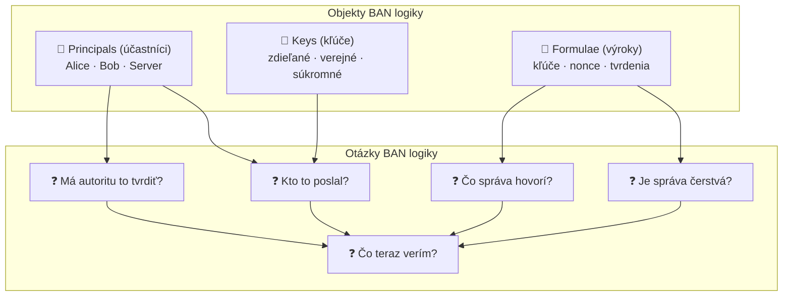

# Q28 — Aké otázky si kladie BAN logika? Aké objekty rozlišuje?

## Kľúčové pojmy

- [[concepts/BAN-logika]] — formálna metóda analýzy protokolov
- **Principals** — účastníci protokolu (Alice, Bob, Server)
- **Keys** — kryptografické kľúče (zdieľané, verejné, súkromné)
- **Formulae** — výroky / správy prenášané v protokole
- **Nonce** — čerstvostné číslo (Number used ONCE)

## Vysvetlenie

> **BAN logika** (Burrows–Abadi–Needham, 1989) je **epistemická modálna logika** — teda logika, ktorá modeluje *vieru* (*belief*) účastníkov protokolu, nie absolútnu pravdu.

### 28.1 Otázky, ktoré si kladie BAN logika

Keď analyzujeme bezpečnostný protokol, BAN logika sa pýta na **päť kľúčových otázok**:

| # | Otázka | Čo preveruje |
|---|--------|-------------|
| 1 | **Pôvod správy** | Prišla správa naozaj od toho, o kom si myslím? |
| 2 | **Čerstvosť správy** | Je táto správa nová, alebo je to replay starých dát? |
| 3 | **Obsah a význam** | Čo mi táto správa hovorí? Aký kľúč/hodnota je v nej? |
| 4 | **Jurisdikcia a dôvera** | Má odosielateľ *oprávnenie* tvrdiť to, čo tvrdí? |
| 5 | **Výsledný stav viery** | Dosahli sme po konci protokolu požadovaný stav dôvery? |

> [!tip] Prečo tieto otázky?
> Pretože väčšina útokov na protokoly *nevyužíva kryptografickú slabinu*, ale logickú — napr. replay útok (znova poslané staré správy) alebo MitM. BAN logika tieto slabiny formálne odhaľuje.

### 28.2 Objekty, s ktorými BAN logika pracuje

BAN logika rozlišuje **tri základné druhy objektov**:

#### 1) Účastníci (Principals)
Označujú sa veľkými písmenami: $A$ (Alice), $B$ (Bob), $S$ (Server/Trent).
- Sú to entity, ktoré môžu *veriť* výrokom, *vyslovovať* správy a *prijímať* správy.
- Každý účastník má **stav viery** — súbor výrokov, ktoré považuje za pravdivé.

#### 2) Kľúče (Keys)
Rozlišujeme tri typy kľúčov v notácii BAN:

| Typ | Notácia | Popis |
|-----|---------|-------|
| Zdieľaný symetrický | $K_{AB}$ alebo $\overset{K}{\leftrightarrow}AB$ | Tajný kľúč zdieľaný len medzi $A$ a $B$ |
| Verejný kľúč | $K_A$ alebo $\overset{K}{\mapsto}A$ | Verejný kľúč $A$; ktokoľvek môže zašifrovať, len $A$ dešifruje |
| Súkromný kľúč | $K_A^{-1}$ | Súkromný kľúč $A$; len $A$ ho vlastní |

#### 3) Výroky / Správy (Formulae)
Informačný obsah prenášaný v protokole:
- **Tvrdenia o kľúčoch**: „Kľúč $K$ je dobrý pre komunikáciu $A$–$B$."
- **Nonce / časové razítka**: Hodnoty dokazujúce čerstvosť (napr. $N_A$ = nonce vygenerovaný Alicou).
- **Zašifrované správy**: Výrok $X$ zašifrovaný kľúčom $K$: $\{X\}_K$.
- **Tajomstvá**: Informácie, ktoré poznajú iba vybraní účastníci.

> **Nonce** (*Number used ONCE*) — náhodné číslo vygenerované raz pre jednu reláciu. Ak ho protistrana zahrnie do odpovede, dokazuje tým, že správa je *čerstvá* (nebola uložená a preplataná).

## Diagram

## Callouts

> [!summary] Čo musím vedieť na skúšku
> 1. BAN = **epistemická logika viery** (nie absolútna pravda).
> 2. **5 otázok**: pôvod, čerstvosť, obsah, jurisdikcia, výsledný stav.
> 3. **3 typy objektov**: Principals, Keys, Formulae.
> 4. Nonce = number used once → dokazuje čerstvosť správy.

> [!tip] Ako si to pamätať
> **„BAN Principals Keep Fresh"** → **B**eliefs (principals majú vieru), **K**eys (kľúče), **F**ormulae (výroky), vždy s dôrazom na **F**reshness (čerstvosť).

> [!warning] Častá chyba
> BAN **nehovorí o absolútnej pravde**, iba o tom, čo účastník *verí*. Preto závery BAN analýzy sú vždy podmienené počiatočnými predpokladmi (assumptions). Ak sú predpoklady zlé, závery môžu byť nesprávne!

> [!example] Príklad
> **Needham-Schroeder protokol**: BAN analýza odhalila, že pôvodný protokol *nespĺňa čerstvosť* kľúčov — útočník mohol použiť starý platný kľúč (replay). Opravená verzia Needham-Schroeder-Lowe toto rieši pridaním identity $B$ do správy.

## Flashcards

Q:: Čo skúma BAN logika?
A:: Formálnu verifikáciu autentizačných protokolov — modeluje stav *viery* účastníkov a overuje, či protokol dosahuje požadované ciele dôvery.

Q:: Aký typ logiky je BAN logika?
A:: Epistemická modálna logika — logika viery (logic of belief), nie logika absolútnej pravdy.

Q:: Vymenuj tri základné objekty BAN logiky.
A:: 1. Principals (účastníci), 2. Keys (kľúče), 3. Formulae (výroky/správy).

Q:: Čo je nonce a prečo sa používa v BAN logike?
A:: Nonce = Number used ONCE — náhodné jednorazové číslo. Slúži ako dôkaz čerstvosti: ak protistrana nonce zahrnie do odpovede, dokazuje, že správa vznikla v aktuálnej relácii (ochrana proti replay útoku).

## Súvisiace

- [[Q27]] — Definícia BAN logiky a jej základná notácia.
- [[Q29]] — Konkrétne konštrukcie a inferenčné pravidlá BAN logiky.
- [[Q30]] — Kroky analýzy protokolu pomocou BAN logiky.
