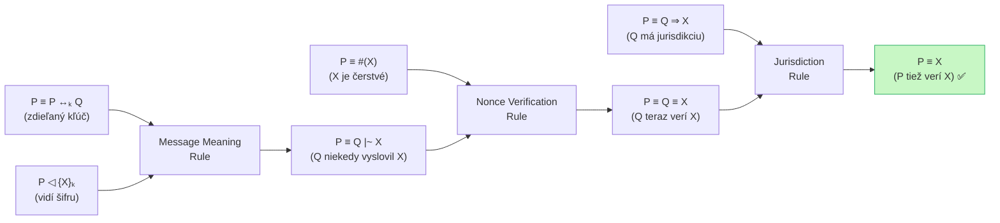

# Q29 — Uveďte a popíšte tri definované konštrukcie a tri definované pravidlá v BAN logike

## Kľúčové pojmy

- [[concepts/BAN-logika]] — epistemická logika viery
- **Konštrukcie (operators)** — základné stavebné kamene logických tvrdení
- **Pravidlá (inference rules)** — ako odvodiť nové fakty z existujúcich
- **Message Meaning Rule** — pravidlo o pôvode správy
- **Nonce Verification Rule** — pravidlo o čerstvosti
- **Jurisdiction Rule** — pravidlo o delegovanej dôvere

## Vysvetlenie

BAN logika má **formálny aparát** zložený z konštrukcií (čo môžeme *povedať*) a pravidiel (čo môžeme *odvodiť*). Kombinovaním týchto nástrojov sa vykonáva analýza protokolu.

---

### 29.1 Tri základné konštrukcie

#### Konštrukcia 1 — Viera: $P \mid\!\equiv X$
> „$P$ **verí** $X$" — účastník $P$ jedná tak, akoby výrok $X$ bol pravdivý.

- Je to *kľúčový cieľ* každého protokolu: chceme dosiahnuť, aby $A \mid\!\equiv (A \overset{K}{\leftrightarrow} B)$ — teda aby Alice *verila*, že zdieľa kľúč $K$ s Bobom.
- Viera sa nevzťahuje len na kľúče, ale aj na čerstvosť hodnôt alebo identitu protistrany.

#### Konštrukcia 2 — Videnie: $P \triangleleft X$
> „$P$ **vidí** $X$" — účastník $P$ prijal správu obsahujúcu výrok $X$.

- Ak je $X$ zašifrovaný kľúčom $K$, $P$ „vidí" $X$ **iba vtedy**, ak má príslušný dešifrovací kľúč.
- Keď $P$ správu vidí, môže ju ďalej spracovávať, zahrnúť do odpovedí alebo z nej odvodiť nové viery.

#### Konštrukcia 3 — Čerstvosť: $\#(X)$
> „$X$ **je čerstvý**" — výrok $X$ (typicky nonce alebo časová pečiatka) nebol v rámci aktuálneho protokolu predtým použitý.

- Základná ochrana proti **replay útoku**: ak je správa čerstvá, útočník ju nemohol skopírovať z minulej relácie.
- Zvyčajne platí: $P \mid\!\equiv \#(N_A)$ — $P$ verí, že *vlastný nonce* $N_A$ je čerstvý (lebo ho práve vygeneroval).

---

### 29.2 Tri základné inferenčné pravidlá

Pravidlá majú formu: „z premís (nad čiarou) odvodzujeme záver (pod čiarou)".

#### Pravidlo 1 — Pravidlo o pôvode správy (*Message Meaning Rule*)

$$\frac{P \mid\!\equiv P \overset{K}{\leftrightarrow} Q, \quad P \triangleleft \{X\}_K}{P \mid\!\equiv Q \mid\!\sim X}$$

**Čítaj:** Ak $P$ verí, že zdieľa kľúč $K$ s $Q$, A $P$ vidí správu $X$ zašifrovanú $K$ — potom $P$ verí, že $Q$ *niekedy v minulosti* vyslovil $X$.

> **Prečo funguje?** Iba $Q$ (okrem $P$) pozná kľúč $K$ — takže zašifrovanú správu mohol vytvoriť len $Q$.

> [!warning] Pozor na „niekedy v minulosti"
> Toto pravidlo hovorí, že $Q$ *kedysi* vyslovil $X$. Nehovorí, či to bolo v tejto alebo starej relácii. Na to slúži Pravidlo 2.

#### Pravidlo 2 — Pravidlo o čerstvosti (*Nonce Verification Rule*)

$$\frac{P \mid\!\equiv \#(X), \quad P \mid\!\equiv Q \mid\!\sim X}{P \mid\!\equiv Q \mid\!\equiv X}$$

**Čítaj:** Ak $P$ verí, že $X$ je čerstvé, A $P$ verí, že $Q$ *kedysi* vyslovil $X$ — potom $P$ verí, že $Q$ $X$ *aktuálne* verí (vyslovil to v tejto relácii).

> **Prečo funguje?** Ak je $X$ čerstvé (nikdy predtým nevidené) a $Q$ ho predsa len použil, muselo to byť teraz. Čerstvosť premosťuje „minulosť" na „prítomnosť".

> **Príklad:** $X$ = nonce $N_B$ vygenerovaný Bobom. Ak ho Alice vidí v odpovedi a verí, že je čerstvý, vie, že Bob hovorí v tejto relácii.

#### Pravidlo 3 — Pravidlo o jurisdikcii (*Jurisdiction Rule*)

$$\frac{P \mid\!\equiv Q \Rightarrow X, \quad P \mid\!\equiv Q \mid\!\equiv X}{P \mid\!\equiv X}$$

**Čítaj:** Ak $P$ verí, že $Q$ má **jurisdikciu** (autoritu) nad výrokom $X$, A $P$ verí, že $Q$ aktuálne verí $X$ — potom $P$ tiež verí $X$.

> **Prečo funguje?** Je to princíp delegovania dôvery. Napríklad: Alice verí, že Server je autorita pre prideľovanie kľúčov relácií. Server verí, že kľúč $K_{AB}$ je dobrý → Alice tiež verí, že $K_{AB}$ je dobrý.

> **Typické použitie**: Server $S$ má jurisdikciu nad kľúčmi relácie → toto pravidlo umožňuje preniesť dôveru Servera na komunikujúce strany.

---

### Prehľad — všetky tri pravidlá

| Pravidlo | Čo kombinuje | Záver |
|----------|-------------|-------|
| **Message Meaning** | zdieľaný kľúč + videná šifra | $Q$ *niekedy* vyslovil $X$ |
| **Nonce Verification** | čerstvosť + $Q$ vyslovil $X$ | $Q$ *teraz* verí $X$ |
| **Jurisdiction** | autorita $Q$ + $Q$ verí $X$ | $P$ tiež verí $X$ |

## Diagram

## Callouts

> [!summary] Čo musím vedieť na skúšku
> **3 konštrukcie:** Viera ($\mid\!\equiv$), Videnie ($\triangleleft$), Čerstvosť ($\#$).
> **3 pravidlá (spamäti):**
> 1. **Message Meaning** — kľúč + šifra → *Q niekedy* vyslovil X
> 2. **Nonce Verification** — čerstvosť + vyslovil → *Q teraz* verí X
> 3. **Jurisdiction** — autorita + verí → *P tiež* verí X

> [!tip] Ako si to pamätať
> **„Môžem Nonce Jurisdikovať"** = Message Meaning → Nonce Verification → Jurisdiction.
> Postupujeme od „*čo som videl*" cez „*je to čerstvé?*" k „*komu verím?*".

> [!warning] Častá chyba
> Message Meaning hovorí „*niekedy* vyslovil" — **nie** „*teraz* verí". Bez Nonce Verification môže ísť o replay starých správ. Obe pravidlá musia byť aplikované v správnom poradí.

> [!example] Príklad — jednoduchý autentizačný protokol
> - Bob vyšle Alici nonce $N_B$: $A \triangleleft \{N_B, K_{AB}\}_{K_{AS}}$
> - Message Meaning: $A \mid\!\equiv S \mid\!\sim (A \overset{K_{AB}}{\leftrightarrow} B \wedge N_B)$
> - Nonce Verification (ak $A \mid\!\equiv \#(N_B)$): $A \mid\!\equiv S \mid\!\equiv K_{AB}$ dobrý
> - Jurisdiction (ak $A \mid\!\equiv S \Rightarrow K_{AB}$): $A \mid\!\equiv K_{AB}$ dobrý ✅

## Flashcards

Q:: Čo hovorí konštrukcia $P \mid\!\equiv X$ v BAN logike?
A:: „$P$ verí $X$" — $P$ jedná tak, akoby $X$ bol pravdivý výrok.

Q:: Čo hovorí konštrukcia $\#(X)$ v BAN logike?
A:: „$X$ je čerstvé" — $X$ (typicky nonce) nebol v tejto relácii predtým použitý; ochrana proti replay útoku.

Q:: Aký je záver pravidla Message Meaning?
A:: Ak $P$ zdieľa kľúč $K$ s $Q$ a vidí $\{X\}_K$, potom $P$ verí, že $Q$ *niekedy v minulosti* vyslovil $X$.

Q:: Čo robí Nonce Verification Rule navyše oproti Message Meaning?
A:: Premosťuje „niekedy v minulosti" na „aktuálne" — ak je $X$ čerstvé a $Q$ ho vyslovil, musel to urobiť v tejto relácii.

Q:: Kedy sa používa Jurisdiction Rule?
A:: Keď chceme preniesť dôveru od autority (napr. servera) na bežného účastníka — ak server verí, že kľúč je dobrý, a má jurisdikciu, Alice tiež verí, že je dobrý.

## Súvisiace

- [[Q27]] — Základná notácia a účel BAN logiky.
- [[Q28]] — Objekty BAN logiky: principals, keys, formulae.
- [[Q30]] — Kroky analýzy protokolu pomocou pravidiel z tejto otázky.
