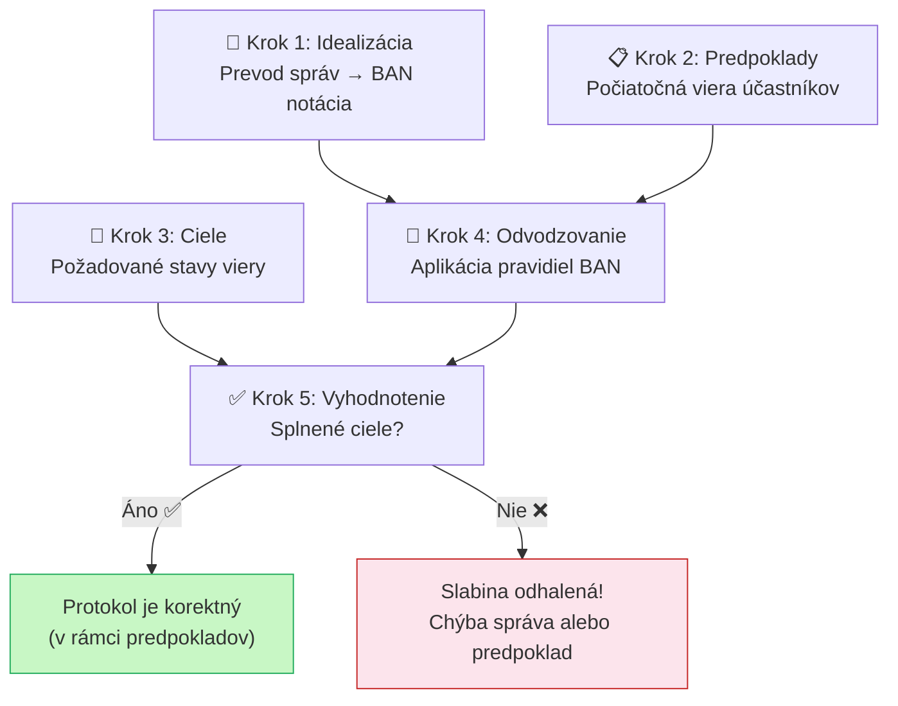

# Q30 — Uveďte jednotlivé kroky analýzy protokolov pomocou BAN logiky

## Kľúčové pojmy

- [[concepts/BAN-logika]] — formálna metóda verifikácie
- **Idealizácia** — prevod správ do formálnej notácie BAN
- **Predpoklady (Assumptions)** — počiatočné viery účastníkov
- **Ciele (Goals)** — požadované stavy viery po skončení protokolu
- **Logické odvodzovanie** — aplikácia inferenčných pravidiel (z [[Q29]])

## Vysvetlenie

Analýza protokolu pomocou BAN logiky je **štruktúrovaný 5-krokový proces**. Cieľom je matematicky dokázať, že protokol dosahuje deklarované bezpečnostné ciele.

---

### Krok 1 — Idealizácia protokolu

**Skutočné správy** (napríklad bajty prenášané sieťou) sa **prevedú do formálnej BAN notácie**.

- Vynechávajú sa časti bez kryptografického významu (hlavičky paketov, protokolové sekvenčné čísla).
- Každá správa sa zapíše ako logická formula: čo obsahuje, čím je chránená.

**Príklad** (Needham–Schroeder so serverom):
- Skutočná správa: `{A, Kas({Kab, B, Nonce_a})}`
- BAN idealizácia: $A \triangleleft \{A \overset{K_{ab}}{\leftrightarrow} B, N_a\}_{K_{as}}$

> [!warning] Kľúčové
> Idealizácia **musí zachovať kryptografický obsah** — aké kľúče chrániace aké výroky. Chybná idealizácia vedie k nesprávnym záverom.

---

### Krok 2 — Stanovenie počiatočných predpokladov

Definuje sa **výchozí stav viery** každého účastníka *pred* prvou správou protokolu.

Typické predpoklady:
- $A \mid\!\equiv A \overset{K_{as}}{\leftrightarrow} S$ — Alice verí, že zdieľa kľúč $K_{as}$ so Serverom.
- $B \mid\!\equiv B \overset{K_{bs}}{\leftrightarrow} S$ — Bob verí, že zdieľa kľúč $K_{bs}$ so Serverom.
- $A \mid\!\equiv S \Rightarrow (A \overset{K}{\leftrightarrow} B)$ — Alice verí, že Server má jurisdikciu nad kľúčmi relácie.
- $A \mid\!\equiv \#(N_a)$ — Alice verí, že jej vlastný nonce je čerstvý.

> Bez predpokladov nie je čo odvodzovať. BAN analýza *vždy závisí na predpokladoch*. Slabé predpoklady = neistá bezpečnosť.

---

### Krok 3 — Definícia cieľov protokolu

Jasne sa určí, **čo musí platiť po skončení protokolu**, aby bol bezpečný.

Príklady cieľov:
- $A \mid\!\equiv A \overset{K_{ab}}{\leftrightarrow} B$ — Alice verí, že zdieľa čerstvý kľúč $K_{ab}$ s Bobom.
- $B \mid\!\equiv A \overset{K_{ab}}{\leftrightarrow} B$ — Bob tiež verí, že zdieľa tento kľúč s Alice.
- $A \mid\!\equiv \#(K_{ab})$ — Alice verí, že kľúč je čerstvý (nie replay).

---

### Krok 4 — Logické odvodzovanie

**Jadro analýzy.** Na idealizované správy (Krok 1) sa aplikujú inferenčné pravidlá (z [[Q29]]) s využitím predpokladov (Krok 2).

Postup: prechádzame každou správu protokolu v poradí a sledujeme, ako sa *stav viery* každého účastníka mení po prijatí každej správy.

**Príklad odvodenia** (Alice prijíma správu zo Servera):
1. $A \triangleleft \{A \overset{K_{ab}}{\leftrightarrow} B, N_a\}_{K_{as}}$ *(Alice vidí správu)*
2. **Message Meaning**: $A \mid\!\equiv A \overset{K_{as}}{\leftrightarrow} S$ + správa zašifrovaná $K_{as}$ → $A \mid\!\equiv S \mid\!\sim (K_{ab}, N_a)$
3. **Nonce Verification**: $A \mid\!\equiv \#(N_a)$ + $S$ vyslovil $N_a$ → $A \mid\!\equiv S \mid\!\equiv K_{ab}$
4. **Jurisdiction**: $A \mid\!\equiv S \Rightarrow K_{ab}$ + $S$ verí $K_{ab}$ → **$A \mid\!\equiv K_{ab}$** ✅

---

### Krok 5 — Vyhodnotenie výsledkov

Porovnajú sa **odvodené tvrdenia** s **definovanými cieľmi** (Krok 3).

| Situácia | Interpretácia |
|----------|-------------|
| Všetky ciele odvodené ✅ | Protokol je (v rámci predpokladov) korektný |
| Cieľ sa nedá odvodiť ❌ | BAN odhalila slabinu — chýba správa alebo predpoklad |
| Cieľ sa dá odvodiť len s príliš silnými predpokladmi | Protokol je príliš záväzný na infraštruktúru |

> [!tip] Praktický výsledok analýzy
> BAN analýza Needham–Schroeder protokolu (1978) odhalila, že Bob nikdy nedostane dôkaz, že kľúč $K_{ab}$ je *čerstvý*. Toto viedlo k návrhu opravenej verzie (Needham–Schroeder–Lowe, 1995), kde Bob pridáva svoju identitu do šifrovanej správy.

## Diagram

## Callouts

> [!summary] Čo musím vedieť na skúšku
> **5 krokov BAN analýzy:**
> 1. **Idealizácia** — správy → BAN notácia
> 2. **Predpoklady** — počiatočná viera (kto komu verí a čomu)
> 3. **Ciele** — čo chceme dosiahnuť
> 4. **Odvodzovanie** — aplikácia Message Meaning + Nonce Verification + Jurisdiction
> 5. **Vyhodnotenie** — porovnanie odvodení s cieľmi

> [!tip] Ako si to pamätať
> **„IPAOV"** — Idealizácia, Predpoklady, Analýza (ciele), Odvodzovanie, Vyhodnotenie.
> Alebo: „*Ideálny Protokol Analyticky Overí*"

> [!warning] Častá chyba
> Vynechanie kroku 2 (predpokladov). Bez explicitných predpokladov nie je odkiaľ začať odvodzovanie — každý krok 4 musí odkazovať na predpoklad alebo predchádzajúce odvodenine.

> [!example] Príklad — Needham–Schroeder opravený
> BAN analýza pôvodného protokolu ukázala, že Bob v kroku odvodenia nemá žiadny spôsob odvodiť $B \mid\!\equiv \#(K_{ab})$. Preto bol cieľ čerstvosti nesplnený → oprava: Bob musí dostať *nonce* prepojený s kľúčom.

## Flashcards

Q:: Vymenuj 5 krokov BAN analýzy protokolu v správnom poradí.
A:: 1. Idealizácia, 2. Predpoklady, 3. Ciele, 4. Logické odvodzovanie, 5. Vyhodnotenie.

Q:: Čo je cieľom kroku Idealizácia v BAN analýze?
A:: Previesť skutočné správy protokolu do formálnej BAN notácie — zachovať kryptografický obsah, vynechať technické hlavičky.

Q:: Čo sa stane, ak sa v kroku 5 nedá odvodiť niektorý cieľ?
A:: BAN logika odhalila slabinu — protokolu chýba správa, kľúč alebo predpoklad potrebný na dosiahnutie daného cieľa dôvery.

Q:: Aký historický protokol BAN analýza opravila?
A:: Needham–Schroeder (1978) — BAN odhalila problém s čerstvosťou kľúča $K_{ab}$ pre Boba. Opravená verzia: Needham–Schroeder–Lowe (1995).

## Súvisiace

- [[Q27]] — Definícia BAN logiky a notácie.
- [[Q28]] — Objekty BAN (principals, keys, formulae).
- [[Q29]] — Konštrukcie a pravidlá, ktoré sa aplikujú v Kroku 4.
