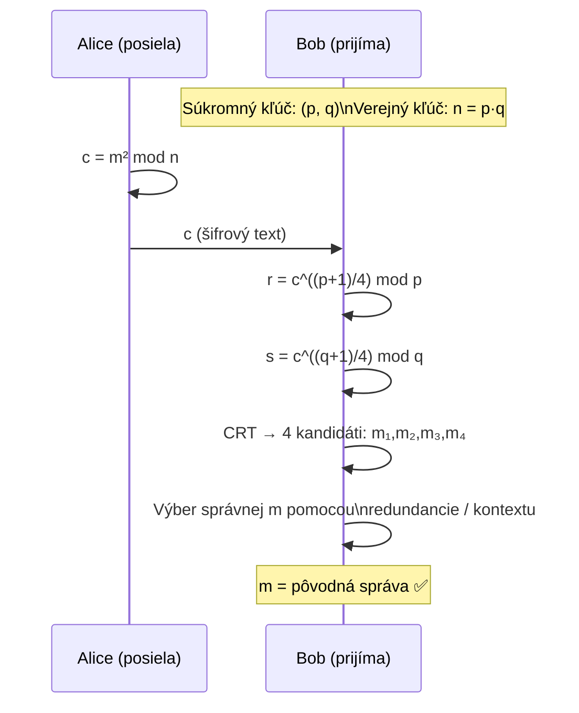

# Q31 — Rabinov kryptosystém: parametre, kľúče, šifrovanie a dešifrovanie, výhody a nevýhody

## Kľúčové pojmy

- **Rabinov kryptosystém** — Michael Rabin, 1979; asymetrický systém
- [[concepts/Faktorizacia]] — základ bezpečnosti (dokazateľná ekvivalencia)
- **Kvadratická odmocnina modulo $n$** — dešifrovanie = hľadanie $\sqrt{c} \pmod{n}$
- **4-na-1 zobrazenie** — jeden šifrový text zodpovedá štyrom možným správam
- [[concepts/CRT]] — Čínska veta o zvyškoch; používa sa pri dešifrovaní
- **Blumove prvočísla** — prvočísla tvaru $p \equiv 3 \pmod{4}$; zjednodušujú dešifrovanie

## Vysvetlenie

> **Kľúčová vlastnosť Rabina:** Prolomenie systému je **matematicky dokázané** ako ekvivalentné faktorizácii modulu $n$. U RSA takýto dôkaz *zatiaľ chýba*. Rabin je preto z teortickeho hľadiska bezpečnejší, no platí za to nejednoznačnosťou dešifrovania.

---

### 31.1 Parametre a generovanie kľúčov

**Krok 1 — Výber prvočísel**
Zvolia sa dve veľké, navzájom rôzne prvočísla $p$ a $q$.
- Pre zjednodušenie dešifrovania sa volí $p \equiv 3 \pmod{4}$ a $q \equiv 3 \pmod{4}$ (*Blumove prvočísla*).
- Príklad: $p = 7, q = 11$ (reálne sa používajú 1024-bitové prvočísla).

**Krok 2 — Výpočet kľúčov**
- **Verejný kľúč**: $n = p \cdot q$ (modul, napr. $7 \times 11 = 77$).
- **Súkromný kľúč**: dvojica $(p, q)$.

> [!tip] Analogia s RSA
> Rabin = RSA, kde verejný exponent $e = 2$ (šifrovanie = umocnenie na druhú). Problém: mocnina 2 je *neinjektívna* modulo $n$ → štyri riešenia pri dešifrovaní.

---

### 31.2 Šifrovanie

Alice chce poslať Bobovi správu $m$, kde $0 \le m < n$.
1. Získa Bobov verejný kľúč $n$.
2. Vypočíta šifrový text:
$$c = m^2 \pmod{n}$$
3. Pošle $c$ Bobovi.

**Príklad (malé čísla, ilustrácia):** $n=77$, $m=10$:
$$c = 10^2 \pmod{77} = 100 \pmod{77} = 23$$

---

### 31.3 Dešifrovanie

Bob obdrží $c$ a musí nájsť $m$ také, že $m^2 \equiv c \pmod{n}$.

**Krok 1 — Odmocniny modulo $p$ a $q$ zvlášť**
Keďže $p \equiv 3 \pmod{4}$, odmocninu modulo $p$ vieme vypočítať jednoducho:
$$r = c^{(p+1)/4} \pmod{p}, \quad s = c^{(q+1)/4} \pmod{q}$$
Teda $r^2 \equiv c \pmod{p}$ a $(-r)^2 \equiv c \pmod{p}$ — **dve riešenia modulo $p$**.
Podobne $s, -s$ sú dve riešenia modulo $q$.

**Krok 2 — Kombinovanie pomocou CRT** ([[concepts/CRT]])
Čínska veta o zvyškoch kombinuje riešenia z $\mathbb{Z}_p$ a $\mathbb{Z}_q$:

| CRT kombinácia | Výsledok |
|---------------|---------|
| $(r \pmod{p},\; s \pmod{q})$ | $m_1$ |
| $(r \pmod{p},\; -s \pmod{q})$ | $m_2$ |
| $(-r \pmod{p},\; s \pmod{q})$ | $m_3 = n - m_2$ |
| $(-r \pmod{p},\; -s \pmod{q})$ | $m_4 = n - m_1$ |

→ Štyri kandidáti: $\{m_1, m_2, m_3, m_4\}$.

**Krok 3 — Výber správnej správy**
Bob musí určiť, ktorý kandidát je pôvodná správa $m$. Riešenia:
- Pridanie **redundancie** ku správe pred šifrovaním (napr. posledných 16 bitov $m$ sa zopakuje).
- Využitie **kontextu** (iba jedna správa dáva zmysel).
- Pridanie **PKCS paddingu** (podobne ako u RSA).

---

### 31.4 Výhody a nevýhody

| | Výhody | Nevýhody |
|---|--------|---------|
| **Bezpečnosť** | Prolomenie ≡ faktorizácia $n$ (matematicky dokázané) | Náchylný na CCA útok |
| **Rýchlosť** | Šifrovanie = jediné umocnenie na 2 (veľmi rýchle) | — |
| **Dešifrovanie** | — | 4 kandidáti — nejednoznačnosť |
| **Práca s kľúčmi** | Verejný kľúč = jedno číslo $n$ | Nutný mechanizmus výberu správy |

**Útok CCA (Chosen Ciphertext Attack):**
Ak môže útočník požiadať Boba, aby dešifroval ľubovoľný šifrový text $c'$, Bob odpovie jedným zo štyroch odmocnín. Z toho útočník môže faktorizovať $n$ → systém *nie je* bezpečný voči CCA.

## Diagram

## Callouts

> [!summary] Čo musím vedieť na skúšku
> 1. **Kľúče**: verejný $n=pq$, súkromný $(p,q)$.
> 2. **Šifrovanie**: $c = m^2 \pmod{n}$ — veľmi jednoduché.
> 3. **Dešifrovanie**: odmocnina modulo $p$ a $q$ zvlášť → CRT → 4 kandidáti.
> 4. **Výhoda**: prolomenie = faktorizácia (dokázané!).
> 5. **Nevýhoda**: 4 možné správy → nutná redundancia; náchylný na CCA.

> [!tip] Ako si to pamätať
> **„Rabin = RSA s e=2, ale 4× zmätočnejší"**. Umocnenie na 2 je rýchle a bezpečné, ale nejednoznačné — ako výpočet $\sqrt{9}$: je to 3 alebo -3?

> [!warning] Častá chyba
> Zabudnúť, že dešifrovanie dáva **štyri** riešenia. A nezamieňať s RSA — pri RSA je $e$ ľubovoľný nepárny a existuje jediné riešenie. Pri Rabinovi $e=2$ dáva vždy 4 riešenia (keď $\gcd(2, \varphi(n)) \ne 1$).

> [!example] Príklad — číselný
> $p=7, q=11, n=77$. Šifrovanie $m=10$: $c = 100 \bmod 77 = 23$.
> Dešifrovanie: $r = 23^{(7+1)/4} \bmod 7 = 23^2 \bmod 7 = 529 \bmod 7 = 4$.
> $s = 23^{(11+1)/4} \bmod 11 = 23^3 \bmod 11 = 12167 \bmod 11 = 1$.
> CRT dá 4 odmocniny: 10, 23, 54, 67 — správna je $m=10$. ✅

## Flashcards

Q:: Ako je definované šifrovanie v Rabinovom kryptosystéme?
A:: $c = m^2 \pmod{n}$, kde $n = p \cdot q$ je verejný kľúč.

Q:: Prečo má Rabinov systém 4 možné správy pri dešifrovaní?
A:: Kvadratická funkcia $x^2 \equiv c \pmod{n}$ má modulo $n = pq$ vždy 4 riešenia (po 2 modulo $p$ a modulo $q$, kombinované CRT).

Q:: Čo je unikátne na bezpečnosti Rabina oproti RSA?
A:: Prolomenie Rabina je *matematicky dokázané* ako ekvivalentné faktorizácii $n$. U RSA taký dôkaz chýba.

Q:: Prečo je Rabin zraniteľný na CCA útok?
A:: Útočník môže predkladať vlastné šifrové texty a zo 4 odpovede Bob vypočítať faktorizáciu $n$, čím odhalí súkromný kľúč.

## Súvisiace

- [[Q24]] — Faktorizácia ako základ bezpečnosti asymetrických systémov.
- [[Q33]] — Slabiny raw RSA (multiplikativita, determinizmus) — Rabin trpí podobnými problémami.
- [[Q21]] — Hastadov útok — súvislosť malých exponentov v RSA.
- [[concepts/CRT]] — Čínska veta o zvyškoch, kľúč k dešifrovaniu.
