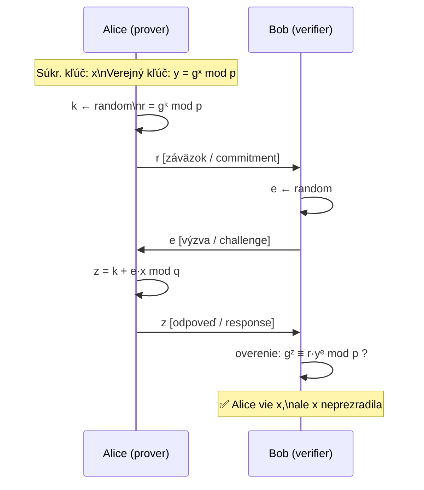

# Q32 — Vysvetlite princíp Schnorrovho identifikačného a podpisového schématu

## Kľúčové pojmy

- **Schnorrov protokol** — Claus-Peter Schnorr, 1989
- [[concepts/DLP]] — Diskrétny logaritmus; základ bezpečnosti
- **Commitment–Challenge–Response** — trojkrokový interaktívny protokol
- **Fiat–Shamirov transform** — premena interaktívneho protokolu na neinteraktívny podpis
- **Nulové znalostné dôkazy (Zero-Knowledge)** — dokáže znalosť $x$, bez prezradenia $x$
- [[concepts/Schnorr]] — atomický pojem

## Vysvetlenie

Schnorrov protokol sa delí na dve časti:
1. **Identifikačný protokol** — interaktívny, Alice dokáže Bobovi, že pozná $x$, bez jeho prezradenia.
2. **Podpisový protokol** — neinteraktívny (Fiat–Shamirov transform), Alice podpíše správu.

---

### 32.1 Nastavenie parametrov (spoločné pre oba protokoly)

Verejné parametre (dohovorené alebo štandardizované):
- $p$ — veľké prvočíslo
- $q$ — prvočíselný deliteľ $p-1$ (rád podgrupy; $q \mid p-1$)
- $g$ — generátor podgrupy rádu $q$ v $\mathbb{Z}_p^*$

**Kľúče Alice:**
- **Súkromný kľúč**: $x \in \{1, \ldots, q-1\}$ (náhodné)
- **Verejný kľúč**: $y = g^x \pmod{p}$

> [!tip] Základ bezpečnosti
> Bezpečnosť stojí na [[concepts/DLP]]: z $y = g^x \pmod{p}$ je výpočtovo nemožné nájsť $x$ bez znalosti súkromného kľúča.

---

### 32.2 Identifikačný protokol (interaktívny)

**Cieľ:** Alice chce dokázať Bobovi, že pozná $x$ (súkromný kľúč), **bez toho aby $x$ odhalila**.

#### Priebeh (3 kroky: Commitment → Challenge → Response)

| Krok | Kto | Akcia |
|------|-----|-------|
| **1. Záväzok (Commitment)** | Alice | Zvolí náhodné $k \in \{1,\ldots,q-1\}$, vypočíta $r = g^k \pmod{p}$, pošle $r$ Bobovi |
| **2. Výzva (Challenge)** | Bob | Zvolí náhodné $e \in \{1,\ldots,q-1\}$, pošle $e$ Alici |
| **3. Odpoveď (Response)** | Alice | Vypočíta $z = k + e \cdot x \pmod{q}$, pošle $z$ Bobovi |
| **Overenie** | Bob | Overí: $g^z \equiv r \cdot y^e \pmod{p}$ |

**Dôkaz správnosti overenia:**
$$g^z = g^{k + ex} = g^k \cdot (g^x)^e = r \cdot y^e \pmod{p} \quad \checkmark$$

> **Prečo Alice neprezradí $x$?**
> Bob vidí len $r = g^k$ a $z = k + ex$. Z $z$ nevie $x$ odvodiť bez znalosti $k$ — a $k$ je náhodné, meniace sa pri každom behu. Je to **nulové-znalostný dôkaz (zero-knowledge proof)**.

> [!warning] Každý beh musí mať nové $k$!
> Ak Alice použije rovnaké $k$ dvakrát s rôznymi výzvami $e_1, e_2$:
> $z_1 = k + e_1 x$ a $z_2 = k + e_2 x$ → Bob vypočíta $x = (z_1 - z_2)/(e_1 - e_2) \pmod{q}$. Katastrofálne!

---

### 32.3 Podpisový protokol (neinteraktívny — Fiat–Shamirov transform)

**Myšlienka:** Bob (overovateľ) sa nahradí **hašovacou funkciou** $H$. Výzva $e$ sa vypočíta deterministicky ako haš správy a záväzku — nikto nemusí byť online.

**Vytvorenie podpisu správy $m$:**
1. Alice zvolí náhodné $k$, vypočíta záväzok $r = g^k \pmod{p}$.
2. Vypočíta výzvu (haš): $e = H(m \| r)$ (správa + záväzok → deterministické).
3. Vypočíta odpoveď: $z = k + e \cdot x \pmod{q}$.
4. **Podpis** = $(e, z)$ (alebo ekvivalentne $(r, z)$).

**Overenie podpisu** (ktokoľvek s verejným kľúčom $y$):
1. Zrekonštruuje záväzok: $r' = g^z \cdot y^{-e} \pmod{p}$.
2. Vypočíta: $e' = H(m \| r')$.
3. Podpis platí, ak $e' = e$. ✅

---

### 32.4 Výhody Schnorrovho schématu

| Vlastnosť | Detail |
|-----------|--------|
| **Krátke podpisy** | Podpis = $(e, z)$ — oboje sú prvky modulo $q$, čo je kratšie ako RSA |
| **Dokazateľná bezpečnosť** | Bezpečnosť dokázaná v modeli náhodného orákula za predpokladu DLP |
| **Agregácia** | Viac podpisov rôznych strán sa dá spojiť do jedného (MuSig, Taproot v Bitcoine) |
| **Deterministický podpis** | Ak $k$ generujeme z $H(x \| m)$, nie je potrebný externý PRNG |

## Diagram

## Callouts

> [!summary] Čo musím vedieť na skúšku
> 1. **Parametre**: $p, q, g$ (verejné); $x$ (súkromný kľúč); $y = g^x$ (verejný kľúč).
> 2. **Identifikácia**: 3 kroky — záväzok $r = g^k$, výzva $e$, odpoveď $z = k+ex$.
> 3. **Overenie**: $g^z \equiv r \cdot y^e \pmod{p}$.
> 4. **Podpis**: Fiat–Shamirov transform — výzva $e = H(m\|r)$ namiesto Boba.
> 5. **Nebezpečnosť opakovaného $k$**: útočník dostane $x$!

> [!tip] Ako si to pamätať
> **„Záväzok–Výzva–Odpoveď"** = Commit–Challenge–Response = CCR.
> Schnorr = **„skrytý x, viditeľné $g^x$"** — klasická jednosmerná funkcia.

> [!warning] Častá chyba
> Neinteraktívna verzia (podpis) sa od interaktívnej líši len tým, že *výzvu generuje haš*, nie Bob. Matematika je identická — menia sa len šípy v diagrame.

> [!example] Príklad — identifikácia
> $p=23, q=11, g=2, x=3, y=2^3\bmod 23=8$.
> Alice: $k=7, r=2^7\bmod 23=128\bmod 23=13$. Pošle $r=13$.
> Bob: $e=4$. Pošle $e=4$.
> Alice: $z = 7+4\cdot 3 \bmod 11 = 19 \bmod 11 = 8$. Pošle $z=8$.
> Bob: $g^z = 2^8\bmod 23 = 256\bmod 23 = 3$; $r\cdot y^e = 13\cdot 8^4\bmod 23 = 13\cdot 4096\bmod 23 = 13\cdot 3 = 39\bmod 23 = 16$… hmm, príklad s malými číslami; v praxi sa vždy overuje vo väčšom $p$.

## Flashcards

Q:: Aké sú tri kroky Schnorrovho identifikačného protokolu?
A:: 1. Záväzok: $r = g^k$, 2. Výzva: $e$ (od Boba), 3. Odpoveď: $z = k + e \cdot x \pmod{q}$.

Q:: Ako Bob overí Schnorrov identifikačný dôkaz?
A:: Overí rovnosť $g^z \equiv r \cdot y^e \pmod{p}$.

Q:: Čo je Fiat–Shamirov transform a ako ho Schnorr využíva?
A:: Premena interaktívneho protokolu na podpis: Bobova náhodná výzva $e$ sa nahradí deterministickým hašom $e = H(m \| r)$.

Q:: Prečo je nebezpečné použiť rovnaké $k$ dvakrát v Schnorrovom protokole?
A:: Z dvoch rovníc $z_1 = k + e_1 x$ a $z_2 = k + e_2 x$ sa dá vypočítať $x = (z_1 - z_2)/(e_1 - e_2)$ — súkromný kľúč je kompromitovaný.

## Súvisiace

- [[Q23]] — DLP — základ bezpečnosti Schnorra.
- [[Q16]] — Digitálny podpis vo všeobecnosti.
- [[Q36]] — EUF-CMA bezpečnosť — Schnorr spĺňa tento model.
- [[Q35]] — EdDSA je priamo odvodená od Schnorra na eliptických krivkách.
