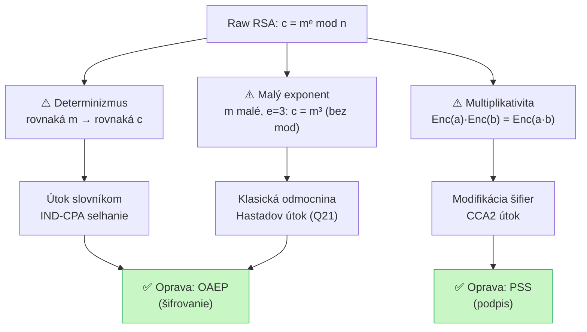

# Q33 — Vysvetlite slabiny raw RSA (učebnicového RSA)

## Kľúčové pojmy

- **Raw RSA / učebnicové RSA** — priama aplikácia $c = m^e \bmod n$ bez paddingu
- **Determinizmus** — rovnaká správa vždy dáva rovnaký šifrový text
- **Multiplikatívna homomorfnosť** — $\text{Enc}(m_1) \cdot \text{Enc}(m_2) = \text{Enc}(m_1 \cdot m_2)$
- **Malé správy / malý exponent** — útok priamou odmocninou
- [[concepts/OAEP]] — oprava pre šifrovanie
- [[concepts/PSS]] — oprava pre podpisy
- **CCA / CCA2** — Chosen Ciphertext Attack; raw RSA nie je CCA2-bezpečné

## Vysvetlenie

> **Raw RSA** = kryptosystém RSA aplikovaný priamo bez akéhokoľvek paddingu alebo randomizácie. V praxi je *nepoužiteľný* kvôli niekoľkým závažným slabinám.

---

### 33.1 Determinizmus (absencia náhodnosti)

**Problém:** Raw RSA je **deterministické** — pre rovnaký verejný kľúč $(n, e)$ a správu $m$ vždy:
$$c = m^e \pmod{n}$$
Výsledok je **vždy rovnaký**. To porušuje základnú požiadavku bezpečného šifrovania: **sémantická bezpečnosť / IND-CPA** (rozlišiteľnosť šifrových textov).

**Útok slovníkom:**
```
Útočník vie, že správa ∈ {"ANO", "NIE"}
1. Vypočíta c₁ = Enc("ANO"), c₂ = Enc("NIE") (verejný kľúč je verejný!)
2. Porovná zachytený šifrový text c s c₁ a c₂
3. Okamžite vie obsah správy ✅
```

**Reálny prípad:** Ak server posiela odpovede iba z obmedzenej množiny (HTTP status 200/403/500), útočník vie pasívnym odpočúvaním zistiť stav bez kľúča.

---

### 33.2 Malé správy a malý verejný exponent

**Problém:** Štandardne sa volí $e = 3$ (alebo $e = 65537$) pre rýchlosť. Ak je správa $m$ malá (napr. 128-bitový symetrický kľúč) a $e = 3$:
$$c = m^3 \pmod{n}$$
Ak $m^3 < n$ (čo nastane, keď $m$ je relatívne malé), modulárna operácia nehrá rolu a:
$$c = m^3 \quad \text{(v celých číslach!)}$$
Útočník vypočíta klasickú reálnu tretinu odmocninu: $m = \sqrt[3]{c}$.

**Hastadov broadcast útok** ([[Q21]]): Ak rovnakú správu $m$ pošleme $e=3$ rôznym príjemcom s rôznymi modulmi $n_1, n_2, n_3$:
$$c_i = m^3 \pmod{n_i} \quad i=1,2,3$$
Pomocou CRT sa rekonštruuje $m^3 \pmod{n_1 n_2 n_3}$, a keďže $m^3 < n_1 n_2 n_3$, klasická odmocnina dá $m$.

---

### 33.3 Multiplikatívna homomorfnosť (tvárnosť)

**Problém:** RSA má **multiplikatívnu vlastnosť**:
$$\text{Enc}(m_1) \cdot \text{Enc}(m_2) = m_1^e \cdot m_2^e = (m_1 m_2)^e = \text{Enc}(m_1 \cdot m_2) \pmod{n}$$

Útočník môže **modifikovať šifrový text** bez znalosti obsahu:
```
Zachytí šifrový text c = Enc(suma_prevodu)
Vypočíta c' = c · Enc(10) = Enc(suma × 10)
Prepošle c' príjemcovi
Príjemca dešifruje 10× väčšiu sumu!
```

**Útok s vybraným šifrovým textom (CCA):**
Útočník chce dešifrovať $c$:
1. Zvolí náhodné $r$, vypočíta $c' = c \cdot r^e \pmod{n}$.
2. Pošle $c'$ k dešifrovaniu orákulu → dostane $m' = m \cdot r$.
3. Vypočíta $m = m' \cdot r^{-1} \pmod{n}$. ✅

---

### 33.4 Prehľad slabin

| Slabina | Podstata | Dôsledok |
|---------|---------|---------|
| **Determinizmus** | Rovnaká správa = rovnaký šifrový text | Útok slovníkom, porušenie IND-CPA |
| **Malý exponent + malá správa** | $m^e < n$ → modulo nehrá rolu | Priama odmocnina, Hastadov útok |
| **Multiplikativita** | $\text{Enc}(ab) = \text{Enc}(a)\cdot\text{Enc}(b)$ | Modifikácia šifier, CCA útok |
| **Fixná štruktúra** | Žiadny padding → predvídateľný formát | PKCS#1 v1.5 oracle útok (Bleichenbacher) |

## Diagram



## Callouts

> [!summary] Čo musím vedieť na skúšku
> **3 hlavné slabiny raw RSA:**
> 1. **Determinizmus** — rovnaká správa = rovnaký šifrový text → útok slovníkom.
> 2. **Malý exponent / malá správa** — $m^e < n$ → klasická odmocnina.
> 3. **Multiplikativita** — $c' = c \cdot r^e$ umožňuje CCA útok a modifikáciu šifier.
>
> **Opravy:** OAEP pre šifrovanie, PSS pre podpisy (detaily v [[Q34]]).

> [!tip] Ako si to pamätať
> **„DMS"** — **D**eterminizmus, **M**ultiplikativita, **S**malé hodnoty.
> Raw RSA = auto bez bezpečnostných pásov: funguje, ale v prvej nehode ťa zabije.

> [!warning] Častá chyba
> Myslieť si, že RSA je bezpečné, lebo nikto nezná súkromný kľúč. Raw RSA sa dá prelomiť *bez súkromného kľúča* — len manipuláciou šifierných textov!

> [!example] Príklad — multiplikativita v banke
> Bob dostane šifrovaný bankový prevod $c = \text{Enc}(100\,\text{EUR})$.
> Eva (útočník) vypočíta $c' = c \cdot \text{Enc}(10) \pmod{n}$.
> Banka dešifruje $c'$ a vyplatí $1000\,\text{EUR}$ — bez akéhokoľvek prístupu ku kľúčom.

## Flashcards

Q:: Prečo je raw RSA deterministické a prečo je to problém?
A:: Rovnaká správa $m$ s rovnakým verejným kľúčom dáva vždy rovnaký $c = m^e \bmod n$. Útočník môže šifrovať všetky kandidáty a porovnávať — porušenie IND-CPA.

Q:: Kedy môže útočník dešifrovať RSA šifrový text priamou odmocninou?
A:: Keď je správa $m$ malá a exponent $e$ malý (napr. $e=3$) tak, že $m^e < n$ — modulárna operácia nehrá rolu a $m = \lfloor c^{1/e} \rfloor$.

Q:: Čo je multiplikatívna homomorfnosť RSA a ako ju útočník zneužije?
A:: $\text{Enc}(m_1)\cdot\text{Enc}(m_2) = \text{Enc}(m_1 m_2)$. Útočník vynásobí zachytený šifrový text $c$ hodnotou $r^e$, dostane po dešifrovaní $m \cdot r$, z čoho vypočíta $m$.

Q:: Čím sa opravujú slabiny raw RSA pre šifrovanie a pre podpisy?
A:: Pre šifrovanie: **OAEP** (pridáva náhodnosť a kontrolu integrity). Pre podpisy: **PSS** (pridáva soľ a dokazateľnú bezpečnosť). Oba sú v [[Q34]].

## Súvisiace

- [[Q21]] — Hastadov útok — využíva slabinu malého exponentu z tejto otázky.
- [[Q22]] — Slepý podpis — využíva multiplikatívnosť RSA konštruktívne.
- [[Q24]] — Faktorizácia RSA modulu.
- [[Q34]] — OAEP a PSS — opravy slabin raw RSA.
