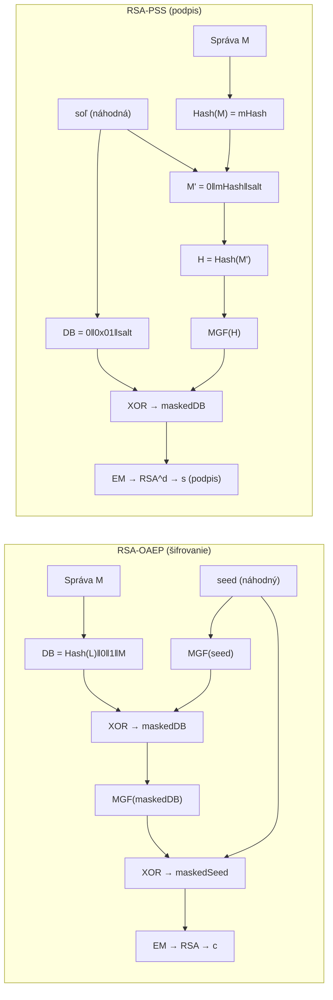

# Q34 — Porovnajte účel doplnenia správy u RSA-OAEP a RSA-PSS

## Kľúčové pojmy

- [[concepts/OAEP]] — Optimal Asymmetric Encryption Padding; pre šifrovanie
- [[concepts/PSS]] — Probabilistic Signature Scheme; pre podpisy
- **Padding** — doplnenie správy pred aplikáciou RSA operácie
- **Soľ (salt)** — náhodná hodnota pridaná pred podpisom v PSS
- **MGF** — Mask Generation Function; hašovacia funkcia v OAEP
- **CCA2** — Chosen Ciphertext Attack (adaptívny); OAEP je odolný
- **Feistelová sieť** — štruktúra použitá v OAEP na miešanie

## Vysvetlenie

Oba štandardy boli vyvinuté ako **opravy slabin raw RSA** ([[Q33]]). Majú rôzne účely:

| | RSA-OAEP | RSA-PSS |
|---|----------|---------|
| **Účel** | Šifrovanie | Digitálny podpis |
| **Štandard** | PKCS#1 v2.x, RFC 8017 | PKCS#1 v2.x, RFC 8017 |
| **Náhodnosť** | Náhodný seed (každý šifrový text iný) | Náhodná soľ (každý podpis iný) |
| **Bezpečnostný model** | CCA2-bezpečné (IND-CCA2) | EUF-CMA bezpečné (v modeli náhodného orákula) |

---

### 34.1 RSA-OAEP — Optimal Asymmetric Encryption Padding

**Cieľ:** Odstrániť determinizmus a homomorfnosť raw RSA pri **šifrovaní**.

#### Tri problémy, ktoré OAEP rieši:
1. **Randomizácia** — každé šifrovanie vkladá nový náhodný `seed` → rovnaká správa dáva vždy iný šifrový text.
2. **Integrita** — OAEP obsahuje kontrolný mechanizmus (hash $L$-labelu); ak sa šifra pozmení, dešifrovanie zlyhá.
3. **CCA2 odolnosť** — útočník nemôže z mierne upraveného šifrového textu odvodiť informácie o otvorenom texte.

#### Princíp (zjednodušená Feistelová štruktúra):

```
Vstup: správa M, náhodný seed r, label L
1. DB = Hash(L) || 0...0 || 1 || M       ← "data block"
2. maskedDB = DB XOR MGF(r)              ← MGF = Mask Generation Function
3. maskedSeed = r XOR MGF(maskedDB)
4. EM = 0x00 || maskedSeed || maskedDB   ← "encoded message"
5. c = EM^e mod n                        ← RSA šifrovanie
```

**Dešifrovanie:** Reverzný postup: RSA dešifrovanie → rozbalenie masiek → kontrola integrity → extrakcia $M$.

> [!tip] Prečo Feistelová štruktúra?
> OAEP používa Feistelovu sieť s MGF (čo je XOF/hašovacia funkcia), aby *bezpečne rozmiešal* seed a správu. Ak útočník zmení čo i len jeden bit šifry, kontroly zlyhajú — celá správa je neplatná.

---

### 34.2 RSA-PSS — Probabilistic Signature Scheme

**Cieľ:** Odstrániť determinizmus pri **podpise** a poskytnúť *dokazateľnú bezpečnosť*.

#### Tri problémy, ktoré PSS rieši:
1. **Odstránenie determinizmu** — predchádzajúci štandard PKCS#1 v1.5 bol deterministický. PSS pridáva náhodnú **soľ** (salt) → rovnaká správa dáva vždy iný podpis.
2. **Dokazateľná bezpečnosť** — existuje *matematický dôkaz*, že podvrhnutie PSS podpisu je rovnako ťažké ako inverzia RSA funkcie.
3. **Odolnosť voči kolíziám hašov** — PSS efektívnejšie využíva hašovaciu funkciu.

#### Princíp:

```
Vstup: správa M, náhodná soľ sLen bajtov
1. mHash = Hash(M)
2. M' = 0x00...00 || mHash || salt        ← 8 nulových bajtov + haš + soľ
3. H = Hash(M')
4. PS = 0x00...00                         ← padding nulami
5. DB = PS || 0x01 || salt
6. maskedDB = DB XOR MGF(H)
7. EM = maskedDB || H || 0xbc             ← "encoded message"
8. s = EM^d mod n                         ← RSA podpisovanie (súkr. kľúč)
```

**Overenie:** $EM' = s^e \bmod n$ → rozbalenie → verifikácia $H$ z $M'$.

---

### 34.3 Súhrnné porovnanie

| Kritérium | RSA-OAEP | RSA-PSS |
|-----------|----------|---------|
| **Operácia** | Šifrovanie / Dešifrovanie | Podpisovanie / Overenie |
| **Náhodný vstup** | seed (pri šifrovaní) | soľ (pri podpisovaní) |
| **Bezpečnostný model** | IND-CCA2 | EUF-CMA |
| **Hashovacia funkcia** | MGF (napr. SHA-256) | SHA-256/384/512 |
| **Deterministický?** | Nie (vždy iný šifrový text) | Nie (vždy iný podpis) |
| **Dokazateľná bezpečnosť?** | Áno (Random Oracle Model) | Áno (ROM) |
| **Nahradil** | PKCS#1 v1.5 šifrovanie | PKCS#1 v1.5 podpisy |

## Diagram



## Callouts

> [!summary] Čo musím vedieť na skúšku
> - **OAEP** = padding pre **šifrovanie** — pridáva seed, Feistelová štruktúra, CCA2-bezpečné.
> - **PSS** = padding pre **podpisy** — pridáva soľ, dokazateľná bezpečnosť, EUF-CMA.
> - Oba odstraňujú determinizmus raw RSA.
> - Oba sú štandardizované v PKCS#1 v2.x a RFC 8017.

> [!tip] Ako si to pamätať
> **OAEP = „Obálka"** — zašifruje správu do náhodnej obálky, nikto nevidí obsah.
> **PSS = „Pečiatka s autogramom"** — každý raz iná pečiatka (soľ), ale vždy overiteľná.

> [!warning] Častá chyba
> **OAEP sa NIKDY nepoužíva na podpisy** a **PSS sa NIKDY nepoužíva na šifrovanie**. Sú to navzájom *nekompatibilné* operácie — zámenou by ste dostali nezmyslený výsledok.

> [!example] Príklad — TLS 1.3
> Pri nadviazaní TLS spojenia:
> - Server podpíše certifikát pomocou **RSA-PSS** (dokazateľne bezpečný podpis).
> - Klient môže zašifrovať predmaster secret pomocou **RSA-OAEP** (ak sa nepoužíva ECDHE).
> V modernom TLS 1.3 sa RSA šifrovanie nepoužíva vôbec — len podpisy cez PSS.

## Flashcards

Q:: Na čo slúži RSA-OAEP a čo je jeho hlavnou inováciou oproti raw RSA?
A:: Na **šifrovanie**. Hlavná inovácia: pridáva náhodný seed → každý šifrový text je unikátny (randomizácia), plus kontrola integrity → CCA2 bezpečnosť.

Q:: Na čo slúži RSA-PSS a čo je jeho hlavnou inováciou?
A:: Na **digitálny podpis**. Hlavná inovácia: náhodná soľ → každý podpis je unikátny + dokazateľná bezpečnosť (v modeli náhodného orákula).

Q:: Čo je MGF v kontexte RSA-OAEP?
A:: MGF = Mask Generation Function — špeciálna hašovacia funkcia (typicky MGF1 = SHA-256 + counter), ktorá generuje masku ľubovoľnej dĺžky na zmiešanie datablokov.

Q:: Prečo PKCS#1 v1.5 (starý štandard) nahradili OAEP a PSS?
A:: PKCS#1 v1.5 šifrovanie je deterministické a náchylné na oracle útok (Bleichenbacherov útok 1998). PKCS#1 v1.5 podpisy sú deterministické a nemajú dokazateľnú bezpečnosť.

## Súvisiace

- [[Q33]] — Slabiny raw RSA, ktoré OAEP a PSS riešia.
- [[Q16]] — Digitálny podpis — kontext pre PSS.
- [[Q36]] — EUF-CMA model — bezpečnostná záruka PSS.
