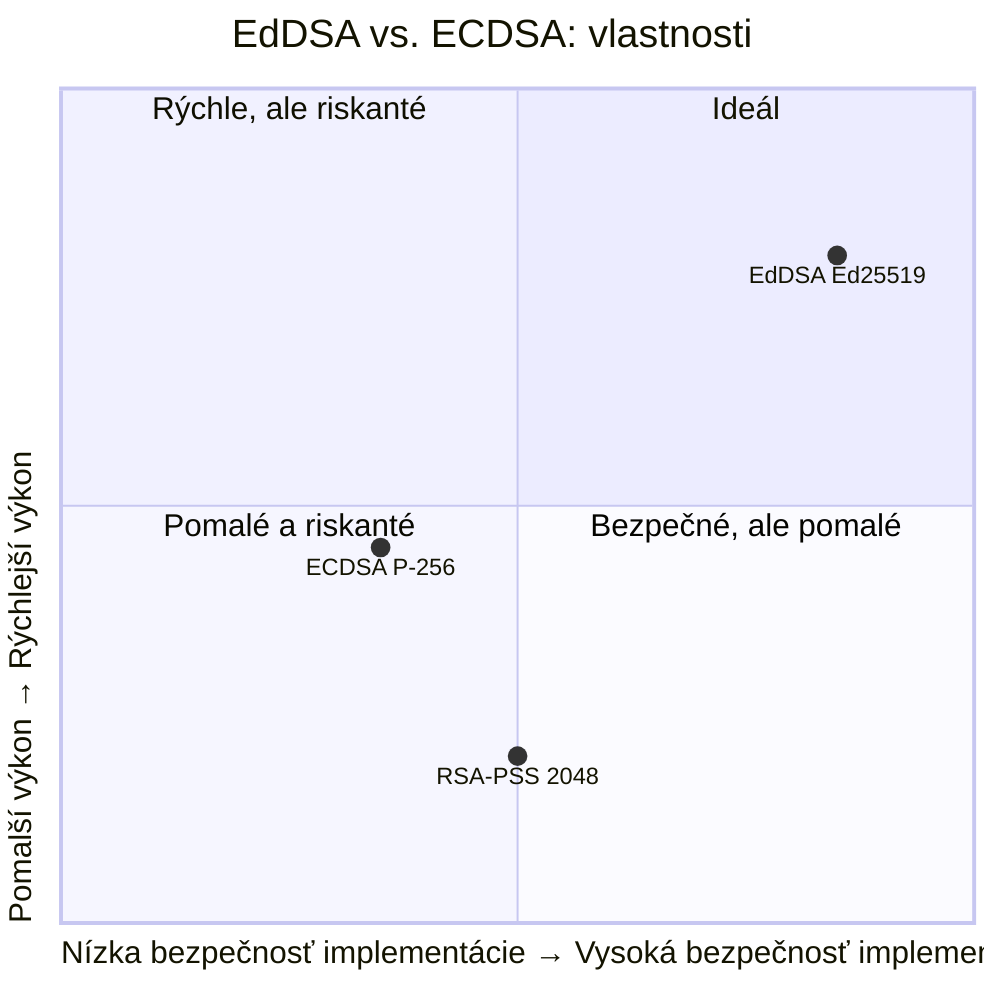

# Q35 — Charakterizujte podpisové schéma EdDSA a vysvetlite, v čom sa líši od ECDSA

> [!warning] Skúška
> Táto otázka je zvyčajne na skúške **preskakovaná**. Je tu pre úplnosť. Ak máš obmedzený čas, preskočte na [[Q36]].

## Kľúčové pojmy

- **ECDSA** — Elliptic Curve Digital Signature Algorithm; klasický štandard (FIPS 186)
- **EdDSA** — Edwards-curve DSA; moderná náhrada (navrhol Daniel J. Bernstein)
- **Ed25519** — konkrétna inštancia EdDSA na krivke Curve25519 (najčastejšia)
- **Twisted Edwards křivky** — matematická forma krivky s výhodnou aritmetikou
- **Side-channel útok** — útok meraním času, spotreby energie alebo elektromagnetického žiarenia
- **Deterministický podpis** — nonce sa generuje hašovaním, nie náhodne

## Vysvetlenie

### 35.1 Charakteristika EdDSA

EdDSA (*Edwards-curve Digital Signature Algorithm*) je moderná varianta podpisu na eliptických krivkách.

**Matematický základ:**
Využíva **Twisted Edwards krivky** (najpopulárnejšia: **Ed25519** = Curve25519):
$$a x^2 + y^2 = 1 + d x^2 y^2 \pmod{p}$$
Tieto krivky majú dve výhody: neexistujú „špeciálne body" vyžadujúce špeciálne ošetrenie, a operácie prebieha v **konštantnom čase**.

**Deterministický nonce:**
Na rozdiel od ECDSA, EdDSA **nepotrebuje externý generátor náhody** pre nonce. Nonce sa vypočíta:
$$r = H(\text{private\_key\_second\_half} \| m)$$
To eliminuje celú triedu zraniteľností spojených so zlým PRNG.

---

### 35.2 Porovnanie EdDSA a ECDSA

| Kritérium | ECDSA | EdDSA (Ed25519) |
|-----------|-------|-----------------|
| **Nonce $k$** | Externý CSPRNG — ak $k$ sa opakuje alebo je slabý, útočník dostane privátny kľúč | Deterministický z $H(sk \| m)$ — bez rizika zlého RNG |
| **Side-channel odolnosť** | Weierstrassove krivky: náchylné na timing útok bez opatrností | Twisted Edwards: prirodzene konštantný čas, bezpečná implementácia jednoduchšia |
| **Výkon** | Pomalší signing; batch verifikácia komplikovaná | Rýchlejší; ľahká batch verifikácia |
| **Typ krivky** | NIST krivky (P-256, P-384) — kritizovaný pôvod konštánt | Curve25519 — transparentne zvolená, vysoká bezpečnostná marža |
| **Veľkosť podpisu** | 64 bajtov (P-256) | 64 bajtov (Ed25519) — rovnaké |
| **Štandard** | FIPS 186, RFC 6979 | RFC 8032 |

> **Dramatický incident:** V roku 2010 odhalili bezpečnostní výskumníci, že konzola **Sony PlayStation 3** používala ECDSA s rovnakým nonce $k$ pre každý podpis. Výsledok: útočníci extrahovali súkromný kľúč Sony a spustili pirátskeho softvéru na všetkých PS3.

---

### 35.3 Kedy použiť ktorý?

| Situácia | Odporúčanie |
|----------|-------------|
| Nová aplikácia, slobodná voľba | **Ed25519** — rýchly, bezpečný, deterministický |
| Kompatibilita so starými systémami (TLS, X.509) | ECDSA P-256/P-384 — široko podporované |
| SSH kľúče | **Ed25519** (od OpenSSH 6.5+) |
| TLS certifikáty | Oba (ECDSA P-256 je bežnejší, Ed25519 rastie) |

## Diagram

## Callouts

> [!summary] Čo musím vedieť na skúšku
> 1. **EdDSA je deterministické** — nonce z haša, nie z RNG → odpadá PS3 riziko.
> 2. **Twisted Edwards krivky** → konštantný čas → odolnosť voči side-channel.
> 3. **ECDSA** vyžaduje dobrý RNG — ak nie, privátny kľúč je kompromitovaný.
> 4. **Ed25519** je odporúčaný moderný štandard (RFC 8032).

> [!tip] Ako si to pamätať
> **„ECDSA = rizikový vodič"** — rýchly, ale ak zabudne zapnúť GPS (RNG), havaruje.
> **„EdDSA = autonómne auto"** — naviguje samo (deterministicky), bez rizika ľudskej chyby.

> [!warning] Častá chyba
> EdDSA **nie je** len EdDSA na Curve25519 — existuje aj Ed448 (na goldilocks krivke). Ed25519 je *inštancia* EdDSA. Rovnako ECDSA nie je algoritmus samotný — záleží na krivke (P-256, P-384…).

> [!example] Príklad — Sony PS3
> Sony podpisovala firmvér konzoly ECDSA s *konštantným* $k$ (bug). Bezpečnostní výskumníci (skupina failOverflow, 2010) z dvoch podpisov vypočítali súkromný kľúč: $x = (z_1 - z_2)/(s_1 - s_2) \bmod q$. Vydali privátny kľúč Sony verejne → koniec DRM ochrany PS3.

## Flashcards

Q:: V čom je EdDSA lepší ako ECDSA z hľadiska generovania nonce?
A:: EdDSA generuje nonce deterministicky ($r = H(sk\_second\_half \| m)$) — nie je potrebný externý RNG. ECDSA vyžaduje silný CSPRNG; ak je slabý alebo opakujúci sa, privátny kľúč je kompromitovaný.

Q:: Čo sú Twisted Edwards krivky a prečo sú výhodné?
A:: Forma eliptickej krivky $ax^2+y^2 = 1+dx^2y^2$. Výhoda: aritmetika prebieha v konštantnom čase (žiadne špeciálne body) → prirodzene odolné voči side-channel útokom.

Q:: Aký bol dôsledok bug-u so Sony PS3 a ECDSA?
A:: Sony používala konštantné $k$ pre každý podpis. Útočníci vypočítali privátny kľúč zo dvoch podpisov → prelomili DRM ochranu konzoly.

## Súvisiace

- [[Q16]] — Digitálny podpis — kontex pre oba algoritmy.
- [[Q32]] — Schnorrov protokol — základ matematiky za EdDSA.
- [[Q36]] — EUF-CMA model — EdDSA spĺňa SUF-CMA.
- [[Q23]] — DLP — základ bezpečnosti ECDSA aj EdDSA.
