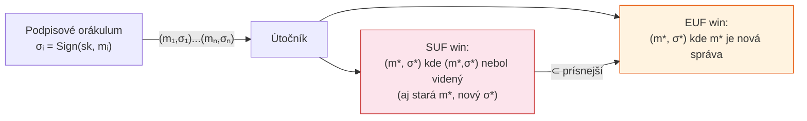

# Q36 — Charakterizujte bezpečnostné modely EUF-CMA a SUF-CMA a vysvetlite ich vzťah k problému tvárnosti podpisu

## Kľúčové pojmy

- **EUF-CMA** — Existential Unforgeability under Chosen Message Attack
- **SUF-CMA** — Strong Existential Unforgeability under Chosen Message Attack
- **Chosen Message Attack (CMA)** — útočník môže žiadať podpisy ľubovoľných správ
- **Forgery (podvrhnutie)** — vytvorenie platného podpisu bez znalosti súkromného kľúča
- **Tvárnosť (Malleability)** — schopnosť upraviť platný podpis na iný platný podpis
- **Podpisové orákulum** — hypotetická entita, ktorá podpisuje ľubovoľné správy

## Vysvetlenie

> Tieto modely odpovedajú na otázku: **„Ako silno je chránený podpis voči falšovaniu?"** EUF je štandard (zlaté minimum), SUF je prísnejší a priamo blokuje tvárnosť.

---

### 36.1 Schopnosti útočníka (CMA — Chosen Message Attack)

V oboch modeloch dostane útočník prístup k **podpisovému orákulu**:
- Môže si zvoliť **ľubovoľné správy** $m_1, m_2, \ldots$ a dostane k nim platné podpisy $\sigma_1, \sigma_2, \ldots$
- Môže sledovať stovky podpisov odesielateľa a analyzovaťzvzory.
- **Nemá** prístup k súkromnému kľúču.

---

### 36.2 EUF-CMA (Existential Unforgeability)

**Definícia — čo útočník potrebuje na víťazstvo:**
> Útočník vyhrá, ak vytvorí **akýkoľvek** platný pár $(m^*, \sigma^*)$, kde $m^*$ je **nová správa** — teda správa, ktorú si pri orákule nenechal podpísať ($m^* \notin \{m_1, m_2, \ldots\}$).

**Interpretácia:**
- Ak je schéma EUF-CMA bezpečná, útočník nedokáže vytvoriť platný podpis pre žiadnu novú správu, ani po štúdiu tisícov podpisov.
- Je to **minimum**, ktoré každý bezpečný podpisový systém musí spĺňať.

**Vizuálne:**
```
Útočník vidí:  (m₁,σ₁), (m₂,σ₂), ..., (mₙ,σₙ)
EUF win:       nájde (m*, σ*) kde m* ∉ {m₁,...,mₙ} a Verify(m*, σ*) = TRUE
```

---

### 36.3 SUF-CMA (Strong Existential Unforgeability)

**Definícia — čo útočník potrebuje na víťazstvo:**
> Útočník vyhrá, ak vytvorí **akýkoľvek nový** platný pár $(m^*, \sigma^*)$, ktorý **doteraz nevidel** — vrátane prípadov, kde $m^*$ je stará správa, ale $\sigma^*$ je *iný* podpis než dostával.

**Dôležitý rozdiel:** SUF útočník vyhrá aj vtedy, keď:
- $m^* = m_i$ (správa bola predtým podpísaná)
- ale $\sigma^* \neq \sigma_i$ (iný podpis pre tú istú správu)

**Vizuálne:**
```
Útočník vidí:  (m₁,σ₁), (m₂,σ₂), ..., (mₙ,σₙ)
SUF win:       nájde (m*, σ*) kde (m*, σ*) ∉ {(m₁,σ₁),...,(mₙ,σₙ)} a Verify(m*, σ*) = TRUE
               ← teda aj (m₁, σ₁') kde σ₁' ≠ σ₁ je SUF víťazstvo!
```

**Vzťah:**
$$\text{SUF-CMA bezpečné} \Rightarrow \text{EUF-CMA bezpečné} \quad (\text{nie naopak})$$

---

### 36.4 Tvárnosť podpisu (Signature Malleability)

**Definícia:** Podpisové schéma je **tvárne (malleable)**, ak existuje efektívny algoritmus, ktorý z platného podpisu $\sigma$ pre správu $m$ vyrobí *iný* platný podpis $\sigma'$ pre tú istú správu $m$, bez znalosti súkromného kľúča.

**Vzťah k modelom:**
| Vlastnosť | EUF-CMA | SUF-CMA |
|-----------|---------|---------|
| Tvárne schéma môže byť EUF-CMA bezpečné? | **ÁNO** — starú správu, nový podpis nevyhrá EUF | **NIE** — nový podpis pre starú správu = SUF víťazstvo |
| Zabraňuje tvárnosti? | Nie | **Áno** |

#### Príklad tvárnosti — ECDSA

ECDSA je **tvárne**: ak $(r, s)$ je platný podpis pre správu $m$ a kľúč $y$, potom $(r, -s \bmod q)$ je **tiež platný** podpis pre rovnakú správu a kľúč.

```
Podpis σ = (r, s)
Tvárny podpis σ' = (r, -s mod q)  ← rovnako platný!
```

ECDSA je **EUF-CMA bezpečné** (nová správa sa nedá sfalšovať), ale **nie SUF-CMA bezpečné** (ten istý podpis sa dá upraviť).

#### Prečo je tvárnosť problém v praxi?

**Bitcoin (2014):** Bitcoin používal ECDSA pre ID transakcií. ID bolo odvodené z *celého obsahu* transakcie vrátane podpisu. Útočník mohol zmeniť podpis $(r,s) \to (r,-s)$ — transakcia zostala platná, ale zmenilaID. To umožňovalo útok: obeť žiadala vrátenie nevyplatenej transakcie (ID sa nezhodovalo), útočník zopakoval výber. Oprava: **Segregated Witness (SegWit)** — ID sa počíta bez podpisu.

#### EdDSA a SUF-CMA

**Ed25519** (EdDSA) je navrhnuté ako **SUF-CMA bezpečné** — deterministický nonce a štruktúra krivky zabraňujú generovaniu alternatívnych podpisov. Je to jedna z kľúčových výhod oproti ECDSA.

---

### 36.5 Súhrnná tabuľka

| Model | Útočník vyhrá keď | Tvárne schéma spĺňa? | Príklady |
|-------|-------------------|---------------------|---------|
| **EUF-CMA** | Nový podpis pre novú správu | **Áno** (môže byť EUF) | ECDSA, RSA-PSS, Schnorr |
| **SUF-CMA** | Akýkoľvek nový (správa,podpis) pár | **Nie** | EdDSA, RSA-PSS (s fixnou soľou) |

## Diagram



## Callouts

> [!summary] Čo musím vedieť na skúšku
> 1. **EUF-CMA**: útočník nevie podpísať *novú* správu (štandard).
> 2. **SUF-CMA**: útočník nevie ani vytvoriť *alternatívny* podpis pre *starú* správu (prísnejší).
> 3. **Tvárnosť**: existuje $\sigma' \neq \sigma$ platný pre tú istú správu → porušuje SUF-CMA.
> 4. **ECDSA** je tvárne (EUF ✅, SUF ❌). **EdDSA** je SUF-CMA bezpečné (EUF ✅, SUF ✅).
> 5. **Bitcoin Malleability Attack** — reálny dôsledok tvárnosti ECDSA.

> [!tip] Ako si to pamätať
> **EUF = "Existenčné"** — útočník hľadá aspoň *nejaké* falzum (novú správu).
> **SUF = "Silné"** — *čokoľvek* nové je výhra, aj variant starého podpisu.
> SUF je SUPERsada podmienok → prísnejší.

> [!warning] Častá chyba
> Myslieť, že tvárnosť = schéma je *nesezpečná*. Nie je! Tvárna schéma môže byť plne EUF-CMA bezpečná (nikto nevie sfalšovať obsah). Tvárnosť je problém len v systémoch, kde *ID = hash(podpis)*.

> [!example] Príklad — Bitcoin SegWit
> Pred SegWit: `TXID = hash(celá_transakcia_vrátane_podpisu)`. Útočník zmenil $(r,s)$ na $(r,-s)$ → nové TXID, ale platná transakcia. Po SegWit: `TXID = hash(transakcia_bez_podpisu)` → tvárnosť podpisu TXID neovplyvní.

## Flashcards

Q:: Čo musí útočník vytvoriť, aby vyhral hru EUF-CMA?
A:: Platný pár $(m^*, \sigma^*)$ kde $m^*$ je *nová* správa — nebola poslaná podpisovému orákulu.

Q:: Čím sa líši SUF-CMA od EUF-CMA?
A:: SUF-CMA útočník vyhrá aj keď vytvorí *alternatívny podpis* $\sigma'$ pre *starú správu* $m$ (t.j. $(m, \sigma')$ kde $\sigma' \neq \sigma$). EUF-CMA toto neumožňuje útočníkovi vyhrať.

Q:: Je tvárne schéma EUF-CMA bezpečné?
A:: **Áno, môže byť.** Tvárnosť hovorí o alternatívnych podpisoch pre *starú* správu — EUF-CMA sa stará len o podpisy *novej* správy. Tvárnosť porušuje len SUF-CMA.

Q:: Ako je ECDSA tvárne a prečo to vadí v Bitcoine?
A:: Ak $(r,s)$ je platný ECDSA podpis, tak $(r, -s \bmod q)$ je tiež platný. Bitcoin odvodzoval TXID z celej transakcie vrátane podpisu → zmena podpisu = nové TXID = zmätenie systému (Bitcoin Malleability Attack).

## Súvisiace

- [[Q16]] — Digitálny podpis — kontext pre bezpečnostné modely.
- [[Q34]] — RSA-PSS je EUF-CMA bezpečné.
- [[Q35]] — EdDSA je SUF-CMA bezpečné; ECDSA je len EUF-CMA.
- [[Q32]] — Schnorrov podpis — EUF-CMA bezpečnosť dokázaná v ROM.
