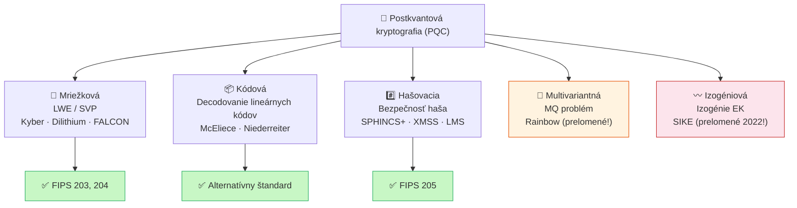

# Q37 — Popíšte dôvody vzniku postkvantovej kryptografie a stručne charakterizujte hlavné rodiny postkvantových konštrukcií

## Kľúčové pojmy

- **PQC** — Post-Quantum Cryptography (postkvantová kryptografia)
- [[concepts/Shorov-algoritmus]] — kvantový algoritmus lomiaci RSA, DH, ECC
- [[concepts/Groverov-algoritmus]] — kvantový algoritmus znižujúci bezpečnosť symetriky na polovicu
- **NIST PQC** — súťaž/štandardizácia NIST (2016–2024)
- **„Ulož teraz, dešifruj neskôr"** — SNDL útok (Store Now, Decrypt Later)
- **Mriežková kryptografia** — Lattice-based; ML-KEM (Kyber), ML-DSA (Dilithium)
- **Kódová kryptografia** — Code-based; McEliece, Niederreiter
- **Hašovacia kryptografia** — Hash-based; SPHINCS+, XMSS, LMS

## Vysvetlenie

---

### 37.1 Prečo vznikla PQC? — Hrozba kvantových počítačov

#### Shorův algoritmus (1994) — hrozba pre asymetrickú kryptografiu
Peter Shor navrhol kvantový algoritmus, ktorý rieši **faktorizáciu** a **diskrétny logaritmus** v polynomiálnom čase.

| Problém | Klasický počítač | Kvantový počítač (Shor) |
|---------|-----------------|------------------------|
| RSA (2048 bitov) | $\approx 10^{25}$ operácií — prakticky nekonečno | Niekoľko hodín |
| DH / DSA / ECC | Exponentné nároky | Polynomiálne |

→ **Celá dnešná asymetrická kryptografia (RSA, ECDSA, DH) padne**, keď bude dostatočne veľký kvantový počítač.

#### Groverov algoritmus (1996) — hrozba pre symetrickú kryptografiu
Lov Grover navrhol algoritmus, ktorý prehľadáva neštruktúrovaný priestor v čase $O(\sqrt{N})$ namiesto $O(N)$.

| Algoritmus | Klasická bezpečnosť | Kvantová bezpečnosť (Grover) |
|------------|--------------------|-----------------------------|
| AES-128 | 128 bitov | 64 bitov — nedostatočné |
| **AES-256** | 256 bitov | **128 bitov — stále bezpečné** |
| SHA-256 | 128-bitová kolízna odolnosť | 85-bitová — oslabené |
| **SHA-384** | 192-bitová | **128-bitová — dostatočná** |

**Oprava:** Jednoduché zdvojnásobenie dĺžky kľúčov — AES-256, SHA-384 sú kvantovo-bezpečné.

#### „Store Now, Decrypt Later" (SNDL)

> Útočníci **dnes** zhromažďujú a archivujú šifrovanú komunikáciu (vládne správy, bankovníctvo, zdravotníctvo). Keď o 10–20 rokov bude k dispozícii výkonný kvantový počítač, tieto záznamy *spätne* dešifrujú.

Preto je nutné zavádzať PQC **ešte pred** príchodom kvantových počítačov.

---

### 37.2 Hlavné rodiny postkvantových konštrukcií

NIST PQC súťaž (2016–2024) identifikovala päť hlavných rodín. NIST finalizoval štandardy v roku 2024 (FIPS 203, 204, 205).

#### Rodina 1 — Mriežková kryptografia (*Lattice-based*)
**Princíp:** Bezpečnosť stojí na obtížnosti hľadania najkratšieho vektoru v $n$-rozmernej mriežke — problémy **SVP** (*Shortest Vector Problem*) a **LWE** (*Learning With Errors*; podrobne [[Q38]]).

**Prečo ťažké?** Mriežka v 1000+ rozmeroch: aj keď poznáme bázu, nájsť najkratší vektor trvá exponenciálne dlho — a žiadny kvantový algoritmus to nezmení.

**Príklady a štandardy:**
- **ML-KEM** (Kyber, FIPS 203) — výmena kľúčov / KEM (*Key Encapsulation Mechanism*)
- **ML-DSA** (Dilithium, FIPS 204) — digitálny podpis
- **FALCON** — alternatívny podpis (kratší podpis, ale zložitejšia implementácia)

**Výhody:** Malé kľúče, rýchlosť, dobre študované.

---

#### Rodina 2 — Kódová kryptografia (*Code-based*)
**Princíp:** Bezpečnosť stojí na obtížnosti **dekódovania všeobecného lineárneho kódu** — zistenie chybového vektoru bez znalosti štruktúry kódu je NP-ťažký problém.

**Príklady a štandardy:**
- **Klasický McEliece** (NIST alternatívny štandard) — podrobne [[Q40]]
- **Niederreiterov systém** — duálna varianta, [[Q41]]

**Výhody:** Preverený časom (McEliece od 1978), veľmi konzervativné bezpečnostné predpoklady.
**Nevýhody:** Veľké verejné kľúče (stovky kB).

---

#### Rodina 3 — Hašovacia kryptografia (*Hash-based*)
**Princíp:** Bezpečnosť závisí **výlučne** od bezpečnosti hašovacej funkcie — minimálne predpoklady. Postavená na Lamportových ([[Q09]]) a Winternitzových ([[Q10]]) jednorazových podpisoch.

**Príklady a štandardy:**
- **SLH-DSA** (SPHINCS+, FIPS 205) — bezstavový podpis
- **XMSS, LMS** (RFC 8391, 8554) — stavové podpisy (vyžadujú správu stavu)

**Výhody:** Konzervativné predpoklady (len bezpečnosť haša), dlhodobo dôveryhodné.
**Nevýhody:** Veľké podpisy (SPHINCS+: 8–50 KB), pomalé.

---

#### Rodina 4 — Kryptografia na báze multivariantných polynómov (*Multivariate*)
**Princíp:** Bezpečnosť stojí na obtížnosti **riešenia sústav nelineárnych kvadratických rovníc** nad konečnými telesami (MQ problém — NP-ťažký).

**Príklady:** Rainbow, GeMSS (oba mali bezpečnostné problémy).
**Status:** V NIST súťaži neprešli — niektoré schémy boli prelomené ([[concepts/Mriežková-kryptografia]] dnes dominuje).

---

#### Rodina 5 — Kryptografia na báze izogénií (*Isogeny-based*)
**Princíp:** Bezpečnosť stojí na obtížnosti výpočtu **izogénií** (mapovaní) medzi eliptickými krivkami.

**Status:** SIKE (najznámejší kandidát) bol v roku 2022 *kompletne prelomený* klasickým algoritmom behom hodín na bežnom notebooku. Rodina stratila dôveryhodnosť.

---

### 37.3 Aktuálne štandardy NIST (2024)

| Štandard | Algoritmus | Rodina | Účel |
|----------|-----------|--------|------|
| **FIPS 203** | ML-KEM (Kyber) | Mriežka | Výmena kľúčov |
| **FIPS 204** | ML-DSA (Dilithium) | Mriežka | Podpisy |
| **FIPS 205** | SLH-DSA (SPHINCS+) | Hašovacia | Podpisy |
| Alternatívny | Classic McEliece | Kódová | Výmena kľúčov |

## Diagram

## Callouts

> [!summary] Čo musím vedieť na skúšku
> 1. **Shor** — lomi RSA, DH, ECC (faktorizácia + DLP).
> 2. **Grover** — znižuje bezpečnosť symetriky na polovicu → riešenie: AES-256, SHA-384.
> 3. **SNDL** — dnes zachytávaj, neskôr dešifruj → PQC treba zavádzať UŽ TERAZ.
> 4. **5 rodín PQC** — Mriežková (víťaz), Kódová, Hašovacia, Multivariantná (prob.), Izogéniová (SIKE prelomená).
> 5. **NIST 2024**: FIPS 203 (Kyber), FIPS 204 (Dilithium), FIPS 205 (SPHINCS+).

> [!tip] Ako si to pamätať
> **„MKH-MI"** — Mriežka, Kódová, Hašovacia (bezpečné), Multivariantná + Izogéniová (problémy).
> Mriežková = zlatý štandard PQC; Hašovacia = najkonzervatívnejšia.

> [!warning] Častá chyba
> Grover **neláme** symetrickú kryptografiu — len *znižuje* bezpečnosť na polovicu. AES-128 s Groverom = 64 bitov (nedostatočné), AES-256 = 128 bitov (stále bezpečné). Preto nie je nutné vymeniť AES, stačí použiť AES-256.

> [!example] Príklad — SNDL útok v praxi
> V roku 2022 novinári zistili, že niektoré spravodajské agentúry systematicky archivujú šifrovanú internetovú komunikáciu. Ak o 15 rokov vznikne dostatočný kvantový počítač, tieto záznamy bude možné dešifrovať. Preto TLS 1.3 v roku 2024 začal integrovať hybridné PQC výmeny kľúčov (napr. X25519+Kyber768).

## Flashcards

Q:: Ktorý kvantový algoritmus ohrozuje RSA a ECC? Čo dokáže?
A:: Shorův algoritmus — rieši faktorizáciu a DLP v polynomiálnom čase na kvantovom počítači. Zlomí RSA, DH, DSA, ECDSA.

Q:: Čo robí Groverov algoritmus a ako sa bráni?
A:: Znižuje efektívnu bezpečnosť symetrických šifier na polovicu. Obrana: zdvojnásobiť dĺžku kľúča (AES-128→AES-256, SHA-256→SHA-384).

Q:: Čo je „Store Now, Decrypt Later" útok?
A:: Útočník dnes archivuje šifrovanú komunikáciu a v budúcnosti (keď bude kvantový počítač) ju dešifruje. Dôvod, prečo zavádzať PQC pred príchodom kvantových PC.

Q:: Vymenuj tri NIST PQC štandardy (2024) a k akej rodine patria.
A:: FIPS 203 = ML-KEM/Kyber (mriežka, výmena kľúčov), FIPS 204 = ML-DSA/Dilithium (mriežka, podpisy), FIPS 205 = SLH-DSA/SPHINCS+ (hašovacia, podpisy).

## Súvisiace

- [[Q14]] — Hrozba kvantových počítačov (Shor, Grover) — kontext pre túto otázku.
- [[Q38]] — LWE — základ mriežkovej kryptografie.
- [[Q40]] — McEliece — kódová rodina.
- [[Q09]], [[Q10]] — Lamport a Winternitz — základ hašovej kryptografie.
