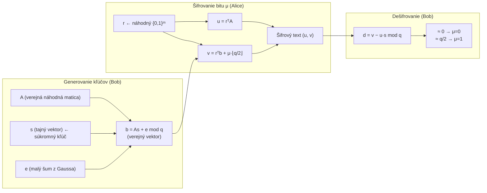

# Q38 — Vysvetlite princíp LWE, uveďte význam vzťahu b = As + e (mod q), popíšte základné šifrovacie schéma

## Kľúčové pojmy

- **LWE** — Learning With Errors (učenie sa s chybami); Oded Regev, 2005
- [[concepts/LWE]] — základ mriežkovej PQC kryptografie
- **Mriežka (Lattice)** — diskrétna periodická štruktúra v $n$-rozmernom priestore
- **SVP** — Shortest Vector Problem (NP-ťažký); redukovateľný z LWE
- **Gaussov šum** — malé náhodné chyby z diskrétneho Gaussovho rozdelenia
- **KEM** — Key Encapsulation Mechanism; LWE je základom ML-KEM (Kyber)
- **Regevovo schéma** — prvý praktický kryptosystém na báze LWE

## Vysvetlenie

> **Základná intuícia:** LWE je ako *zašumená* sústava lineárnych rovníc. Normálnu sústavu vyriešiš Gaussovou elimináciou za sekundy. Ale keď každý výsledok obsahuje malú náhodnú chybu $e_i$, Gaussova eliminácia zlyhá — chyby sa kumulujú a riešenie je vypočtovo nedosiahnuteľné.

---

### 38.1 Matematický základ — vzťah $\mathbf{b} = A\mathbf{s} + \mathbf{e} \pmod{q}$

#### Čo znamenajú symboly:

| Symbol | Typ | Popis |
|--------|-----|-------|
| $A$ | $m \times n$ matica nad $\mathbb{Z}_q$ | **Verejná náhodná matica** — koeficienty "sústav rovníc" |
| $\mathbf{s}$ | vektor dĺžky $n$ | **Tajný vektor** = súkromný kľúč; "neznáme" |
| $\mathbf{e}$ | vektor dĺžky $m$ | **Chybový vektor (šum)** — malé hodnoty z Gaussovho rozdelenia |
| $\mathbf{b}$ | vektor dĺžky $m$ | **Verejný vektor** — súčasť verejného kľúča |
| $q$ | prvočíslo (modulus) | Veľkosť konečného telesa $\mathbb{Z}_q$ |

#### Prečo je to ťažký problém?

**Bez šumu ($\mathbf{e} = \mathbf{0}$):** Rovnica $\mathbf{b} = A\mathbf{s}$ je obyčajná sústava lineárnych rovníc. Riešenie: Gaussova eliminácia, $O(n^3)$ operácií — triviálne.

**So šumom ($\mathbf{e} \neq \mathbf{0}$):** Akonáhle sú výsledky mierne skreslené, eliminácia nekontrolovateľne *amplifikuje chyby*. Výsledok je nepoužiteľný. Nájsť $\mathbf{s}$ z $(A, \mathbf{b})$ je výpočtovo ekvivalentné **hľadaniu najkratšieho vektora v mriežke (SVP)** — problém, pre ktorý neexistuje žiadny efektívny algoritmus ani na kvantovom počítači.

> [!tip] Príklad — ručný výpočet s malými číslami
> Nech $n=2$, $q=7$, $\mathbf{s} = (3, 1)$, $\mathbf{e} = (0, 1, -1)$.
> ```
> A = [[1, 2],     b = A·s + e =  [(1·3+2·1)=5,   (5+0)=5 ]
>      [3, 4],                     [(3·3+4·1)=13=6, (6+1)=0 ]
>      [5, 6]]                     [(5·3+6·1)=21=0, (0-1)=6 ]]
> ```
> Verejné: $A$ a $\mathbf{b} = (5, 0, 6)$. Z toho nájsť $\mathbf{s} = (3,1)$ je ťažké!

---

### 38.2 Regevovo šifrovacie schéma (šifrovanie jedného bitu)

Toto je základné schéma Odeda Regeva (2005) — demonštruje ako LWE umožňuje asymetrické šifrovanie.

#### Generovanie kľúčov (Bob)
1. Zvolí náhodnú verejnú maticu $A \in \mathbb{Z}_q^{m \times n}$.
2. Zvolí tajný vektor $\mathbf{s} \in \mathbb{Z}_q^n$ (súkromný kľúč).
3. Zvolí malý šumový vektor $\mathbf{e}$ z diskrétneho Gaussovho rozdelenia.
4. Vypočíta $\mathbf{b} = A\mathbf{s} + \mathbf{e} \pmod{q}$.
- **Verejný kľúč:** $(A, \mathbf{b})$
- **Súkromný kľúč:** $\mathbf{s}$

#### Šifrovanie bitu $\mu \in \{0, 1\}$ (Alice)
Namiesto celej matice Alice vyberie *náhodnú podmnožinu riadkov* matice $A$ pomocou náhodného binárneho vektora $\mathbf{r} \in \{0,1\}^m$:

1. Vypočíta $u = \mathbf{r}^T \cdot A \pmod{q}$ (kombinácia riadkov $A$).
2. Vypočíta $v = \mathbf{r}^T \cdot \mathbf{b} + \mu \cdot \lfloor q/2 \rfloor \pmod{q}$.
3. **Šifrový text:** $(u, v)$.

> **Prečo $\lfloor q/2 \rfloor$?** Ide o kódovanie bitu: $0$ sa zakóduje do 0, $1$ sa zakóduje do $q/2$. Sú to "odľahlé" oblasti v $\mathbb{Z}_q$, aby malý šum neovplyvnil dekódovanie.

#### Dešifrovanie (Bob)
Bob vypočíta:
$$d = v - u \cdot \mathbf{s} \pmod{q}$$

Rozvinieme:
$$d = \mathbf{r}^T \mathbf{b} + \mu \lfloor q/2 \rfloor - \mathbf{r}^T A \mathbf{s}$$
$$= \mathbf{r}^T (A\mathbf{s} + \mathbf{e}) + \mu \lfloor q/2 \rfloor - \mathbf{r}^T A \mathbf{s}$$
$$= \mathbf{r}^T \mathbf{e} + \mu \lfloor q/2 \rfloor$$

Keďže $\mathbf{e}$ je *malé*, $\mathbf{r}^T \mathbf{e}$ je tiež malé:
- Ak $\mu = 0$: $d \approx 0$ (blízko nule)
- Ak $\mu = 1$: $d \approx q/2$ (blízko "stredu")

Bob rozhodne prahom: $\mu = 0$ ak $d < q/4$, inak $\mu = 1$.

---

### 38.3 Výhody a varianty

| Variant | Štruktúra | Veľkosť kľúčov | Príklad |
|---------|-----------|----------------|---------|
| **LWE** | Náhodná matica | Veľké ($\approx$ MB) | Regevovo schéma |
| **Ring-LWE** | Polynómy | Malé ($\approx$ KB) | Základ Kyber (FIPS 203) |
| **Module-LWE** | Malé matice polynómov | Stredné, škálovateľné | Kyber, Dilithium |

Podrobné porovnanie v [[Q39]].

## Diagram



## Callouts

> [!summary] Čo musím vedieť na skúšku
> 1. **LWE vzťah**: $\mathbf{b} = A\mathbf{s} + \mathbf{e} \pmod{q}$ — verejné $(A, \mathbf{b})$, tajné $\mathbf{s}$.
> 2. **Prečo ťažké**: šum $\mathbf{e}$ znemožňuje Gaussovu elimináciu → ekvivalentné SVP.
> 3. **Regevovo schéma**: 3 fázy — KeyGen $(A, \mathbf{b}, \mathbf{s})$, Enc $(u, v = \mathbf{r}^T \mathbf{b} + \mu \lfloor q/2\rfloor)$, Dec $(d = v - u\mathbf{s} \approx \mu \lfloor q/2\rfloor)$.
> 4. **Ring-LWE** = efektívna varianta → základ Kyber (FIPS 203).

> [!tip] Ako si to pamätať
> **„Šum je kľúč k bezpečnosti"** — bez $\mathbf{e}$ je problém triviálny, so šumom je nekonečne ťažký.
> Dešifrovanie funguje preto, že Bob pozná $\mathbf{s}$ a vie šum *odčítať*. Útočník šum odčítať nevie.

> [!warning] Častá chyba
> LWE šifruje **iba 1 bit** v základnej verzii. V praxi (Kyber) sa šifruje blok symbolov naraz pomocou polynómov, nie po bite.

> [!example] Príklad — Ring-LWE v TLS 1.3
> Google a Cloudflare v roku 2018 testovali hybridné TLS s NTRU/Ring-LWE popri X25519. V roku 2024 sa FIPS 203 (Kyber = ML-KEM) stál officialným štandardom. Moderné TLS implementácie začínajú integrovať X25519+Kyber768 hybridnú výmenu kľúčov.

## Flashcards

Q:: Čo znamenajú symboly vo vzťahu $\mathbf{b} = A\mathbf{s} + \mathbf{e} \pmod{q}$?
A:: $A$ = verejná náhodná matica; $\mathbf{s}$ = tajný vektor (súkromný kľúč); $\mathbf{e}$ = malý šumový vektor (Gaussov šum); $\mathbf{b}$ = verejný vektor (súčasť verejného kľúča); $q$ = modulus.

Q:: Prečo je LWE výpočtovo ťažký problém?
A:: Nájsť $\mathbf{s}$ z $(A, \mathbf{b})$ kde $\mathbf{b} = A\mathbf{s} + \mathbf{e}$ je ekvivalentné SVP (Shortest Vector Problem) v mriežke — NP-ťažký problém aj pre kvantové počítače.

Q:: Ako Regevovo schéma zakóduje bit $\mu = 1$ do šifrového textu?
A:: $v = \mathbf{r}^T \mathbf{b} + \lfloor q/2 \rfloor \pmod{q}$ — bit 1 sa "posunie" o $q/2$, čo je polcesta v $\mathbb{Z}_q$; malý šum ho neovplyvní.

Q:: Čo je Ring-LWE a prečo je efektívnejšie ako LWE?
A:: Ring-LWE nahrádza matice polynómami v okruhu $\mathbb{Z}_q[x]/(x^n+1)$. Násobenie polynómov = NTT (rýchle ako FFT) → dramaticky menšie kľúče a rýchlejší výpočet.

## Súvisiace

- [[Q37]] — PQC rodiny — LWE je základ mriežkovej rodiny.
- [[Q39]] — Porovnanie LWE, Ring-LWE, Module-LWE.
- [[Q14]] — Kvantová hrozba — prečo LWE nahradí RSA/ECC.
