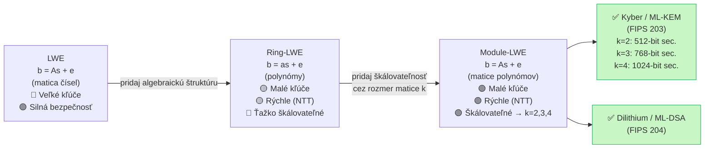

# Q39 — Porovnanie LWE, Ring-LWE a Module-LWE

## Kľúčové pojmy

- [[concepts/LWE]] — Learning With Errors; základ mriežkovej kryptografie
- **Ring-LWE (R-LWE)** — LWE nad polynomiálnym okruhom
- **Module-LWE (M-LWE)** — zovšeobecnenie; malé matice polynómov
- **NTT** — Number Theoretic Transform; rýchle násobenie polynómov (obdoba FFT)
- **ML-KEM** — FIPS 203 (Kyber); postavený na Module-LWE
- **ML-DSA** — FIPS 204 (Dilithium); postavený na Module-LWE
- **Kyber-512/768/1024** — bezpečnostné úrovne ML-KEM ($k=2/3/4$)

## Vysvetlenie

> Tri varianty predstavujú **evolúciu mriežkovej kryptografie**: od čisto teoretického základu (LWE) cez praktické zrýchlenie (Ring-LWE) k flexibilnému štandardu (Module-LWE).

---

### 39.1 LWE — klasická verzia

**Algebraická štruktúra:** Lineárna algebra; $\mathbf{b} = A\mathbf{s} + \mathbf{e} \pmod{q}$ (matica $\times$ vektor).

**Veľkosť kľúčov:** Verejný kľúč obsahuje maticu $A$ rozmermi $m \times n$ — pre $n = 1024$ a $q \approx 2^{12}$ to je $m \times 1024 \times 12$ bitov ≈ **megabajty**.

**Výpočtová náročnosť:** Násobenie matice $A \cdot \mathbf{s}$: $O(n^2)$ operácií.

**Bezpečnostný predpoklad:** Najsilnejší — iba na základe LWE (žiadna extra algebraická štruktúra).

---

### 39.2 Ring-LWE (R-LWE)

**Kľúčová myšlienka:** Namiesto ľubovoľnej matice $A$ sa používa **jeden polynóm** $a \in \mathbb{Z}_q[x]/(f(x))$, kde $f(x) = x^n + 1$ (cyklotomický polynóm).

**Algebraická štruktúra:** Polynómy v okruhu $R_q = \mathbb{Z}_q[x]/(x^n+1)$.

- **Vzťah R-LWE:** $b = a \cdot s + e \pmod{q}$ — násobenie polynómov (nie matíc!).
- Polynóm $a$ sa dá popísať $n$ koeficientami → **verejný kľúč = 2 polynómy** ≈ $\approx 1\,\text{KB}$.

**Zrýchlenie:** Násobenie polynómov v $R_q$ sa vykonáva pomocou **NTT** (Number Theoretic Transform):
$$\text{NTT}: O(n^2) \to O(n \log n)$$
Analogia: NTT : polynómy = FFT : signály.

**Nevýhoda:** Celý systém je naviazaný na fixné $n$ — ak sa zvýši bezpečnosť, mení sa celý okruh, nie len dimenzia.

---

### 39.3 Module-LWE (M-LWE)

**Kľúčová myšlienka:** Namiesto jedného polynomu (R-LWE) alebo veľkej matice čísel (LWE) sa používa **malá matica polynómov** — $k \times k$ matica, kde každý prvok je polynóm.

**Vzťah M-LWE:** $\mathbf{b} = A \cdot \mathbf{s} + \mathbf{e} \pmod{q}$ — kde $A$ je $k\times k$ matica polynómov z $R_q$.

**Výhoda škálovania:** Bezpečnostná úroveň sa mení iba zmenou hodnoty $k$:
- $k = 2$: Kyber-512 (128-bitová bezpečnosť)
- $k = 3$: Kyber-768 (192-bitová bezpečnosť)
- $k = 4$: Kyber-1024 (256-bitová bezpečnosť)

Okruh polynómov (hodnota $n$) zostáva rovnaký ($n = 256$) — iba rozmer matice sa mení. To umožňuje **jeden kód pre všetky bezpečnostné úrovne**.

---

### 39.4 Súhrnné porovnanie

| Vlastnosť | LWE | Ring-LWE | Module-LWE |
|-----------|-----|----------|------------|
| **Algebraická štruktúra** | Vektory/matice nad $\mathbb{Z}_q$ | Polynómy nad $R_q = \mathbb{Z}_q[x]/(x^n+1)$ | Matice polynómov nad $R_q$ |
| **Verejný kľúč** | $\approx$ MB | $\approx$ 1 KB | $\approx$ 1–2 KB |
| **Rýchlosť** | Pomalé ($O(n^2)$) | Rýchle (NTT $O(n\log n)$) | Rýchle (NTT) |
| **Škálovateľnosť** | Nutno zmeniť celú maticu | Nutno zmeniť $n$ (celý okruh) | Stačí zmeniť $k$ (rozmer matice) |
| **Bezpečnostný základ** | Najširší (iba LWE) | Úzky (LWE v špeciálnom okruhu) | Kompromis |
| **Príklady** | Regevovo schéma | NTRUEncrypt, NewHope | ML-KEM (Kyber), ML-DSA (Dilithium) |
| **NIST štandard** | ❌ (príliš veľké kľúče) | ❌ (ťažko škálovateľné) | ✅ FIPS 203, 204 |

---

### 39.5 NTT — prečo je dôležité

**Number Theoretic Transform** je diskrétna Fourierova transformácia nad konečným telesom $\mathbb{Z}_q$ (namiesto komplexných čísel).

- Klasické násobenie polynómov: $O(n^2)$ — príliš pomalé pre $n = 256$.
- NTT násobenie polynómov: $O(n \log n)$ — prakticky rýchle.

Kyber (ML-KEM) pri $n = 256$ a $k = 3$ zvládne výmenu kľúčov v $< 0{,}1\,\text{ms}$ na modernom CPU — porovnateľné s ECDH.

## Diagram

## Callouts

> [!summary] Čo musím vedieť na skúšku
> 1. **LWE** = základ, matica čísel, veľké kľúče ($\approx$ MB).
> 2. **Ring-LWE** = polynómy namiesto matíc, malé kľúče, NTT urýchlenie, ťažko škálovateľné.
> 3. **Module-LWE** = malé matice polynómov, škálovateľné zmenou $k$, základom ML-KEM (Kyber) a ML-DSA (Dilithium).
> 4. **NTT** = rýchle násobenie polynómov ($O(n\log n)$) — kľúčové pre praktickú rýchlosť.

> [!tip] Ako si to pamätať
> **„LWE → Ring = špeciálna štruktúra → Module = Goldilocks"**
> - LWE: príliš veľké kľúče
> - Ring-LWE: príliš rigidné (nie je horúce ani studené)
> - Module-LWE: *akorát* — malé kľúče + škálovateľnosť = Goldilocks

> [!warning] Častá chyba
> Ring-LWE a Module-LWE sú *silnejšie predpoklady* než LWE — ak sa nájde útok na LWE, automaticky by prelomil aj oba. Ak sa nájde útok na Ring-LWE, nemusí lomiť LWE (Ring-LWE je špeciálny prípad). Hierarchia: LWE ← Ring-LWE ← Module-LWE.

> [!example] Príklad — Kyber-768 parametre
> ML-KEM-768 (Kyber): $n=256$, $k=3$, $q=3329$.
> - Verejný kľúč: 1184 bajtov (~1.2 KB)
> - Šifrový text: 1088 bajtov (~1 KB)
> - Porovnanie: RSA-2048 verejný kľúč = 256 bajtov, ale šifrovanie je 1000× pomalšie

## Flashcards

Q:: Čím sa Ring-LWE líši od LWE?
A:: Ring-LWE nahrádza matice čísel polynómami v okruhu $\mathbb{Z}_q[x]/(x^n+1)$. Výsledok: dramaticky menšie kľúče a rýchlejšie operácie cez NTT.

Q:: Prečo je Module-LWE lepšie škálovateľné ako Ring-LWE?
A:: Module-LWE používa $k \times k$ maticu polynómov — bezpečnosť sa nastaví zmenou $k$ (2,3,4) pri zachovaní rovnakého polynomiálneho okruhu. U Ring-LWE by bola nutná zmena celého okruhu (hodnoty $n$).

Q:: Čo je NTT a prečo je dôležité pre PQC?
A:: Number Theoretic Transform = diskrétna Fourierova transformácia nad $\mathbb{Z}_q$. Znižuje násobenie polynómov z $O(n^2)$ na $O(n \log n)$, čo robí praktické Kyber/Dilithium operácie porovnateľne rýchle s ECDH/ECDSA.

Q:: Aké sú tri bezpečnostné úrovne ML-KEM (Kyber) a ako sa líšia?
A:: Kyber-512 ($k=2$, 128-bit), Kyber-768 ($k=3$, 192-bit), Kyber-1024 ($k=4$, 256-bit) — líšia sa len rozmerom matice $k$, polynomiálny okruh ($n=256, q=3329$) je rovnaký.

## Súvisiace

- [[Q38]] — LWE základ — princíp a Regevovo schéma.
- [[Q37]] — PQC rodiny — Module-LWE je najúspešnejšia mriežková rodina.
- [[Q14]] — Kvantová hrozba — prečo je PQC potrebná.
