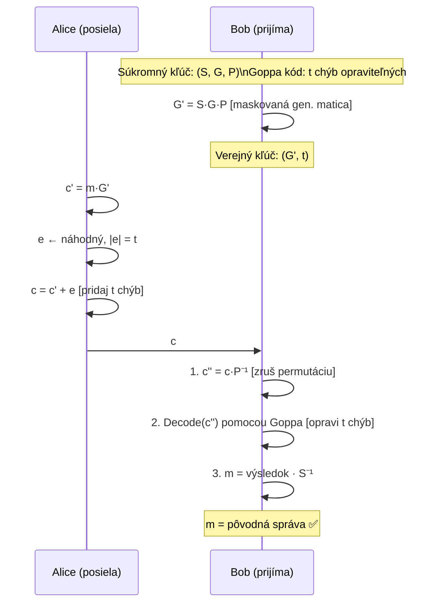

# Q40 — Princíp McElieceovho kryptosystému: generovanie kľúčov, šifrovanie a dešifrovanie

## Kľúčové pojmy

- [[concepts/McEliece]] — Robert McEliece, 1978; najstarší PQC asymetrický systém
- **Goppa kód** — binárny lineárny opravný kód; základ systému
- **Generujúca matica $G$** — popisuje kódové slová; súčasť kľúčov
- **Kontrolná matica $H$** — súvisí s opravou chýb; základ Niederreitera ([[Q41]])
- **Chybový vektor $\mathbf{e}$** — $t$ náhodných bitov; „zašumí" kódové slovo
- **Permutačná matica $P$** — náhodné premiešanie stĺpcov
- **Skrývacia matica $S$** — náhodná invertovateľná matica; maskuje štruktúru kódu
- **NP-ťažkosť dekódovania** — dekódovanie obecného lin. kódu = základ bezpečnosti

## Vysvetlenie

> **Základná myšlienka:** Vezmi kód, ktorý vieš *efektívne dekódovať* (Goppa kód), skry jeho štruktúru náhodnou matici ($S$) a permutáciou ($P$). Verejný kľúč vyzerá ako náhodný kód, ktorý sa nedá dekódovať bez znalosti skrytej štruktúry.

---

### 40.1 Prečo Goppa kód?

**Goppa kód** $\mathcal{G}(L, g)$ je trieda binárnych lineárnych opravných kódov s efektívnym dekódovacím algoritmom (Patterson, Berlekamp-Massey).

- Parametre: $[n, k, d]$-kód — dĺžka $n$, dimenzia $k$, minimálna vzdialenosť $d = 2t+1$.
- Dokáže opraviť až $t$ chýb (bitových prechodov) v $n$-bitovom slove.
- **Kľúčové:** Bez znalosti štruktúry (matíc $S, P$) vyzerá Goppa kód ako *náhodný* kód, ktorý sa opravuje len v exponenciálnom čase.

---

### 40.2 Generovanie kľúčov

**Krok 1 — Výber Goppa kódu:**
Zvolí sa binárny $[n, k, t]$-Goppa kód $\mathcal{C}$ s generujúcou maticou $G$ (rozmer $k \times n$).
- Typicky: $n = 1024$, $k = 524$, $t = 50$ (klasické parametre).

**Krok 2 — Skrývacia matica $S$:**
Vygeneruje sa náhodná binárna invertovateľná matica $S$ rozmeru $k \times k$.
- Slúži na *premiešanie riadkov* generujúcej matice.

**Krok 3 — Permutačná matica $P$:**
Vygeneruje sa náhodná permutačná matica $P$ rozmeru $n \times n$.
- Slúži na náhodné *preusporiadanie stĺpcov*.

**Krok 4 — Výpočet kľúčov:**
$$\hat{G} = S \cdot G \cdot P$$
- **Verejný kľúč:** $(\hat{G}, t)$ — verejná generujúca matica + max. počet chýb.
- **Súkromný kľúč:** $(S, G, P)$ — trojica matíc umožňujúca efektívne dekódovanie.

> [!tip] Prečo $\hat{G}$ vyzerá náhodne?
> $S$ premiešava riadky, $P$ premiešava stĺpce → $\hat{G}$ neobsahuje žiadnu viditeľnú štruktúru Goppa kódu. Útočník ho nedokáže odlíšiť od náhodnej matice.

---

### 40.3 Šifrovanie

Alice chce poslať správu $\mathbf{m} \in \{0,1\}^k$ Bobovi.

1. **Kódovanie** pomocou Bobovho verejného kľúča $\hat{G}$:
$$\mathbf{c}' = \mathbf{m} \cdot \hat{G}$$
2. **Pridanie náhodného chybového vektora** $\mathbf{e} \in \{0,1\}^n$ s váhou $|\mathbf{e}| = t$ (presne $t$ jednotkových bitov):
$$\mathbf{c} = \mathbf{c}' + \mathbf{e} = \mathbf{m} \hat{G} + \mathbf{e}$$
3. **Šifrový text** $\mathbf{c}$ sa pošle Bobovi.

> **Bezpečnosť:** Útočník vidí $\mathbf{c} = \mathbf{m}\hat{G} + \mathbf{e}$. Nájsť $\mathbf{m}$ bez znalosti $(S,G,P)$ = dekódovanie obecného lineárneho kódu = **NP-ťažký problém**.

---

### 40.4 Dešifrovanie

Bob obdrží $\mathbf{c}$ a použije trojicu $(S, G, P)$.

**Krok 1 — Odstránenie permutácie:**
$$\mathbf{c}' = \mathbf{c} \cdot P^{-1} = \mathbf{m} \hat{G} P^{-1} + \mathbf{e} P^{-1} = \mathbf{m} S G + \mathbf{e}'$$
kde $\mathbf{e}' = \mathbf{e} P^{-1}$ má stále váhu $t$ (permutácia nezmení váhu vektora).

**Krok 2 — Dekódovanie Goppa kódom:**
Bob použije efektívny dekódovací algoritmus pre kód $G$ (napr. Patterson) na odstránenie $t$ chýb z $\mathbf{c}'$:
$$\mathbf{c}'' = \text{Decode}(\mathbf{c}') = \mathbf{m} S G$$

**Krok 3 — Získanie správy:**
Vynásobením inverznou maticou $S^{-1}$:
$$\mathbf{m} = \mathbf{c}'' \cdot G^{-1} \cdot S^{-1}$$
(Alebo ekvivalentne extrahovať $\mathbf{m}$ zo systematickej formy $G$.)

---

### 40.5 Bezpečnosť a parametre

| Bezpečnostná úroveň | $n$ | $k$ | $t$ | Verejný kľúč | Šifrový text |
|--------------------|-----|-----|-----|-------------|-------------|
| 128-bit (Classic McEliece-348864) | 3488 | 2720 | 64 | **261 KB** | 128 B |
| 256-bit (Classic McEliece-6960119) | 6960 | 5413 | 119 | **1 MB** | 226 B |

> **Hlavná nevýhoda:** Verejný kľúč je **stovky kilobajtov až megabajty** — oveľa väčšie ako Kyber (1-2 KB). To obmedzuje použitie na situácie, kde kľúč sa prenáša zriedkavo alebo sa vopred uloží.

## Diagram

## Callouts

> [!summary] Čo musím vedieť na skúšku
> 1. **Základ bezpečnosti:** Dekódovanie obecného lin. kódu = NP-ťažký problém.
> 2. **Kľúče:** Verejný $\hat{G} = SGP$ (maskovaná gen. matica); súkromný $(S, G, P)$.
> 3. **Šifrovanie:** $\mathbf{c} = \mathbf{m}\hat{G} + \mathbf{e}$, kde $|\mathbf{e}| = t$.
> 4. **Dešifrovanie:** Zruš $P$ → Goppa decoder opraví chyby → zruš $S$.
> 5. **Nevýhoda:** Obrovský verejný kľúč (stovky KB – MB).

> [!tip] Ako si to pamätať
> **„Spy v kostýme"** — Goppa kód je špión (vie rýchlo dekódovať). $S$ a $P$ sú jeho kostým a parochňa. Verejnosť vidí len náhodný kód, špión si kostým sám stiahne.

> [!warning] Častá chyba
> Zámennosť Q19 a Q40: Q19 je *úvod* (princíp, výhody/nevýhody), Q40 je *detail* (konkrétny postup s matici $S, G, P$). Na skúške môžu pýtať obe — Q40 je podrobnejšia verzia.

> [!example] Príklad — Classic McEliece v praxi
> Classic McEliece sa testoval v NIST PQC procese a bol zaradený ako alternatívny štandard (nie FIPS, ale „NIST Selected"). Používa ho napr. WireGuard PQ fork a niektoré vojenské komunikačné systémy. Hlavný problém: 1MB kľúč cez Wi-Fi je OK, cez IoT senzor je problém → preto Kyber dominuje.

## Flashcards

Q:: Čo je verejný a čo súkromný kľúč v McElieceovom kryptosystéme?
A:: Verejný kľúč: maskovaná generujúca matica $\hat{G} = S \cdot G \cdot P$ a parameter $t$. Súkromný kľúč: trojica matíc $(S, G, P)$ a Goppa dekódovací algoritmus.

Q:: Prečo je McElieceov systém bezpečný (základ bezpečnosti)?
A:: Bezpečnosť stojí na NP-ťažkosti dekódovania obecného lineárneho kódu. Verejná matica $\hat{G}$ vyzerá náhodne (kvôli $S$ a $P$) → útočník nemá efektívny dekódovací algoritmus.

Q:: Aké kroky vykoná Bob pri dešifrovaní v McElieceovom systéme?
A:: 1) Odstráni permutáciu: $\mathbf{c}' = \mathbf{c} P^{-1}$, 2) Goppa kód opraví $t$ chýb, 3) Odstráni maskovaciu maticu $S^{-1}$ → získa $\mathbf{m}$.

Q:: Aká je hlavná nevýhoda McElieceovho kryptosystému?
A:: Veľmi veľký verejný kľúč — stovky kilobajtov až megabajty (napr. Classic McEliece-348864: 261 KB). Porovnaj: ML-KEM-768: ~1.2 KB.

## Súvisiace

- [[Q19*]] — Úvod do McEliece (princíp, výhody/nevýhody).
- [[Q41]] — Niederreiterov systém — duálna varianta McEliece.
- [[Q37]] — PQC rodiny — kódová kryptografia.
