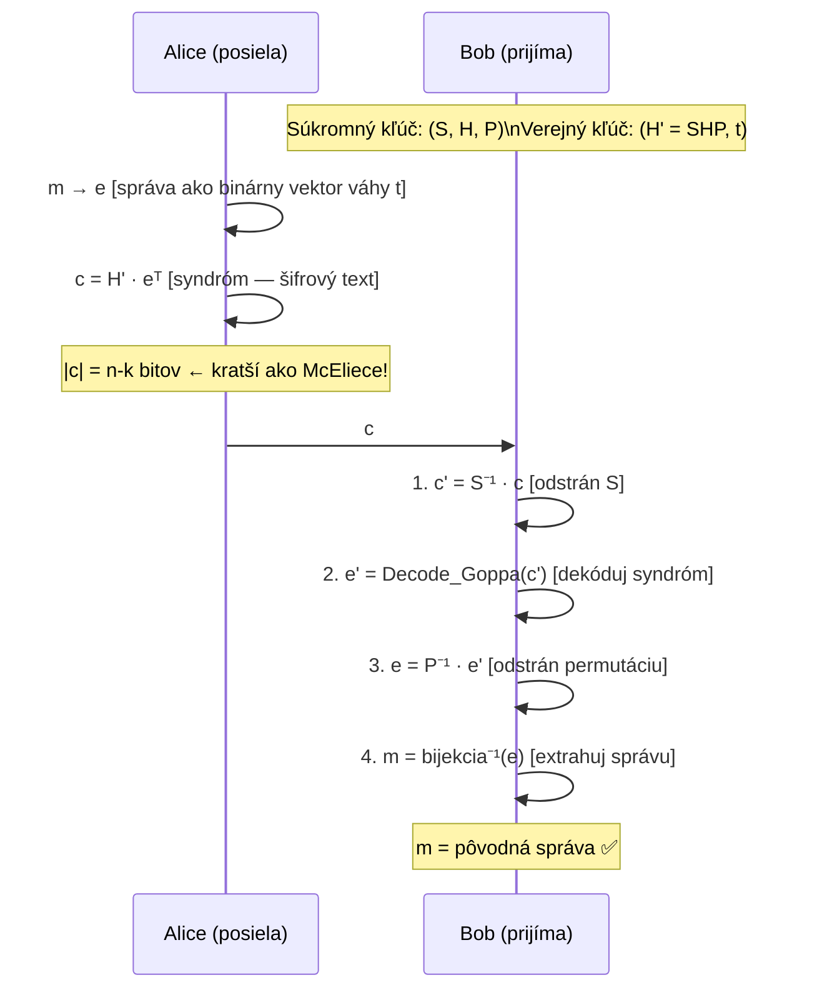

# Q41 — Princíp Niederreiterovho kryptosystému: generovanie kľúčov, šifrovanie a dešifrovanie

## Kľúčové pojmy

- **Niederreiterov systém** — Harald Niederreiter, 1986; duálna varianta McEliece
- **Kontrolná (parity-check) matica $H$** — kľúčová matica; kontrast s gen. maticou $G$ v McEliece
- **Syndróm** — $\mathbf{s} = H \cdot \mathbf{e}^T$ — komprimovaná reprezentácia chybového vektora
- **Váhový vektor** — správa je reprezentovaná ako vektor váhy $t$ (presne $t$ jednotiek)
- [[concepts/McEliece]] — príbuzný systém; oba sú z kódovej PQC rodiny
- **CFS podpis** — Courtois-Finiasz-Sendrier; využíva Niederreitera pre podpisy

## Vysvetlenie

> **Kľúčový rozdiel od McEliece:** McEliece šifruje pomocou *generujúcej matice* $G$ a pridáva chyby do kódového slova. Niederreiter šifruje pomocou *kontrolnej matice* $H$ — správa je *samotný chybový vektor* a šifrový text je jeho *syndróm*.

---

### 41.1 Dualita McEliece — Niederreiter

Každý lineárny kód má dve matice:

| Matica | Popis | Použitie |
|--------|-------|---------|
| **Generujúca $G$ ($k \times n$)** | Kódové slová = $\mathbf{m} G$ | McEliece ([[Q40]]) |
| **Kontrolná $H$ ($(n-k) \times n$)** | Syndróm = $H \mathbf{c}^T = \mathbf{0}$ pre platný kód | Niederreiter |

Pre Goppa kód platí: $H G^T = 0$. Oba systémy teda zdieľajú *rovnaký kód*, ale pracujú s *rôznymi maticami*.

---

### 41.2 Generovanie kľúčov

Postup je analogický McEliece, ale s kontrolnou maticou:

**Krok 1 — Výber Goppa kódu:**
Zvolí sa binárny $[n, k, t]$-Goppa kód s kontrolnou maticou $H$ rozmerov $(n-k) \times n$.

**Krok 2 — Maskovaná matica:**
Vygenerujú sa náhodné:
- Invertovateľná matica $S$ rozmerov $(n-k) \times (n-k)$ (miešanie riadkov $H$).
- Permutačná matica $P$ rozmerov $n \times n$ (permutácia stĺpcov).

**Výpočet:**
$$\hat{H} = S \cdot H \cdot P$$

**Kľúče:**
- **Verejný kľúč:** $(\hat{H}, t)$
- **Súkromný kľúč:** $(S, H, P)$ a dekódovací algoritmus Goppa kódu

---

### 41.3 Šifrovanie

**Kľúčový rozdiel:** Správa $\mathbf{m}$ je reprezentovaná *nie ako $k$-bitový vektor* ale ako **$n$-bitový vektor váhy $t$** (presne $t$ jednotiek):
$$\mathbf{e} \in \{0,1\}^n, \quad |\mathbf{e}| = t$$

Alice zakóduje správu $\mathbf{m}$ ako binárny vektor $\mathbf{e}$ (existujú štandardné bijekcii medzi poradovými číslami a vektormi váhy $t$).

Šifrový text je **syndróm** vektora $\mathbf{e}$ vzhľadom k verejnej matici $\hat{H}$:
$$\mathbf{c} = \hat{H} \cdot \mathbf{e}^T$$

**Veľkosť šifrového textu:** $n - k$ bitov (oveľa kratší ako u McEliece, kde $|\mathbf{c}| = n$).

---

### 41.4 Dešifrovanie

Bob obdrží syndróm $\mathbf{c}$ a musí z neho rekonštruovať $\mathbf{e}$.

**Krok 1 — Odstránenie maskovacej matice:**
$$\mathbf{c}' = S^{-1} \cdot \mathbf{c} = S^{-1} \cdot S \cdot H \cdot P \cdot \mathbf{e}^T = H \cdot P \cdot \mathbf{e}^T$$
Nechaj $\mathbf{e}' = P \mathbf{e}^T$ — stále platí $|\mathbf{e}'| = t$ (permutácia zachováva váhu).

**Krok 2 — Dekódovanie syndrómu:**
$\mathbf{c}'$ je syndróm vektora $\mathbf{e}'$ vzhľadom k *pôvodnej* Goppa kontrolnej matici $H$.
Bob použije efektívny dekódovací algoritmus (napr. Berlekamp-Massey) na nájdenie $\mathbf{e}'$ z jeho syndrómu $\mathbf{c}' = H \mathbf{e}'^T$.

**Krok 3 — Inverzia permutácie:**
$$\mathbf{e} = P^{-1} \mathbf{e}'$$

Bob rekonštruuje pôvodnú správu $\mathbf{m}$ zo vektora $\mathbf{e}$ (inverzia bijekcie správa→vektor).

---

### 41.5 Porovnanie s McElieceom

| Vlastnosť | McEliece | Niederreiter |
|-----------|---------|-------------|
| **Matica v kľúči** | Generujúca $G$ | Kontrolná $H$ |
| **Formát správy** | $k$-bitový vektor | $n$-bitový vektor váhy $t$ |
| **Šifrový text** | $n$-bitové kódové slovo + chyby ($n$ bitov) | Syndróm ($n-k$ bitov) |
| **Veľkosť šifry** | Dlhší (~ $n$ bitov) | **Kratší** (~ $n-k$ bitov) |
| **Bezpečnosť** | Ekvivalentná | Ekvivalentná |
| **Použitie** | Šifrovanie | Šifrovanie + *digitálne podpisy* (CFS) |

> **Kompresný pomer šifry:** Pre typické parametre ($n=1024, k=524$): McEliece = 1024-bitový šifrový text, Niederreiter = 500-bitový šifrový text. **2× kratší!**

---

### 41.6 CFS podpisové schéma

Niederreiterov systém sa dá použiť na **digitálne podpisy** (schéma Courtois-Finiasz-Sendrier):

Idea: Podpis = chybový vektor $\mathbf{e}$ k syndrómu $\mathbf{c} = H(\mathbf{e}^T)$ kde $\mathbf{c} = H(\text{správy})$.
Overovateľ overí, že $\hat{H} \cdot \mathbf{e}^T = \text{Hash(správy)}$ a $|\mathbf{e}| = t$.

## Diagram

## Callouts

> [!summary] Čo musím vedieť na skúšku
> 1. **Kľúčový rozdiel od McEliece:** kontrolná matica $H$ (nie generujúca $G$).
> 2. **Správa = chybový vektor** váhy $t$ (nie priamy $k$-bitový vektor).
> 3. **Šifrový text = syndróm:** $\mathbf{c} = \hat{H} \cdot \mathbf{e}^T$ — kratší ako u McEliece.
> 4. **Dešifrovanie:** $S^{-1}$ → Goppa dekódovanie syndrómu → $P^{-1}$.
> 5. **Ekvivalentná bezpečnosť** s McElieceom; kratšia šifra; tiež veľký verejný kľúč.

> [!tip] Ako si to pamätať
> **McEliece = poštová schránka** (dáš tam správu + chyby).
> **Niederreiter = QR kód** (správa *je* chybový vzor, šifrový text je syndróm = komprimovaný odtlačok).

> [!warning] Častá chyba
> V Niederreiterovom systéme sa správa *neposiela priamo* — musí sa najprv *transformovať* na binárny vektor váhy presne $t$. Ak $t = 50$ a $n = 1024$, správa je číslo z $\binom{1024}{50} \approx 2^{194}$ možností — to zodpovedá 194-bitovej správe.

> [!example] Príklad — CFS podpis
> Niederreiterov systém sa používa vo variante digitálnych podpisov CFS (Courtois-Finiasz-Sendrier, 2001). Ide o jediné postkvantové podpisové schéma založené na kódoch (okrem hašovacích). Nevýhoda: podpisovanie je extrémne pomalé kvôli opakovanému skúšaniu hashov.

## Flashcards

Q:: Čím sa Niederreiterov systém líši od McEliecea?
A:: Niederreiter používa *kontrolnú maticu* $H$ (nie generujúcu $G$). Správa je reprezentovaná ako *chybový vektor váhy $t$* a šifrový text je *syndróm* tohto vektora.

Q:: Prečo je Niederreiterov šifrový text kratší ako McElieceov?
A:: McEliece: šifrový text = $n$ bitov (kódové slovo + chyby). Niederreiter: šifrový text = $n-k$ bitov (syndróm). Pre typické parametre je to ~2× kratšie.

Q:: Aký algoritmus Bob používa pri dešifrovaní Niederreitera?
A:: Efektívny dekódovací algoritmus Goppa kódu (napr. Berlekamp-Massey) — dekóduje syndróm a nájde chybový vektor $\mathbf{e}'$ s váhou $t$.

Q:: Aká je bezpečnostná ekvivalencia McEliece a Niederreitera?
A:: Oba systémy sú považované za bezpečnostne ekvivalentné — oba stoja na NP-ťažkosti dekódovania obecného lineárneho kódu a používajú ten istý Goppa kód.

## Súvisiace

- [[Q40]] — McElieceov systém — generujúca matica, priame porovnanie.
- [[Q19]] — Úvod do McEliece.
- [[Q37]] — PQC rodiny — kódová rodina.
