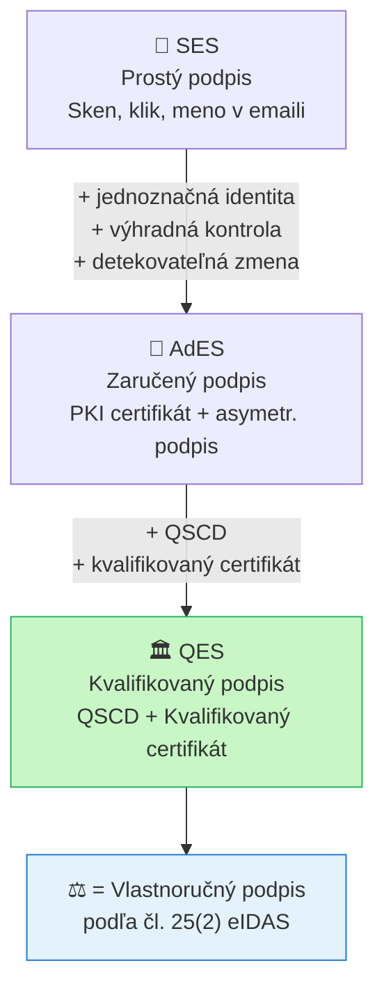

# Q42 — Vzťah digitálneho podpisu k právnemu rámcu eIDAS a úrovne podpisov

## Kľúčové pojmy

- [[concepts/eIDAS]] — Nariadenie EÚ 910/2014 o elektronickej identifikácii
- **eIDAS 2.0** — aktualizácia 2024 (Nariadenie 2024/1183)
- **SES** — Simple Electronic Signature (prostý elektronický podpis)
- **AdES** — Advanced Electronic Signature (zaručený elektronický podpis)
- **QES** — Qualified Electronic Signature (kvalifikovaný elektronický podpis)
- **QSCD** — Qualified Signature Creation Device (napr. čipová karta, HSM)
- **TSP** — Trust Service Provider (poskytovateľ dôveryhodných služieb)
- **EUDI Wallet** — European Digital Identity Wallet; novinka z eIDAS 2.0
- [[concepts/PKI]] — Public Key Infrastructure; základ pre certifikáty
- [[concepts/X.509]] — štandard pre digitálne certifikáty

## Vysvetlenie

---

### 42.1 Digitálny podpis vs. Elektronický podpis

Tieto dva pojmy sa v praxi **nesprávne zamieňajú**:

| Pojem | Charakter | Definícia |
|-------|-----------|-----------|
| **Digitálny podpis** | Technický/kryptografický | Algoritmus (RSA-PSS, ECDSA, EdDSA) zabezpečujúci integritu a autenticitu pomocou asymetrickej kryptografie |
| **Elektronický podpis** | Právny | Akékoľvek elektronické dáta priradené k dokumentu, ktoré podpisovateľ používa na podpis (definícia z eIDAS) |

**Vzťah:** Digitálny podpis je *technická implementácia* elektronického podpisu. Elektronický podpis je *právny pojem* — zahŕňa aj jednoduché veci ako sken vlastnoručného podpisu.

> **Prečo eIDAS?** Bez právneho rámca by súdy mohli odmietať elektronické dokumenty. eIDAS garantuje, že kvalifikovaný elektronický podpis *má rovnaký právny účinok ako vlastnoručný podpis* v celej EÚ.

---

### 42.2 Tri úrovne podpisov podľa eIDAS

eIDAS definuje **hierarchiu** troch úrovní podpisov, ktoré sa líšia bezpečnosťou a právnou silou:

---

#### Úroveň 1 — SES: Prostý elektronický podpis

**Definícia (čl. 3 eIDAS):** Akékoľvek dáta v elektronickej forme pripojené k iným elektronickým dátam, ktoré podpisovateľ použije na podpis.

**Technické požiadavky:** Žiadne špecifické kryptografické požiadavky.

**Príklady:**
- Naskenovaný vlastnoručný podpis vložený do PDF
- Patička e-mailu „Ing. Ján Novák"
- Kliknutie na tlačidlo „Súhlasím s podmienkami"
- Zadanie mena na konci dokumentu

**Právna sila:** Najnižšia. Súd ho môže akceptovať, ale môže ho aj odmietnuť ako nedostatočný dôkaz identity.

**Použitie:** Bežné nízkohodnotové transakcie, neformálna komunikácia.

---

#### Úroveň 2 — AdES: Zaručený elektronický podpis

**Definícia (čl. 26 eIDAS):** Musí spĺňať štyri podmienky:
1. Je **jednoznačne spojený** s podpisovateľom.
2. **Umožňuje identifikáciu** podpisovateľa.
3. Je vytvorený dátami, ktoré podpisovateľ používa pod **výhradnou kontrolou** (súkromný kľúč).
4. Je spojený s podpísanými dátami tak, že akákoľvek **zmena dát je detekovateľná**.

**Technická realizácia:** Typicky PKI-based — certifikát vydaný dôveryhodnou certifikačnou autoritou + asymetrický podpis (RSA-PSS, ECDSA).

**Príklady:**
- Podpis pomocou osobného certifikátu vydaného komerčnou CA
- Podpis pomocou firemného certifikátu

**Právna sila:** Stredná. Platný v súkromnoprávnych vzťahoch; identita podpisovateľa je overiteľná.

**Varianty:**
- **XAdES** — pre XML dokumenty
- **PAdES** — pre PDF dokumenty (najpoužívanejší)
- **CAdES** — všeobecný formát podpisu
- **ASiC** — kontajner pre kombináciu formátov

---

#### Úroveň 3 — QES: Kvalifikovaný elektronický podpis

**Definícia (čl. 25 eIDAS):** Zaručený podpis + dve extra podmienky:
1. Vytvorený pomocou **kvalifikovaného prostriedku** (QSCD).
2. Založený na **kvalifikovanom certifikáte**.

**QSCD** (*Qualified Signature Creation Device*) — zariadenie, z ktorého súkromný kľúč nemožno exportovať:
- Čipová karta (smart card)
- USB kryptografický token (napr. eID karta)
- HSM (*Hardware Security Module*) v cloude
- Mobilná aplikácia na certifikovanom zariadení

**Kvalifikovaný certifikát** — vydaný *kvalifikovaným poskytovateľom dôveryhodných služieb* (TSP) registrovaným v národnom zozname dôveryhodnosti (EU Trusted List).

**Príklady:**
- Podpis pomocou štátnej eID karty (napr. slovenský občiansky preukaz s čipom)
- Podpis cez cloudový HSM s kvalifikovaným certifikátom
- Notárske overenie dokumentu elektronicky

**Právna sila:** **Najvyššia** — podľa čl. 25(2) eIDAS má *rovnaký právny účinok ako vlastnoručný podpis*. V SR a ČR povinný pre elektronické právne úkony úradných osôb.

---

### 42.3 Ďalšie služby podľa eIDAS

Okrem podpisov eIDAS definuje:

| Služba | Popis | Ekvivalent QES |
|--------|-------|---------------|
| **Elektronická pečať** | Pre právnické osoby (firmy, úrady); zaručuje pôvod dokumentu | **QSeal** — kvalifikovaná pečať |
| **Elektronické časové razítko** | Dôkaz existencie dokumentu v čase (pozri [[Q17]]) | **QETS** — kvalifikované časové razítko |
| **Elektronické doručenie** | Registrovaná elektronická pošta | — |
| **Autentizácia webstránok** | TLS certifikáty pre weby | Kvalifikovaný certifikát pre web |

---

### 42.4 eIDAS 2.0 — European Digital Identity Wallet (EUDI Wallet)

Aktualizácia eIDAS 2.0 (Nariadenie 2024/1183) prináša:

**EUDI Wallet** — mobilná aplikácia pre každého občana EÚ:
- Bezpečné uloženie identifikačných atribútov (meno, adresa, dátum narodenia).
- Digitálne verzie dokladov: vodičský preukaz, diplom, zdravotný preukaz.
- Možnosť **vytvárať QES priamo z telefónu** (bez fyzickej čipovej karty).
- Selektívne zdieľanie atribútov (napr. „mám >18 rokov" bez odkrytia dátumu narodenia).
- Funkcia od roku **2026** povinná pre všetky členské štáty EÚ.

## Diagram

## Tabuľka — porovnanie úrovní

| Kritérium | SES | AdES | QES |
|-----------|-----|------|-----|
| **Kryptografia** | Žiadna špecifická | PKI + asymetrický podpis | PKI + asymetrický podpis |
| **Certifikát** | Nie je nutný | Komerčná CA | Kvalifikovaná CA (TSP) |
| **QSCD** | Nie | Nie | **Áno** |
| **Identifikácia** | Slabá | Overiteľná | Silná (garantovaná TSP) |
| **Právna sila** | Minimálna | Stredná | **= vlastnoručný podpis** |
| **Príklad** | Email podpis | Firemný certifikát | Občiansky preukaz s čipom |

## Callouts

> [!summary] Čo musím vedieť na skúšku
> 1. **3 úrovne**: SES (prostý) < AdES (zaručený, PKI) < QES (kvalifikovaný, QSCD + certifikát).
> 2. **QES = vlastnoručný podpis** právne (čl. 25 eIDAS).
> 3. **QSCD** = zariadenie, z ktorého kľúč nemožno exportovať (čipová karta, HSM).
> 4. **eIDAS 2.0**: EUDI Wallet — QES z mobilu, selektívne zdieľanie atribútov.
> 5. **Pečať** = podpis pre právnické osoby (nie fyzické).

> [!tip] Ako si to pamätať
> **SES = fotokópia podpisu** — každý ho vie urobiť.
> **AdES = overenie notárom** — overiteľné, ale notár nie je štátom certifikovaný.
> **QES = notár s úradnou pečaťou a evidenciou** — plná právna sila.

> [!warning] Častá chyba
> Nezamieňaj **digitálny podpis** (technický pojem, algoritmus) s **elektronickým podpisom** (právny pojem z eIDAS). Každý digitálny podpis je elektronickým podpisom, ale nie každý elektronický podpis je digitálnym podpisom (napr. sken nie je).

> [!example] Príklad — slovenský eID
> Slovenský občiansky preukaz s čipom (eID karta) je **QSCD**. Obsahuje súkromný kľúč, ktorý *nikdy neopustí čip*. Podpis vytvorený eID kartou spĺňa všetky podmienky **QES** podľa eIDAS — má rovnaký právny účinok ako vlastnoručný podpis pri podávaní dokumentov na slovenské úrady.

## Flashcards

Q:: Aký je rozdiel medzi digitálnym a elektronickým podpisom?
A:: Digitálny podpis = kryptografický algoritmus (RSA-PSS, ECDSA). Elektronický podpis = právny pojem z eIDAS (akékoľvek el. dáta priradené k dokumentu). Digitálny podpis je technická implementácia, elektronický podpis je právny rámec.

Q:: Vymenuj tri úrovne podpisov podľa eIDAS a ich hlavné rozdiely.
A:: SES (prostý — žiadne kryptografické požiadavky), AdES (zaručený — PKI + asymetrický podpis, overiteľná identita), QES (kvalifikovaný — AdES + QSCD + kvalifikovaný certifikát = právna sila vlastnoručného podpisu).

Q:: Čo je QSCD a prečo je požadované pre QES?
A:: QSCD = Qualified Signature Creation Device (čipová karta, HSM, certifikovaný token). Zariadenie, z ktorého súkromný kľúč *nemožno exportovať*. Garantuje, že podpis vytvorila fyzická osoba vlastniaca QSCD — nemožno ho falšovať softvérovým nástrojom.

Q:: Čo je EUDI Wallet a čo umožní?
A:: European Digital Identity Wallet — mobilná aplikácia (eIDAS 2.0, 2026). Umožní: ukladať identitu a doklady, vytvárať QES z telefónu, selektívne zdieľať atribúty (napr. „>18" bez dátumu narodenia) naprieč celou EÚ.

## Súvisiace

- [[Q16]] — Digitálny podpis — technická stránka.
- [[Q17]] — Časové razítko — ďalšia eIDAS dôveryhodná služba.
- [[Q18]] — eIDAS — prehľad nariadenia (táto otázka je podrobnejšia).
- [[Q43]] — Ideové návrhy — 43.6 využíva QES pre e-government.
